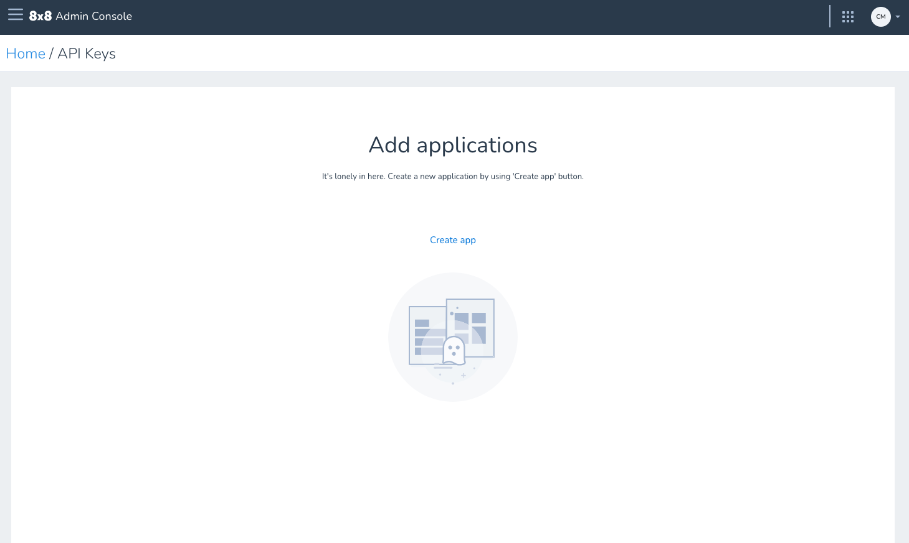
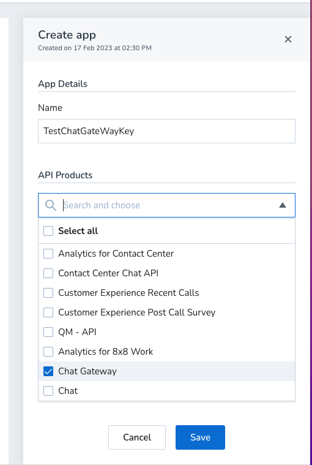
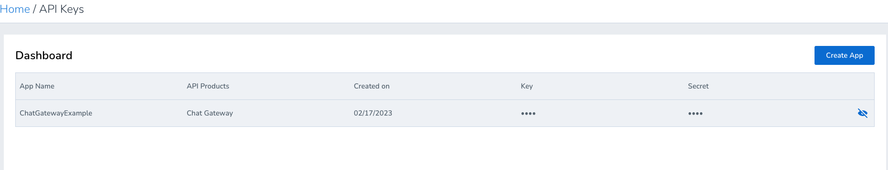
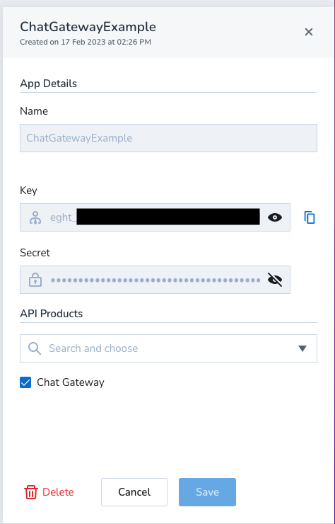

# API Key

## Procedure

You can obtain an API key using your [8x8 Admin Console](https://admin.8x8.com/) implementation.

To obtain your 8x8 API key:

1. Access your 8x8 Admin Console implementation.
2. Click **API Keys**
3. Click **Create App**

4. Add your Application.

  * Enter an application name
  * Under API products select **Chat Gateway** to create an API key enabled for the Chat Gateway and click Save.

* You can access the token, by clicking on the eye icon

## Or click on the key

Then it opens and you can use the eye icon, then copy. . You DO NOT need the secret.

