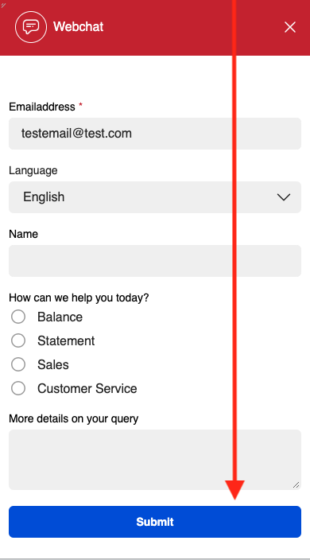
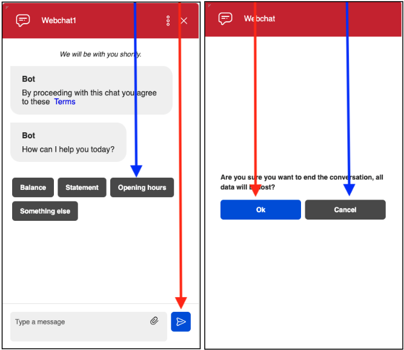
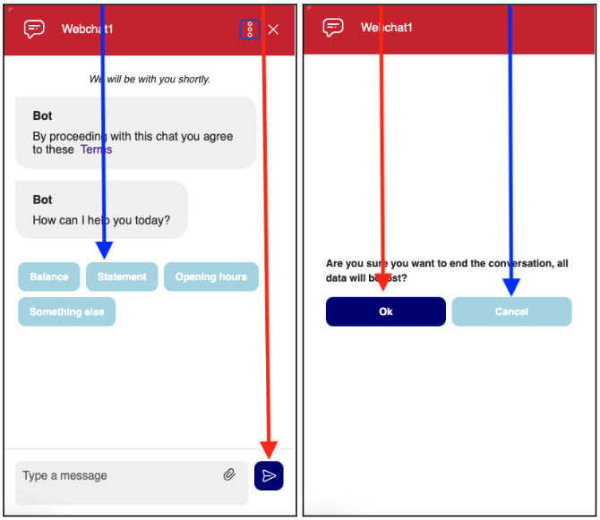

# Button theming

## Primary and secondary buttons

You can change both the primary and secondary colours on the chat button, either globally across each of the parts of the widget, invitation/form/window or configure each one differently.

On the form below, there are just primary buttons (red arrow points to primary button)


  
Then, for the web window, here you can see the primary buttons, but also the secondary buttons are both the quick replies, and cancel options. (Red arrow points to the primary button/blue to secondary button)


  
## Button properties

Below, is the table of configuration that you can use to change the button colours, the chat theme property is what is used to change the colour.

| Chat Theme Property | Example value | Description |
| --- | --- | --- |
| buttonPrimaryTextColor | `#FFFFFF` | Changes the primary button text colour |
| buttonPrimaryTextColorDisabled | `#888888` | Changes the primary button text colour when it's disabled |
| buttonPrimaryBackgroundColor | `#00008B` | Changes the primary button background colour |
| buttonPrimaryBackgroundColorHover | `#000099` | Changes the primary button background colour when it's hover |
| buttonPrimaryBackgroundColorActive | `#000066` | Changes the primary button background colour when it's active |
| buttonPrimaryBackgroundColorDisabled | `#FFFFFF` | Changes the primary button background colour when it's disabled |
| buttonSecondaryTextColor | `#888888` | Changes the secondary button text colour |
| buttonSecondaryTextColorDisabled | `#ADD8E6` | Changes the secondary button text colour when it's disabled |
| buttonSecondaryBackgroundColorHover | `#B0E0E6` | Changes the secondary button background colour when it's hover |
| buttonSecondaryBackgroundColorActive | `#87CEEB` | Changes the secondary button background colour when it's active |
| buttonSecondaryBackgroundColorDisabled | `#B0C4DE` | Changes the secondary button background colour when it's disabled |
| buttonBorderRadius | `0px` | Changes the button rounding |

Here is an example of where the customer information is being set, for this example, the customer is already logged into the website, so we are passing in the information to the agent, to let them know the customer's name and email address, and also that they have already been verified

```javascript
 themeCustom: {
    "buttonPrimaryTextColor": "#FFFFFF",
    "buttonPrimaryTextColorDisabled": "#888888",
    "buttonPrimaryBackgroundColor": "#000080",  // Navy Blue
    "buttonPrimaryBackgroundColorHover": "#00008B",  // Darker Navy Blue
    "buttonPrimaryBackgroundColorActive": "#000099",  // Active Navy Blue
    "buttonPrimaryBackgroundColorDisabled": "#000066",  // Disabled Navy Blue
    "buttonSecondaryTextColor": "#FFFFFF",
    "buttonSecondaryTextColorDisabled": "#888888",
    "buttonSecondaryBackgroundColor": "#ADD8E6",  // Light Blue
    "buttonSecondaryBackgroundColorHover": "#B0E0E6",  // Powder Blue
    "buttonSecondaryBackgroundColorActive": "#87CEEB",  // Sky Blue
    "buttonSecondaryBackgroundColorDisabled": "#B0C4DE",  // Light Steel Blue
    "buttonBorderRadius": "0px",
    "headerBackgroundColor": "blue",// Header Background Color
    },

```

To add this, you need to add it at the bottom of the script in this area here

```javascript
"__8x8-chat-button-container-script_1333070733643e5b8fa7a791.52161248",
            align: "right",

ADD THE THEMING CODE HERE
        };

        var url = new URL("https://cloud8-cc-geo.8x8.com/vcc-chat-channels/public/webchat/discovery");

```

Then, the full script will look like this

```html
    <!-- Place this code snippet anywhere you want the button to appear in your page. If no button has been configured in the chat script, it will not show up nor take any space. -->
    <div id="__8x8-chat-button-container-script_1333070733643e5b8fa7a791.52161248"></div>

    <!-- This script will not interfere with the button layout, you just need to include it in the same page. It must also be within the <body> section of the page, preferably just before the ending tag. -->
    <script type="text/javascript">
    (function(c, f, ef){
        var typeofC = Object.prototype.toString.call(c);
        var props = (typeofC === '[object Object]' && c) || {};
        var cb = f || (typeofC === '[object Function]' && c);
        var config = {
            scriptUuid: "script_1333070733643e5b8fa7a791.52161248",
            tenant: "Y2hyaXNjcm9tYmllZGVtbzAx",
            channelName: "WebChatChannel",
            channelUuid: "Ak3ULjXFQx-unSA6ebdW8A",
            domain: "https://vcc-eu11.8x8.com",
            buttonContainerId: "__8x8-chat-button-container-script_1333070733643e5b8fa7a791.52161248",
            align: "right",
        };

        var url = new URL("https://cloud8-cc-geo.8x8.com/vcc-chat-channels/public/webchat/discovery");
        var params = { domain: config.domain, tenant: config.tenant, channelUuid: config.channelUuid };
        url.search = new URLSearchParams(params).toString();
        fetch(url)
            .then(response => response.json())
            .then(data => config.domain = !data.domain ? config.domain : data.domain)
            .catch(error => console.warn('Failed to retrieve override domain, will continue using ', config.domain, error))
            .finally(() => loadChat());

        function loadChat() {
            var se = document.createElement("script");
            se.type = "text/javascript";
            se.async = true;
            se.src = props.loaderURL || (config.domain + "/CHAT/common/js/chatv3.js");
            Object.keys(config).forEach(function (k) { se.dataset[k] = config[k] });
            Object.keys(props).forEach(function (k) { se.dataset[k] = props[k] });
            function handleInitEvent(e) {
                var initFn = e.detail.init;
                initFn(config, cb);
                se.removeEventListener('init', handleInitEvent)
            }
            function handleErrorEvent(e) {
                ef && ef(e);
                se.removeEventListener('customerror', handleErrorEvent);
            }
            se.addEventListener('init', handleInitEvent);
            se.addEventListener('customerror', handleErrorEvent);
            var os = document.getElementsByTagName("script")[0];
            os.parentNode.insertBefore(se, os);
        }
    })(function(chatApp) {
    chatApp.setCustomerInfo({
      "First name": "James",
      "Last name": "Smith",
      "Verified": 'yes',
      "Email address": "james.smith@example.com"
    })
  });
    </script>

```

### Images with buttons changed

Then, when this is ran, you can see how it looks on the chat widget, again the red arrow showing the primary and blue the secondary button. In this as well, the “buttonBorderRadius”a was set to “10px”, to make the buttons more rounded.


