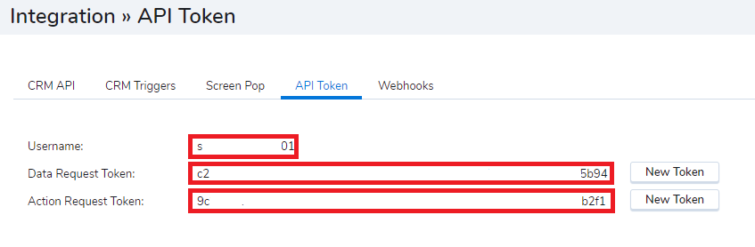
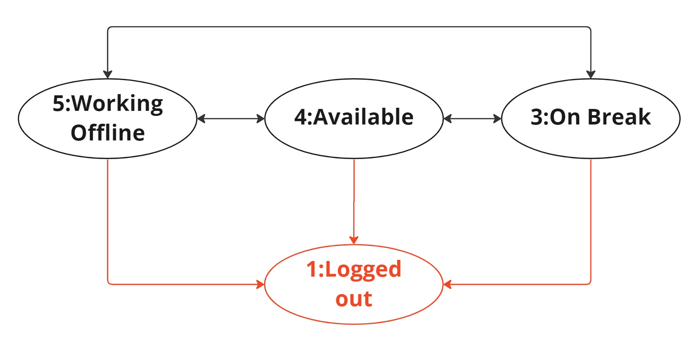

# CC Managing Agent Status

This guide describes how to manage agent status via API

## Authentication

CC Campaign APIs leverage the credentials from the Integration >> API Token area in Configuration Manager.  
These APIs use Basic Authentication.  
The username will be the "Username" value from this screen, it is generally the tenant name

`Authorization :Basic encodedValue`

Where encodedValue is base64encode(username:password)



> 📘 If there are no token values
>
> If the token values are empty you can generate the token by clicking on 'New Token'. Once a token is generated, if you would like to generate a new one, please be aware that once a new token is generated, the old one will not work anymore for anybody.
>

## Get Status for all agents

### Parameters

**Method: GET**

#### Headers

| Name          | Required | Description                                                                                                                                                                         | Example                                    |
| :------------ | :------- | :---------------------------------------------------------------------------------------------------------------------------------------------------------------------------------- | :----------------------------------------- |
| Authorization | ✓        | [Basic Authentication](https://en.wikipedia.org/wiki/Basic_access_authentication) where username is the value of username and the password is the value of **Action Request Token** | Basic bXljbGllbnRJZDpuZXZlcnRlbGxhbnlvbmU= |

#### Path

| Name       | Required | Description                                                                                                                                                                                                                                                | Example    |
| ---------- | -------- | ---------------------------------------------------------------------------------------------------------------------------------------------------------------------------------------------------------------------------------------------------------- | ---------- |
| ccPlatform | ✓        | Contact Center platform can be found in the url when accessing CC Configuration Manager.<br>North America starts NA<br>Europe starts EU<br>Canada starts CA<br>Asia Pacific starts AP<br>Australia starts AU<br>Bell Canada starts BC<br>Sandbox starts SB | na12       |
| version    | ✓        | The API version. The current version is 1 resulting in. v1                                                                                                                                                                                                 | v1         |
| tenantId   | ✓        | The CC Tenant name of the tenant to list agent status for. Tenant name is generally the same as the username above. It can be located in CC Configuration Manager @ Home :: Profile :: Tenant Name                                                         | acmecorp01 |

### All Agents Status Request

```curl
curl --location --request GET 'https://{ccPlatform}.8x8.com/api/v{version}/tenants/{tenantId}/agentstatus/agents' \
--header 'Authorization: Basic {encodedValue}'
```

### All Agent Status Response

```json
{
    "data": [
        {
            "agent-id": "ag0VYyLh0YTsymdbtYIaaaa",
            "agent-status": 1,
            "name": "Ilya Workshard"
        },
        {
            "agent-id": "ag0XgxWZr7TzqWFhxboBGj1g",
            "agent-status": 1,
            "status-code-list-id": -1,
            "status-code-item-id": 1,
            "name": "Jane Smith"
        },
        {
            "agent-id": "ag1LmqEeEYRoOti9KjIi_Dng",
            "agent-status": 0,
            "name": "Paul Neverhere"
        },
        {
            "agent-id": "ag64oyEUb_Sk6bxVB9P5ye5w",
            "agent-status": 5,
            "status-code-list-id": 801,
            "status-code-item-id": 1726,
            "status-code-item-short-code": "Train",
            "name": "Padma Othertask",
            "agent-sub-status": "none"
        }
    ]
}
```

## Get Status for single agent

To request status for an individual agent simply append the appropriate agentId `/agents/agentId`

### Parameters

**Method: GET**

#### Headers

| Name          | Required | Description                                                                                                                                                                         | Example                                    |
| :------------ | :------- | :---------------------------------------------------------------------------------------------------------------------------------------------------------------------------------- | :----------------------------------------- |
| Authorization | ✓        | [Basic Authentication](https://en.wikipedia.org/wiki/Basic_access_authentication) where username is the value of username and the password is the value of **Action Request Token** | Basic bXljbGllbnRJZDpuZXZlcnRlbGxhbnlvbmU= |

#### Path

| Name       | Required | Description                                                                                                                                                                                                                                                | Example                  |
| ---------- | -------- | ---------------------------------------------------------------------------------------------------------------------------------------------------------------------------------------------------------------------------------------------------------- | ------------------------ |
| ccPlatform | ✓        | Contact Center platform can be found in the url when accessing CC Configuration Manager.<br>North America starts NA<br>Europe starts EU<br>Canada starts CA<br>Asia Pacific starts AP<br>Australia starts AU<br>Bell Canada starts BC<br>Sandbox starts SB | na12                     |
| version    | ✓        | The API version. The current version is 1 resulting in. v1                                                                                                                                                                                                 | v1                       |
| tenantId   | ✓        | The CC Tenant name of the tenant to list agent status for. Tenant name is generally the same as the username above. It can be located in CC Configuration Manager @ Home :: Profile :: Tenant Name                                                         | acmecorp01               |
| agentId    | ✓        | The agentId of the agent to set the status for. This can be found in CC Configuration Manager "Users" add the "Internal Id" column, or in the "General" section of the user as "Internal Id"                                                               | ag64oyEUb_Sk6bxVB9P5yaaa |

### Single Agent Status Request

```curl
curl --location --request GET 'https://{ccPlatform}.8x8.com/api/v{version}/tenants/{tenantId}/agentstatus/agents/{agentId}' \
--header 'Authorization: Basic {encodedValue}'
```

### Single Agent Status Response

```json
{
  "agent-id": "ag64oyEUb_Sk6bxVB9P5yaaa",
  "agent-status": 5,
  "status-code-list-id": 801,
  "status-code-item-id": 1726,
  "status-code-item-short-code": "Train",
  "name": "Padma Othertask",
  "agent-sub-status": "none"
}
```

## Allowed Status Transitions

- Red lines indicate single direction (not reversible via API)
- Black lines indicate bidirectional
- All other transitions are NOT supported via API



[Agent status API Reference](/actions-events/reference/getagentsstatus) allows you to try out this API.

## Set Status for a single agent

The status can only be set to and from the statuses defined in [allowed status change diagram](/actions-events/docs/cc-managing-agent-status#allowed-status-transitions)

### Parameters

**Method: PUT**

#### Headers

| Name          | Required | Description                                                                                                                                                                         | Example                                    |
| :------------ | :------- | :---------------------------------------------------------------------------------------------------------------------------------------------------------------------------------- | :----------------------------------------- |
| Authorization | ✓        | [Basic Authentication](https://en.wikipedia.org/wiki/Basic_access_authentication) where username is the value of username and the password is the value of **Action Request Token** | Basic bXljbGllbnRJZDpuZXZlcnRlbGxhbnlvbmU= |
| Content-Type  | ✓        | Set the content type to application/json                                                                                                                                            | application/json                           |

#### Path

| Name       | Required | Description                                                                                                                                                                                                                                                | Example                 |
| ---------- | -------- | ---------------------------------------------------------------------------------------------------------------------------------------------------------------------------------------------------------------------------------------------------------- | ----------------------- |
| ccPlatform | ✓        | Contact Center platform can be found in the url when accessing CC Configuration Manager.<br>North America starts NA<br>Europe starts EU<br>Canada starts CA<br>Asia Pacific starts AP<br>Australia starts AU<br>Bell Canada starts BC<br>Sandbox starts SB | na12                    |
| version    | ✓        | The API version. The current version is 1 resulting in. v1                                                                                                                                                                                                 | v1                      |
| tenantID   | ✓        | The CC Tenant name of the tenant to list agent status for. Tenant name is generally the same as the username above. It can be located in CC Configuration Manager @ Home :: Profile :: Tenant Name                                                         | acmecorp01              |
| agentId    | ✓        | The agentId of the agent to set the status for. This can be found in CC Configuration Manager "Users" add the "Internal Id" column, or in the "General" section of the user as "Internal Id"                                                               | ag0VYyLh0YTsymdbtYIaaaa |

#### Body

| Name                        | Required | Description                                                                                                                                                                 | Example |
| :-------------------------- | :------- | :-------------------------------------------------------------------------------------------------------------------------------------------------------------------------- | :------ |
| agent-status                | ✓        | The status to assign to the agent. See [Status Values](/actions-events/docs/cc-managing-agent-status#status-values)                                                         | 5       |
| status-code-list-id         | ✓        | Status Code List Id is the id of the list. See [Status Code Lists and Items](/actions-events/docs/cc-managing-agent-status#status-code-lists-and-items)                     | 801     |
| status-code-item-id         | ✓        | The id of the item within the status code list. See [Status Code Lists and Items](/actions-events/docs/cc-managing-agent-status#status-code-lists-and-items)                | 1722    |
| status-code-item-short-code | ✓        | Short Text associated to the item within the status code list. See [Status Code Lists and Items](/actions-events/docs/cc-managing-agent-status#status-code-lists-and-items) | Meet    |

### Set Single Agent Status Request

```curl
curl --location --request PUT 'https://{ccPlatform}.8x8.com/api/v{version}/tenants/{tenantId}/agentstatus/agents/{agentId}' \
--header 'Authorization: Basic {encodedValue}'
--header 'Content-Type: application/json' \
--data-raw '{
    "agent-status": 5,
    "status-code-list-id": 801,
    "status-code-item-id": 1722,
    "status-code-item-short-code": "Meet"
}'
```

### Set Single Agent Status Response

```json
{
    "reason": "OK",
    "change-status": 200,
    "message": "Agent status change successful"
}
```

> 🚧 403 response code &lt;API&gt;&lt;Error&gt;403 - Forbidden.&lt;/Error&gt;&lt;/API&gt;
>
> Historically this capability has only enabled on request. If you receive response code 403 then please contact 8x8 support and request that your "Agent Status API" is enabled in OPSCON.
>

## Set Status for Agents in bulk

To set the status of multiple agents in a single request.

- The requested status can be different for each agent.
- Each agent request is independent and some requests can succeed and others fail within a single request. The outcome is delivered via a HTTP 207 Multi-Status response.

### Parameters

**Method: PUT**

#### Headers

| Name          | Required | Description                                                                                                                                                                           | Example                                    |
| :------------ | :------- | :------------------------------------------------------------------------------------------------------------------------------------------------------------------------------------ | :----------------------------------------- |
| Authorization | ✓        | [Basic Authentication](https://en.wikipedia.org/wiki/Basic_access_authentication) where username is the value of username and the password is the value of **Action Request Token.** | Basic bXljbGllbnRJZDpuZXZlcnRlbGxhbnlvbmU= |
| Content-Type  | ✓        | Set the content type to application/json                                                                                                                                              | application/json                           |

#### Path

| Name       | Required | Description                                                                                                                                                                                                                                                | Example    |
| ---------- | -------- | ---------------------------------------------------------------------------------------------------------------------------------------------------------------------------------------------------------------------------------------------------------- | ---------- |
| ccPlatform | ✓        | Contact Center platform can be found in the url when accessing CC Configuration Manager.<br>North America starts NA<br>Europe starts EU<br>Canada starts CA<br>Asia Pacific starts AP<br>Australia starts AU<br>Bell Canada starts BC<br>Sandbox starts SB | na12       |
| version    | ✓        | The API version. The current version is 1 resulting in. v1                                                                                                                                                                                                 | v1         |
| tenantId   | ✓        | The CC Tenant name of the tenant to list agent status for. Tenant name is generally the same as the username above. It can be located in CC Configuration Manager @ Home :: Profile :: Tenant Name                                                         | acmecorp01 |

#### Body

The body will contain an array of agents, each entry in the array will have the following:

| Name                               | Required | Description                                                                                                                                                                                  | Example                  |
| :--------------------------------- | :------- | :------------------------------------------------------------------------------------------------------------------------------------------------------------------------------------------- | :----------------------- |
| agents.agent-id                    | ✓        | The agentId of the agent to set the status for. This can be found in CC Configuration Manager "Users" add the "Internal Id" column, or in the "General" section of the user as "Internal Id" | ag64oyEUb_Sk6bxVB9P5yaaa |
| agents.agent-status                |          | The status to assign to the agent. See [Status Values](/actions-events/docs/cc-managing-agent-status#status-values)                                                                          | 5                        |
| agents.status-code-list-id         | ✓        | Status Code List Id is the id of the list. See [Status Code Lists and Items](/actions-events/docs/cc-managing-agent-status#status-code-lists-and-items)                                      | 801                      |
| agents.status-code-item-id         | ✓        | The id of the item within the status code list. See [Status Code Lists and Items](/actions-events/docs/cc-managing-agent-status#status-code-lists-and-items)                                 | 1722                     |
| agents.status-code-item-short-code | ✓        | Short Text associated to the item within the status code list. See [Status Code Lists and Items](/actions-events/docs/cc-managing-agent-status#status-code-lists-and-items)                  | Meet                     |

### Set Bulk Status Request

```curl
curl --location --request PUT 'https://<<ccPlatform>>.8x8.com/api/v1/tenants/<<tenantId>>/agentstatus/agents/bulk' \
--header 'Authorization: Basic <<encodedValue>>'
--header 'Content-Type: application/json' \
--data-raw '{
    "agents": [
    {
        "agent-id": "ag64oyEUb_Sk6bxVB9P5yaaa",
        "agent-status": 3,
        "status-code-list-id": 801,
        "status-code-item-id": 1725,
        "status-code-item-short-code": "Lunch"
    },
    {
        "agent-id": "agAQDqmvKiRbG4ekigNSmbbb",
        "agent-status": 3,
        "status-code-list-id": 801,
        "status-code-item-id": 1725,
        "status-code-item-short-code": "Lunch"
    }
]
}'
```

### Set Bulk Status Response

Response Status is `207` and the individual status of each agent status change is contained in the body of the response

```json
{
    "data": [
        {
            "agent-id": "ag64oyEUb_Sk6bxVB9P5yaaa",
            "reason": "OK",
            "change-status": 200,
            "message": "Agent status change successful"
        },
        {
            "agent-id": "agAQDqmvKiRbG4ekigNSmbbb",
            "reason": "OK",
            "change-status": 200,
            "message": "Agent status change successful"
        }
    ]
}
```

## References

### Status Values that can be changed as explained in the diagram form the beginning of this documentation

| Status | Label         | Description                                                                                                            |
| :----- | :------------ | :--------------------------------------------------------------------------------------------------------------------- |
| 1      | LOGGED_OUT    | Currently logged out (and has previously logged in at least one time)                                                  |
| 3      | ON_BREAK      | On break status, could be manually selected or automatically on break based on initial login or missing a transaction. |
| 4      | WAIT_TRANSACT | Available                                                                                                              |
| 5      | WORK_OFFLINE  | Working offline                                                                                                        |

### Status Values that can be returned by the GET operations but cannot be ammended by the SET operation

| Status | Label            | Description                                                                          |
| :----- | :--------------- | :----------------------------------------------------------------------------------- |
| 0      | UNKNOWN          | Generally the Agent has never logged in                                              |
| 2      | LOGGED_IN        |                                                                                      |
| 6      | TRANSACT_OFFERED |                                                                                      |
| 7      | PROCESS_TRANSACT |                                                                                      |
| 8      | POST_PROCESS     |                                                                                      |
| 9      | BUSY             |                                                                                      |
| 10     | DIRECT_CALL      | Note: If a direct call is also marking the agent Busy then the status will be 9 BUSY |
| 11     | ON_EMAIL         |                                                                                      |

### Status Code Lists and Items

Status Code Lists are assigned to Agent Groups via CC Configuration Manager.  
These lists allow for a specific reason for the status to be selected by the agent or in this case assigned via the API.

**status-code-list-id** this is the id of the list itself: This can be identified either by using the [Get Agent Status](#get-status-for-all-agents) or via the stats API.

**status-code-item-id** this is the id of the list itself: This can be identified either by using the [Get Agent Status](#get-status-for-all-agents) to return the values for an agent in a known state or via the stats API.

**status-code-item-short-code**  This can be found in CC Configuration Manager under: Status Codes, by selecting the required Status Code List, then under "Codes" referencing the "Short Codes" column, or by using the [Get Agent Status](#get-status-for-all-agents) to return the values for an agent in a known state or via the stats API.
