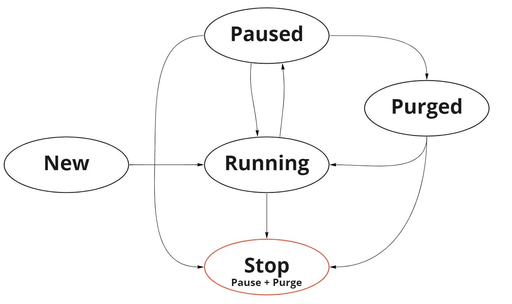

# CC Managing Campaign Status

> 📘 **Prerequisites**
>
> * The Campaign MUST be configured as a Dynamic Campaign in Configuration Manager
>

## Authentication

CC Campaign APIs leverage the credentials from the Integration >> API Token area in Configuration Manager.  

These APIs use Basic Authentication.  

The username will be the "Username" value from this screen, it is generally the tenant name  

**For read APIs the Data Request Token will the password**  

**For write APIs the Action Request Token will be the password**  

`Authorization :Basic encodedValue`  

Where encodedValue is base64encode(username:password)


## Working with Campaign Status

### Status Assignment

**RUNNING** - Change status to Running from one of the allowed initial states  

**PAUSED** - Change status to Paused from one of the allowed initial states  

**PURGED** - Change status to Purged from one of the allowed initial states  

**STOPPED** - Change status to Stopped from one of the allowed initial states. **Stopped is a FINAL STATE**

### Allowed Campaign Status Changes

No other transitions are allowed, once a campaign is Stopped it cannot be restarted.

Allowed Campaign State Transitions

## Get Campaign Status

> 🚧 **URLS vary in this section with an additional 't' in setting campaign status**
>
> For **Getting** the campaign status the url contains stats: /api/stats/campaigns/  
>
> For **Setting** the campaign status the url contains tstats: /api/**t**stats/campaigns/
>
>

### Parameters

**Method: GET**

#### Headers

| Name          | Required | Description                                                                                                                                                                        | Example                                    |
| ------------- | -------- | ---------------------------------------------------------------------------------------------------------------------------------------------------------------------------------- | ------------------------------------------ |
| Authorization | ✓        | [Basic Authentication](https://en.wikipedia.org/wiki/Basic_access_authentication) where username is the value of username and the password is the value of **Data Request Token**. | Basic bXljbGllbnRJZDpuZXZlcnRlbGxhbnlvbmU= |

#### Path

| Name       | Required | Description                                                                                                                                                                                                                                                               | Example |
| ---------- | -------- | ------------------------------------------------------------------------------------------------------------------------------------------------------------------------------------------------------------------------------------------------------------------------- | ------- |
| ccPlatform | ✓        | Contact Center platform can be found in the url when accessing CC Configuration Manager. <br />North America starts NA<br />Europe starts EU<br />Canada starts CA<br />Asia Pacific starts AP<br />Australia starts AU<br />Bell Canada starts BC<br />Sandbox starts SB | na12    |
| campaignId | ✓        | The id of the campaign to get the status for. Can be located in CC Configuration Manager "Campaigns" and adding the "Campaign ID" column, or within a specific campaign as part of "Properties", "General Properties"                                                     | 125     |

### Campaign Status Request

```bash
curl --location --request GET 'https://vcc-{ccPlatform}.8x8.com/api/stats/campaigns/{campaignId}.json' \
--header 'Authorization: Basic {encodedValue}'

```

### Campaign Status Response

```json
{
    "campaign": {
        "campaign-name": "My Callbacks",
        "campaign-id": 6561,
        "enabled": "Y",
        "status": 3,
        "no-of-records": 18,
        "caller-id": 13125555068,
        "queue-id": 598,
        "start-time": "",
        "end-time": "",
        "actual-run-time": "2022-10-17T22:31:02+01:00",
        "actual-stop-time": "",
        "daily-start-time": "",
        "daily-end-time": "",
        "retry-interval": 30,
        "max-retry": 1,
        "abandon-max-retry": "",
        "max-ring-time": 15,
        "integration-type": "contactual",
        "calling-window": 2,
        "schedule-name": "'5-6pm Eastern'",
        "timezone": "EST5EST",
        "dynamic-campaign": "Y",
        "sequential": "N"
    }
}

```

## Change Campaign Status

> 🚧 **URLS vary in this section with an additional 't' in setting campaign status**
>
> For **Getting** the campaign status the url contains stats: /api/stats/campaigns/  
>
> For **Setting** the campaign status the url contains tstats: /api/**t**stats/campaigns/
>
>

### Parameters

**Method: POST**

#### Headers

| Name          | Required | Description                                                                                                                                                                        | Example                                    |
| ------------- | -------- | ---------------------------------------------------------------------------------------------------------------------------------------------------------------------------------- | ------------------------------------------ |
| Authorization | ✓        | [Basic Authentication](https://en.wikipedia.org/wiki/Basic_access_authentication) where username is the value of username and the password is the value of **Data Request Token**. | Basic bXljbGllbnRJZDpuZXZlcnRlbGxhbnlvbmU= |

#### Path

| Name       | Required | Description                                                                                                                                                                                                                                                               | Example |
| ---------- | -------- | ------------------------------------------------------------------------------------------------------------------------------------------------------------------------------------------------------------------------------------------------------------------------- | ------- |
| ccPlatform | ✓        | Contact Center platform can be found in the url when accessing CC Configuration Manager. <br />North America starts NA<br />Europe starts EU<br />Canada starts CA<br />Asia Pacific starts AP<br />Australia starts AU<br />Bell Canada starts BC<br />Sandbox starts SB | na12    |
| campaignId | ✓        | The id of the campaign to get the status for. Can be located in CC Configuration Manager "Campaigns" and adding the "Campaign ID" column, or within a specific campaign as part of "Properties", "General Properties"                                                     | 125     |

#### Body

| Name   | Required | Description                                                                                                                                                                                                                                                                                                                | Example |
| ------ | -------- | -------------------------------------------------------------------------------------------------------------------------------------------------------------------------------------------------------------------------------------------------------------------------------------------------------------------------- | ------- |
| status | ✓        | The status to change the campaign state to: See [Status Assignment](/actions-events/docs/cc-managing-campaign-status#status-assignment) and [Allowed Campaign Status Changes](/actions-events/docs/cc-managing-campaign-status#allowed-campaign-status-changes) <br />- RUNNING<br />- PAUSED<br />- PURGED<br />- STOPPED | RUNNING |

### Change Campaign Status Request

```bash
curl --location --request POST 'https://vcc-{ccPlatform}.8x8.com/api/tstats/campaigns/{campaignId}' \
--header 'Content-Type: application/json' \
--header 'Authorization: Basic {encodedValue}'
--data-raw '{
  "status": "RUNNING"
}'

```

### Change Campaign Status Response

```json
{
    "message": "Campaign status changed."
}

```

## References

### Campaign Status List

| Campaign Status ID | Description                                                                                                                                           |
| ------------------ | ----------------------------------------------------------------------------------------------------------------------------------------------------- |
| 0                  | **New** <br /> Campaigns that are newly created that have not been started or scheduled.                                                              |
| 1                  | **Manual Started** <br /> Campaigns that have been manually started.                                                                                  |
| 2                  | **Scheduled** <br /> Campaigns with scheduled start time that have been started but start time has not been reached.                                  |
| 3                  | **Manual Running** <br /> Campaigns that have been started manually without schedule. These campaigns go into running state right after it is started |
| 4                  | **Schedule Running** <br /> Campaigns that have reached scheduled start time and successfully run. These campaigns are still in running states.       |
| 5                  | **Manual Stopped** <br /> Campaigns that have been manually stopped by clicking stop button                                                           |
| 6                  | **Completed (Stopped)** <br /> Campaigns have all records completed. These campaigns stopped.                                                         |
| 7                  | **Schedule Stopped** <br /> Campaigns that have been stopped due to scheduled stop time has been reached.                                             |
| 8                  | **Manual Paused** <br /> Campaigns that have been paused. All the queued records will continue to be processed.                                       |
| 9                  | **Schedule Paused**                                                                                                                                   |
| 10                 | **Manual Purged** <br /> Campaigns that have been paused and records that are in the queues have been flushed as appropriate.                         |
| 11                 | **Schedule Purged**                                                                                                                                   |
