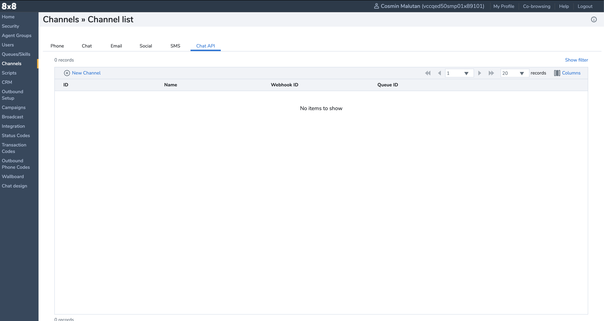
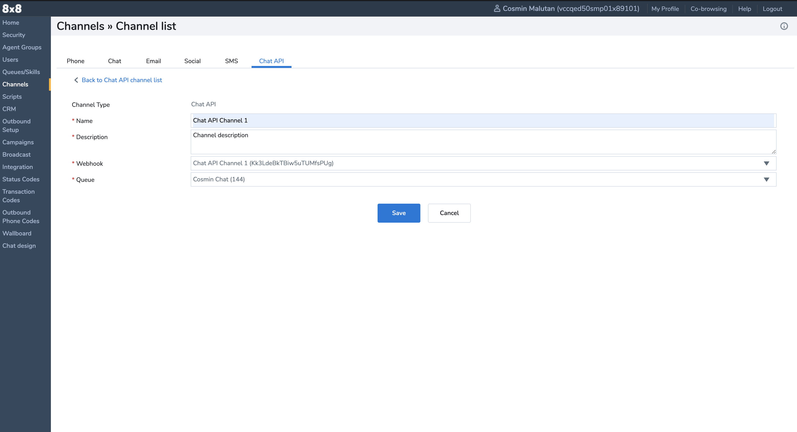

# Channel

After creating a webhook you can then create a channel. The channel contains a webhook that passes the outbound messages and notifications.

The channel has a **[chat queue](https://docs.8x8.com/8x8WebHelp/VCC/configuration-manager-unified-login/content/queuespageoverview.htm)** (ideally with an agent assigned), for routed inbound conversations.

A Channel can be created either via UI or via API.

## Create a channel using Configuration Manager

1. Access [Configuration Manager](https://docs.8x8.com/8x8WebHelp/VCC/configuration-manager-general/content/cfgoverview.htm).
2. Go to **Channels > Chat API**

3. Click **New Channel**

4. Complete the **Name**, **Description**, **Webhook** and **Queue** fields
5. Click **Save**

## Create a channel using API

1. Obtain your **[API key](/actions-events/docs/api-key)**
2. Call the **[Create a Channel endpoint](/actions-events/reference/createchatapichannel-1)**
