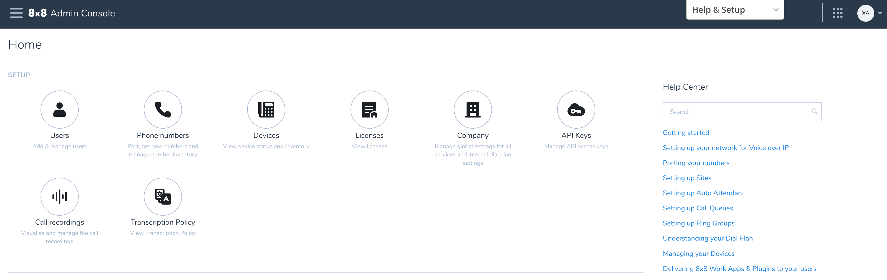
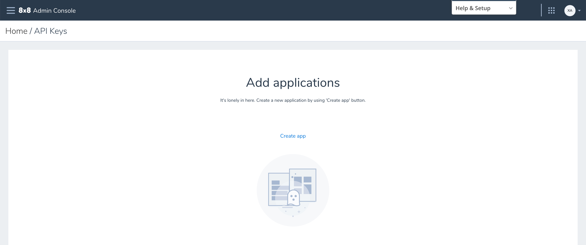
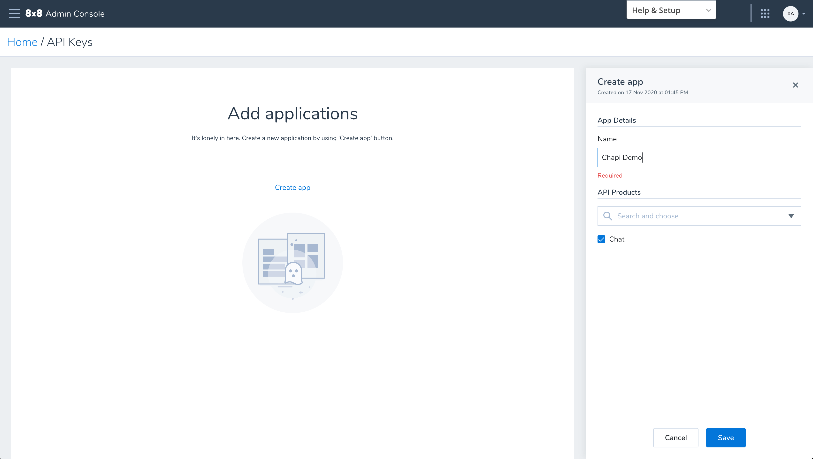

# API Key

You can now get an API key via the 8x8 [Admin Console.](https://admin.8x8.com)

Admin Console Home Page

1. Click on API Keys

2. Click on Create App

3. Add A new Application. Here you'll give it a name, and under API products select "Chat" to create an API key enabled for Chapi.
