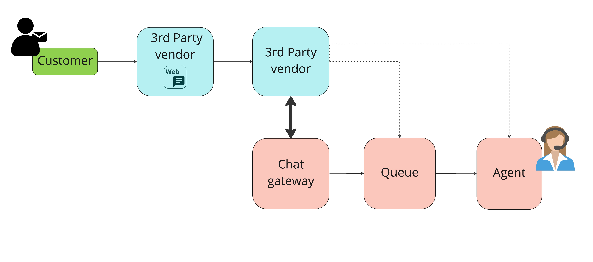

# Chat Gateway

## Overview

The 8x8 Contact Center Chat Gateway enables you to provide chat services with your chat app and chatbot.

The Chat Gateway API provides a server-to-server integration that enables a client application to provide chat services while retaining full control of both the user interface and experience. The Chat Gateway API also supports chatbot integration so you can have direct conversations to further enhance your customer service deflection capabilities (e.g., chatbots facilitate the initial customer engagement which would then be transferred to a live agent as needed). Enhanced automation such as chatbots drives agent efficiencies and reduces new agent training costs.

Your customers can use their phones or digital devices to communicate and engage with your service agents or representatives through messaging. The types of communication channels include:

* Mobile app-based chat
* Desktop web chatbots
* Messaging via integrations with other apps or platforms

The API routes customer communications to your Contact Center enabled agents from initial engagement. This provides continuity of experience and ensures customer confidence in your enterprise as you proactively respond to their inquiries. Using Contact Center with the Chat Gateway API enables you to scale and manage your customer service engagements.

The Chat Gateway enables you to:

* Initiate (chatbot) conversations with your customers and then hand them over to available agents
* Achieve 2-way communication by using web API calls and callbacks to and from Contact Center.  

You are able to forward customer messages and are notified when your agents reply to customers.

* Route conversations straight into the preferred queue and let Contact Center handle the agent assignment based on availability and experience.

Additional functions include:  

• Screen-pops with relevant CRM customer information

```text
•  Pass the context of the bot conversation to the agent

•  Pass the full transcription of the bot conversation to the agent

•  Update CRM information while a customer is queuing

•  Display of FAQs or prepared responses

•  Auto-translation of customer messages

•  Standardized transaction codes while wrapping up customer interactions

•  Transfer chats to other queues or departments

```

## Use cases

A retail client wants to be able to add the ability for their webchat customers to see where their order is, without the need to speak to an agent. However, they want to be able to hand over other queries to an agent. The client can engage with a 3rd party conversational AI provider to provide a chatbot, then use their chat widget where they can provide the self-serve for customers on the progress of their orders. When the query needs to be handed over to an agent, the chatbot will connect into the chat gateway, which allows them to route the customer through to a queue, which will then be received by an agent. When the agent accepts this interaction, they will receive information from the chatbot on what the query is about and be able to see a full transcript of the chatbot conversation. The agent can then communicate with the customer to help solve their query.

## Example flow with vendor channels

A customer uses a 3rd party vendors widget on a web site  

The 3rd party vendor provides self serve capability to this customer  

The customer wants to speak to an agent  

3rd party vendor connects to the 8x8 chat gateway  

3rd party vendor selects the queue to route  

The customer is then queue and connected with an agent with chat history and customer information provided from the 3rd party vendor



## Example flow with 8x8 digital channels

A customer uses an 8x8 widget on a web site  

8x8 route this query through to a 3rd party vendor for self serve  

During self serve, the bot recognises that the customer wants to speak to an agent  

3rd party vendor selects the queue to route  

The customer is then queue and connected with an agent with chat history and customer information provided from the 3rd party vendor


