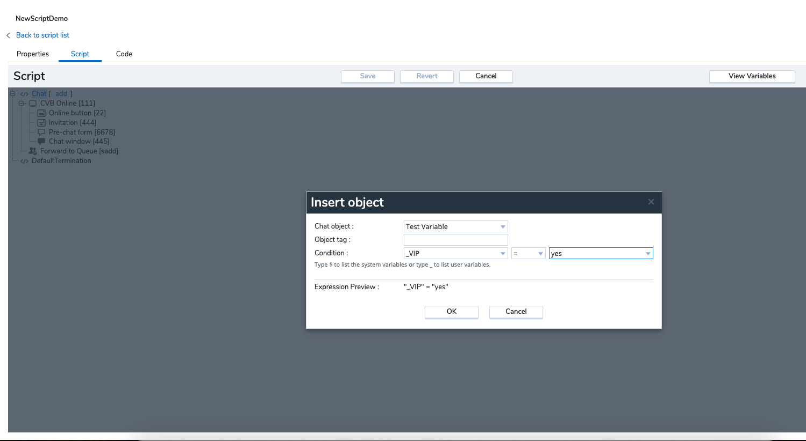

# Set chat variables

## Introduction

Variables can be sent into the widget for a number of reasons. The first is so they can be used to update data in the 8x8 Native CRM, for example sending in an email address create a record and execute a screen pop. Also you can set custom variables, which can then be used for routed within the 8x8 script.

CRM variables:  

'$language',  

'$caseNumber',  

'$accountNumber',  

'$emailAddress',  

'$emailSubject',  

'$emailBody'

### Script config

Here is an example, where we are setting a variable to show the customer is a VIP, so inside the scripting they can go to that queue, and also setting the email address to it can create a screen pop for the agent.

```javascript
// set variables
chatApp.setVariables({"_VIP":"YES", 
                      "$language":"fr", 
                      "$emailAddress": "testemail@example.com"}
```

To add this, you need to add it at the bottom of the script in this area here

```html
})(
  --ADD THE FUNCTION CHATAPP CODE HERE
);
</script>

```

Then, the full script will look like this

```javascript
    <!-- Place this code snippet anywhere you want the button to appear in your page. If no button has been configured in the chat script, it will not show up nor take any space. -->
    <div id="__8x8-chat-button-container-script_1333070733643e5b8fa7a791.52161248"></div>

    <!-- This script will not interfere with the button layout, you just need to include it in the same page. It must also be within the \\<body\\> section of the page, preferably just before the ending tag. -->
    <script type="text/javascript">
    (function(c, f, ef){
        var typeofC = Object.prototype.toString.call(c);
        var props = (typeofC === '[object Object]' && c) || {};
        var cb = f || (typeofC === '[object Function]' && c);
        var config = {
            scriptUuid: "script_1333070733643e5b8fa7a791.52161248",
            tenant: "Y2hyaXNjcm9tYmllZGVtbzAx",
            channelName: "WebChatChannel",
            channelUuid: "Ak3ULjXFQx-unSA6ebdW8A",
            domain: "https://vcc-eu11.8x8.com",
            buttonContainerId: "__8x8-chat-button-container-script_1333070733643e5b8fa7a791.52161248",
            align: "right",
        };

        var url = new URL("https://cloud8-cc-geo.8x8.com/vcc-chat-channels/public/webchat/discovery");
        var params = { domain: config.domain, tenant: config.tenant, channelUuid: config.channelUuid };
        url.search = new URLSearchParams(params).toString();
        fetch(url)
            .then(response => response.json())
            .then(data => config.domain = !data.domain ? config.domain : data.domain)
            .catch(error => console.warn('Failed to retrieve override domain, will continue using ', config.domain, error))
            .finally(() => loadChat());

        function loadChat() {
            var se = document.createElement("script");
            se.type = "text/javascript";
            se.async = true;
            se.src = props.loaderURL || (config.domain + "/CHAT/common/js/chatv3.js");
            Object.keys(config).forEach(function (k) { se.dataset[k] = config[k] });
            Object.keys(props).forEach(function (k) { se.dataset[k] = props[k] });
            function handleInitEvent(e) {
                var initFn = e.detail.init;
                initFn(config, cb);
                se.removeEventListener('init', handleInitEvent)
            }
            function handleErrorEvent(e) {
                ef && ef(e);
                se.removeEventListener('customerror', handleErrorEvent);
            }
            se.addEventListener('init', handleInitEvent);
            se.addEventListener('customerror', handleErrorEvent);
            var os = document.getElementsByTagName("script")[0];
            os.parentNode.insertBefore(se, os);
        }
    })(function (chatApp) {
// set variables
chatApp.setVariables({"_VIP":"YES", 
                      "$language":"fr", 
                      "$emailAddress": "testemail@example.com"})
}
);
    </script>

```

### 8x8 script

Then inside the 8x8 script, you can use the variable like the below, to route to the queue you want them to go to


  
### Important Notes

* Language $language is the only CRM variable that will not be sent back in CM to use inside chat script testVariable node but will actually take effect immediately and change the chat language; also it will set the default language option value in pre-chat language question drop-down select (if pre-chat and language question set).
* If no pre-chat form/no language question is set then the only effect is the language change for the available next steps (chat window, offline form).
* All custom variables prefixed with _ and the rest of the CRM variables available ($emailAddress, $emailBody etc.) end up in the interaction details and additional properties in AW.
* The variables key:value pair is limited to 255 characters for the key and the value each. Any key:pair bigger than the specified value will be ignored.
* The variable key that is not a string and does not match the pattern *(any alphanumeric characters plus underscore _, any digit 1-9, a hyphen -)* will be ignored and a warning is shown in the console.

### Troubleshooting

* Make sure that, when passing the variables the correct format and type string is adhered to and it is a key-value object.
* If the message *"Customer variable: provided variable [variableKey] does not match the expected pattern or its chars exceeded the max length of 255. It will be discarded"*, it means that the set custom variable key value is of a format or pattern unsupported by the embedded chat. Only custom variables prefixed with _ and that match the pattern *(any alphanumeric characters plus underscore _, any digit 1-9, a hyphen -)* are accepted.
* If the message *"Customer variable: provided system variable [variableKey ] it's not supported. It will be discarded"*, it means that the set system variable key value is of a format or pattern unsupported by the embedded chat. Only CRM variables prefixed with $ and that match the pattern *(any alphanumeric characters plus underscore _, any digit 1-9, a hyphen -)* and are included in the System Variables map are accepted.
* If the message *"Customer variable: provided variable [variableKey] is not a string or its chars exceeded the max length of 255. It will be discarded"*, it means that the set variable key value is of a format or size unsupported by the embedded chat. Only variables of format string with key and value max length of 255 characters each are accepted.
