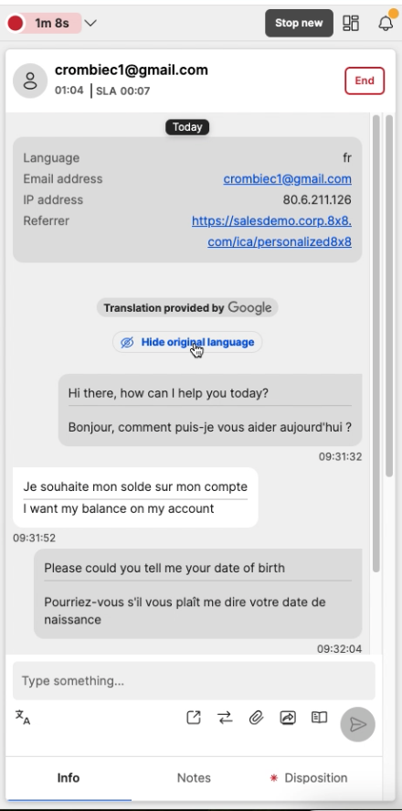
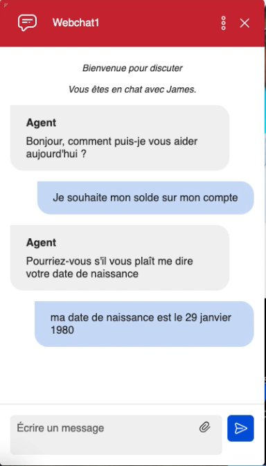

# Chat Language

## Introduction

Using the webchat, you may have a customer that is comforable speaking in their own language, so we offer realtime translation on this chat, you can find more on this service [here](https://docs.8x8.com/8x8WebHelp/contact-center/agent-workspace/Content/aw/handle-multilingual-chats.htm)

When using the webchat API, you can decide to set the language, other than it using the form or the customer browser language.

The list of supported languages are:  

English: en  

Russian: ru  

German: de  

Japanese: ja  

Spanish: es  

French: fr  

Portuguese: pt  

Italian: it  

Polish: pl  

Croatian: hr  

Hindi: hi  

Dutch: nl  

Arabic: ar  

Danish: da  

Korean: ko  

Norwegian: no  

Swedish: sv  

Vietnamese: vi  

Welsh: cy  

Thai: th  

Simplified Chinese: zh-CN  

Traditional Chinese: zh-TW

### Script config

Here is an example of where the language you to set for the customer is French.

```javascript
function fn(chatApp) {
  chatApp.setCustomerLanguage("fr"); 
}
```

To add this, you need to add it at the bottom of the script in this area here

```html
})(  
--ADD THE FUNCTION CHATAPP CODE HERE  
);  
    </script>
```

Then, the full script will look like this

```javascript
    <!-- Place this code snippet anywhere you want the button to appear in your page. If no button has been configured in the chat script, it will not show up nor take any space. -->
    <div id="__8x8-chat-button-container-script_1333070733643e5b8fa7a791.52161248"></div>

    <!-- This script will not interfere with the button layout, you just need to include it in the same page. It must also be within the <body> section of the page, preferably just before the ending tag. -->
    <script type="text/javascript">
    (function(c, f, ef){
        var typeofC = Object.prototype.toString.call(c);
        var props = (typeofC === '[object Object]' && c) || {};
        var cb = f || (typeofC === '[object Function]' && c);
        var config = {
            scriptUuid: "script_1333070733643e5b8fa7a791.52161248",
            tenant: "Y2hyaXNjcm9tYmllZGVtbzAx",
            channelName: "WebChatChannel",
            channelUuid: "Ak3ULjXFQx-unSA6ebdW8A",
            domain: "https://vcc-eu11.8x8.com",
            buttonContainerId: "__8x8-chat-button-container-script_1333070733643e5b8fa7a791.52161248",
            align: "right",
        };

        var url = new URL("https://cloud8-cc-geo.8x8.com/vcc-chat-channels/public/webchat/discovery");
        var params = { domain: config.domain, tenant: config.tenant, channelUuid: config.channelUuid };
        url.search = new URLSearchParams(params).toString();
        fetch(url)
            .then(response => response.json())
            .then(data => config.domain = !data.domain ? config.domain : data.domain)
            .catch(error => console.warn('Failed to retrieve override domain, will continue using ', config.domain, error))
            .finally(() => loadChat());

        function loadChat() {
            var se = document.createElement("script");
            se.type = "text/javascript";
            se.async = true;
            se.src = props.loaderURL || (config.domain + "/CHAT/common/js/chatv3.js");
            Object.keys(config).forEach(function (k) { se.dataset[k] = config[k] });
            Object.keys(props).forEach(function (k) { se.dataset[k] = props[k] });
            function handleInitEvent(e) {
                var initFn = e.detail.init;
                initFn(config, cb);
                se.removeEventListener('init', handleInitEvent)
            }
            function handleErrorEvent(e) {
                ef && ef(e);
                se.removeEventListener('customerror', handleErrorEvent);
            }
            se.addEventListener('init', handleInitEvent);
            se.addEventListener('customerror', handleErrorEvent);
            var os = document.getElementsByTagName("script")[0];
            os.parentNode.insertBefore(se, os);
        }
    })(function (chatApp) {
        chatApp.setCustomerLanguage("fr");
    });
    </script>

```

### Agent view

When the query is routed through to an agent, they will be able to see the data that was passed into the webchat, in both the interaction panel



Here, it what the customer see's so the full conversation is in french



### Important Notes

* The chat language can be set at any time before starting a chat (when the customer enters a queue) and you can change it as many time as you want, only the last value will be considered.
* Same elements that are translated with pre-chat form set language or default browser/tenant language will be translated here as well.
* Questions in the pre-chat form and quick replies are not currently translated
