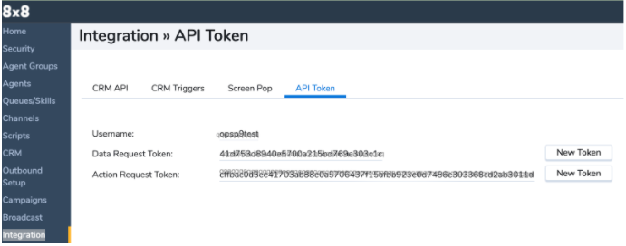
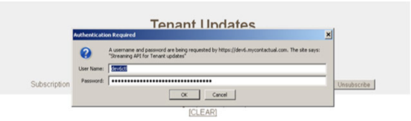
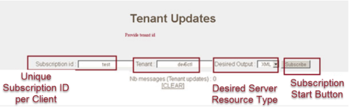

# Streaming API Overview

## General Approach

Generally the Streaming API should be considered only when alternate approaches are not capable of meeting the needs. For general analytic, non real-time even type scenarios the [CCA Realtime], [CCA Historical], [CEX Recent Calls] APIs provide a simpler approach.

When there is a need for real-time event streams or other advanced use cases SAPI is often the appropriate API. It is well adopted and leveraged both by customers, partners and technology partners at scale.

SAPI is intended to be used in a Server to Server or Cloud to Cloud approach and is not intended to be used where a subscription is made from each agents desktop. In cases where there is a need to deliver events to multiple locations/endpoints a central subscription should be made and this should provide an input to a publisher that satisfies the downstream consumers.

## Overview

The SAPI enables you to receive streaming event update information for a Contact Center tenant. You will receive notifications for both agent status and provisioning as well as interactions that occur within your tenant. There is no filter capability all events for all event types are delivered.

SAPI provides data for real-time events via server push notifications. It uses a Websocket protocol-based event stream and does not use HTTP. Therefore, in order to communicate via WebSocket protocol, you need to maintain a WebSocket connection to the CC platform.

## Accessing the API

### Authentication

In order to subscribe to SAPI events, you must first obtain an authentication token that has been issued for your tenant. This token is a single string that combines your username and password.

To either obtain an existing or generate a new authentication token:

1. Log into **Contact Center (CC) Configuration Manager**.
2. On the menu, pane go to **Integration** **> API Token**
3. If no tokens are present, click the **New Token** box next to the **Data Request Token** field.



4. Copy the generated **Data Request Token** to your clipboard for authentication use.

**Note**: The generated authentication token for your tenant can be used for your SAPI as well as other 8x8 API requests. It does not expire nor have a time limit unless you decide to change it. If you already have a token and you click on the **New Token** button, your existing authentication token becomes invalid **for all use cases**. You should save a copy in a safe storage location for future reference.

### Subscribing to SAPI

#### URL Format

wss://vcc-`{cluster}`.8x8.com/api/streaming/v`{version}`/clientconnect/subscribe/TenantUpdates-`{tenant}`-`{subscriptionId}`?desiredOutputType=`{outputType}`&tenantId=`{tenantId}`&subsId=`{subscriptionId}`

#### Parameters

#### Path

| Name           | Required | Description                                                                                                                                                                                                                                                              | Example           |
| -------------- | -------- | ------------------------------------------------------------------------------------------------------------------------------------------------------------------------------------------------------------------------------------------------------------------------ | ----------------- |
| cluster        | ✓        | Contact Center cluster can be found in the url when accessing CC Configuration Manager. <br />North America starts NA<br />Europe starts EU<br />Canada starts CA<br />Asia Pacific starts AP<br />Australia starts AU<br />Bell Canada starts BC<br />Sandbox starts SB | eu3               |
| version        | ✓        | The API version. The current version is 1 resulting in v1                                                                                                                                                                                                                | 1                 |
| subscriptionId | ✓        | This is a consumer specified unique identifier for the subscription. See [Connection Lifecycle Information](/actions-events/docs/streaming-api-overview#connection-lifecycle-information) for guidance.                                                                  | real-time-monitor |

#### Query

| Name              | Required | Description                                                                                                                                                                                        | Example           |
| ----------------- | -------- | -------------------------------------------------------------------------------------------------------------------------------------------------------------------------------------------------- | ----------------- |
| tenantId          | ✓        | The CC Tenant name of the tenant to list agent status for. Tenant name is generally the same as the username above. It can be located in CC Configuration Manager @ Home :: Profile :: Tenant Name | acmecorp01        |
| subscriptionId    | ✓        | As specified in the `Path` above.                                                                                                                                                                  | real-time-monitor |
| desiredOutputType |          | This controls the output format of the stream. Options are: JSON, XML, NEWLINE_JSON and NEWLINE_XML. The NEWLINE variants will emit a newline after each event in the specified format             | NEWLINE_JSON      |

### Connection Lifecycle Information

Please review the following details before you begin using SAPI:

* Only three SAPI clients per tenant can be connected at a given time.
* If you wish to make more than one distinct connection/subscription you MUST use a unique subscriptionId for each connection. (Max 3 concurrent subscriptions)
* A subscription is valid for 60 minutes after which it will be disconnected.
  * On disconnect the subscription will cache up to 2 hours of data, reconnecting using the same subscriptionId will deliver all the cached events.
  * Consumers should reconnect using the same subscriptionId to continue the stream.
  * If a consumer subscribes with the same subscriptionId more than 2 hours after disconnecting this is treated as a new subscription and no cached events are delivered.

## Event Reference

### Event types / call state

The following table lists the SAPI Event Type with the corresponding Call State ID and definition:

> 📘 **callState ID will only be available for Call/Interaction events.**
>
> Property `callState` is not present in event types indicated by callState ID **`NA`**.
>
>

| **Event Type**                     | **callState ID**                  | **Definition**                                                                                                                                                                                                                                                                                                                                                                                                                                                                                                                                                                 |
| ---------------------------------- | --------------------------------- | ------------------------------------------------------------------------------------------------------------------------------------------------------------------------------------------------------------------------------------------------------------------------------------------------------------------------------------------------------------------------------------------------------------------------------------------------------------------------------------------------------------------------------------------------------------------------------ |
| **`AgentStatusChange`**            | **`NA`**                          | Indicates the current status of the monitored agent.                                                                                                                                                                                                                                                                                                                                                                                                                                                                                                                           |
| **`AgentProvChange`**              | **`NA`**                          | Indicates a change to the agent profile. For example; display name change, etc.                                                                                                                                                                                                                                                                                                                                                                                                                                                                                                |
| **`InteractionCreated`**           | **`CS_IDLE, CS_QUEUED`**          | Indicates that a new outbound or inbound phone call has been created. Note that if it is an outbound type, it will be subject to queuing if part of a campaign prior to dialing.                                                                                                                                                                                                                                                                                                                                                                                               |
| **`InteractionDeleted`**           | **`CS_DISCONNECTED`**             | Indicates a phone call hangup or a single call leg when leaving a conference scenario.<br /> Also includes the following enums:<br /><br /> **`hangupInitiator`**-<br /><br />**`SYSTEM`**<br />**`AGENT`**<br />**`CUSTOMER`**<br /><br />**`callHangupReason`**-<br /><br />**`CEC_NONE`**<br />**`CEC_DISCONNECT_NORMAL`**<br />**`CEC_DISCONNECT_BUSY`**<br />**`CEC_DISCONNECT_BADADDRESS`**<br />**`CEC_DISCONNECT_NOANSWER`**<br />**`CEC_DISCONNECT_CANCELLED`**<br />**`CEC_DISCONNECT_REJECTED`**<br />**`CEC_DISCONNECT_FAILED`**<br />**`CEC_DISCONNECT_BLOCKED`** |
| **`Interaction Hold/Unhold`**      | **`CS_HOLD /CS_CONNECTED`**       | Indicates the playing of music on hold (MOH) for an ongoing phone call.                                                                                                                                                                                                                                                                                                                                                                                                                                                                                                        |
| **`InteractionQueued`**            | **`CS_QUEUED`**                   | Indicates an incoming phone call. The newly created inbound phone call has been queued and is waiting to be assigned to an agent.                                                                                                                                                                                                                                                                                                                                                                                                                                              |
| **`InteractionAssigned`**          | **`CS_IDLE`**                     | This means an outbound or an inbound call has been assigned to an available agent.                                                                                                                                                                                                                                                                                                                                                                                                                                                                                             |
| **`InteractionRecordingStarted`**  | **`NA`**                          | Indicates that the system has started recording a call leg.                                                                                                                                                                                                                                                                                                                                                                                                                                                                                                                    |
| **`InteractionAccepted`**          | **`CS_INPROGRESS /CS_CONNECTED`** | Indicates an outbound phone call is in progress and ringing at the destination with an accepted agent waiting for the customer to answer. If inbound, this means the queued phone call has been accepted by an agent                                                                                                                                                                                                                                                                                                                                                           |
| **`InteractionCustomerAccepted`**  | **`CS_CONNECTED`**                | Indicates that a ringing outbound phone call has been answered by the destination external participant / customer.                                                                                                                                                                                                                                                                                                                                                                                                                                                             |
| **`InteractionPostProcess`**       | **`CS_DISCONNECTED`**             | Indicates the start of a phone call wrap-up for a call that has concluded.                                                                                                                                                                                                                                                                                                                                                                                                                                                                                                     |
| **`InteractionRecordingReady`**    | **`NA`**                          | Indicates that an interaction recording is ready for analysis.                                                                                                                                                                                                                                                                                                                                                                                                                                                                                                                 |
| **`InteractionEndPostProcess`**    | **`CS_DISCONNECTED`**             | Indicates the conclusion of a phone call wrap process.                                                                                                                                                                                                                                                                                                                                                                                                                                                                                                                         |
| **`InteractionDeassigned`**        | **`CS_DISCONNECTED`**             | Indicates the reassigning of a phone call from an available agent. This can occur if the agent has not accepted the offered phone call on preview mode and then the call times out.                                                                                                                                                                                                                                                                                                                                                                                            |
| **`InteractionParticipantChange`** | **`CS_DISCONNECTED`**             | When two phone lines are joined or when a supervisor joins an ongoing call.                                                                                                                                                                                                                                                                                                                                                                                                                                                                                                    |

### Event Sequence Examples

This section describes example call flow scenarios with the **`EventTypes`** and **`callStates`** that are encountered.

#### Inbound call

| **Action**                                                                           | **EventType**                   | **callState**         |
| ------------------------------------------------------------------------------------ | ------------------------------- | --------------------- |
| 1. An incoming call from a customer.                                                 | **`InteractionCreated`**        | **`CS_QUEUED`**       |
| 2. The call goes into queue and is waiting to be assigned to an agent.               | **`InteractionQueued`**         | **`CS_QUEUED`**       |
| 3. The call is assigned to an agent.                                                 | **`InteractionAssigned`**       | **`CS_QUEUED`**       |
| 4. The agent accepts the call and speaks with the customer.                          | **`InteractionAccepted`**       | **`CS_CONNECTED`**    |
| 5. Automatic post processing starts (i.e., the conclusion or wrapping up of a call). | **`InteractionPostProcess`**    | **`CS_DISCONNECTED`** |
| 6. Automatic post processing concludes.                                              | **`InteractionEndPostProcess`** | **`CS_DISCONNECTED`** |
| 7. The customer ends the call.                                                       | **`InteractionDeassigned`**     | **`CS_DISCONNECTED`** |
| 8. The agent ends the call.                                                          | **`InteractionDeassigned`**     | **`CS_DISCONNECTED`** |

#### Outbound call without queue

| **Action**                                                                                                                          | **EventType**                     | **callState**         |
| ----------------------------------------------------------------------------------------------------------------------------------- | --------------------------------- | --------------------- |
| 1. An incoming call from a customer.                                                                                                | **`InteractionCreated`**          | **`CS_IDLE`**         |
| 2. The call is assigned to an agent.                                                                                                | **`InteractionAssigned`**         | **`CS_IDLE`**         |
| 3. The system has started recording a call leg.                                                                                     | **`InteractionRecordingStarted`** | **`NA`**              |
| 4. The outbound phone call is in progress and ringing at the destination with an accepted agent waiting for the customer to answer. | **`InteractionAccepted`**         | **`CS_INPROGRESS`**   |
| 5. The outbound phone call has been answered by the destination external participant / customer.                                    | **`InteractionCustomerAccepted`** | **`CS_CONNECTED`**    |
| 6. The conclusion of the phone call wrap up process.                                                                                | **`InteractionEndPostProcess`**   | **`CS_DISCONNECTED`** |
| 7. The phone call has been reassigned from an agent.                                                                                | **`InteractionDeAssigned`**       | **`CS_DISCONNECTED`** |

#### Outbound call with queue

| **Action**                                                                                                                                                                      | **EventType**                     | **callState**         |
| ------------------------------------------------------------------------------------------------------------------------------------------------------------------------------- | --------------------------------- | --------------------- |
| 1. An outbound phone call has been created and is a queue.                                                                                                                      | **`InteractionCreated`**          | **`CS_IDLE`**         |
| 2. The outbound call has been assigned to an available agent.                                                                                                                   | **`InteractionAssigned`**         | **`CS_IDLE`**         |
| 3. The system has started call leg recording.                                                                                                                                   | **`InteractionRecordingStarted`** | **`NA`**              |
| 4. The outbound phone call is in progress and ringing at the destination with an accepted agent waiting for the customer to answer.                                             | **`InteractionAccepted`**         | **`CS_INPROGRESS`**   |
| 5. The outbound phone call has been answered by the intended destination external participant / customer.                                                                       | **`InteractionCustomerAccepted`** | **`CS_CONNECTED`**    |
| 6. The start of call wrap-up for the concluded phone call.                                                                                                                      | **`InteractionEndPostProcess`**   | **`CS_DISCONNECTED`** |
| 7. The phone call has been reassigned from an available agent. This can occur if the agent has not accepted the offered phone call on preview mode and then the call times out. | **`InteractionDeAssigned`**       | **`CS_DISCONNECTED`** |

#### Outbound conference call (with queue)

| **Action**                                                                                         | **EventType**                      | **CallState**               |
| -------------------------------------------------------------------------------------------------- | ---------------------------------- | --------------------------- |
| 1. An outbound phone call has been created by an agent and is in the queue.                        | **`InteractionCreated`**           | **`CS_IDLE`**               |
| 2. The agent’s phone rings.                                                                        | **`InteractionQueued`**            | **`CS_IDLE`**               |
| 3. The agent picks up the incoming call.                                                           | **`InteractionAssigned`**          | **`CS_IDLE`**               |
| 4. The customer’s phone rings.                                                                     | **`InteractionAccepted`**          | **`CS_INPROGRESS`**         |
| 5. The customer picks up the call.                                                                 | **`InteractionCustomerAccepted`**  | **`CS_CONNECTED`**          |
| 6. The initial first agent calls a second agent on line 2 (from the agent tab on the line 1 call). | **`InteractionCreated`**           | **`CS_IDLE`**               |
| 7. The second agent’s phone starts ringing.                                                        | **`InteractionAssigned`**          | **`CS_IDLE`**               |
| 8. The second agent picks up the call.                                                             | **`InteractionAccepted`**          | **`CS_INPROGRESS`**         |
| 9. The second agent is connected on the Agent Workspace                                            | **`InteractionAssigned`**          | **`CS_INPROGRESS`**         |
| 10. The first agent and the second agent are connected on line 2.                                  | **`InteractionAccepted`**          | **`CS_CONNECTED`**          |
| 11. The first agent joins the calls together on line 1.                                            | **`InteractionEndPostProcess`**    | **`CS_DISCONNECTED`**       |
| 12. Line 2 is de-assigned                                                                          | **`InteractionDeassigned`**        | **`CS_DISCONNECTED`**       |
| 13. All calls are joined together.                                                                 | **`InteractionReconnect`**         | **`CS_DISCONNECTED`**       |
| 14. All calls are joined together.                                                                 | **`InteractionParticipantChange`** | **`CS_CONNECTED`**          |
| 15. Line 2 is deassigned                                                                           | **`InteractionDeassigned`**        | **`CS_DISCONNECTED`**       |
| 16. The system disconnects line 2 `"hangupInitiator": "SYSTEM"`                                    | **`InteractionDeleted`**           | **`CEC_DISCONNECT_NORMAL`** |
| 17. A conference call is created.                                                                  | **`InteractionJoinLinesRequest`**  | **`NA`**                    |
| 18. The first agent leaves the created conference call.                                            | **`InteractionPostProcess`**       | **`CS_DISCONNECTED`**       |
| 19. All calls are disconnected                                                                     | **`InteractionParticipantChange`** | **`CS_DISCONNECTED`**       |
| 20. The conclusion of the phone call wrap up process.                                              | **`InteractionEndPostProcess`**    | **`CS_DISCONNECTED`**       |
| 21. The phone call has been reassigned from an agent.                                              | **`InteractionDeassigned`**        | **`CS_DISCONNECTED`**       |
| 22. The second agent leaves the call                                                               | **`InteractionPostProcess`**       | **`CS_DISCONNECTED`**       |
| 23. The conclusion of the phone call wrap up process.                                              | **`InteractionEndPostProcess`**    | **`CS_DISCONNECTED`**       |
| 24. The phone call has been reassigned from an agent.                                              | **`InteractionDeassigned`**        | **`CS_DISCONNECTED`**       |
| 25.The agent leaves the conference call scenario. `"hangupInitiator": "AGENT"`                     | **`InteractionDeleted`**           | **`CEC_DISCONNECT_NORMAL`** |

### Transfer of call to another agent (inbound or outbound call)

| **Action**                                                                                | **EventType**                      | **callState**         |
| ----------------------------------------------------------------------------------------- | ---------------------------------- | --------------------- |
| 1. An outbound phone call has been created by the first agent and is subject to queuing.  | **`InteractionCreated`**           | **`CS_IDLE`**         |
| 2. The agent’s phone starts ringing.                                                      | **`InteractionQueued`**            | **`CS_IDLE`**         |
| 3. The agent picks up the phone call.                                                     | **`InteractionAssigned`**          | **`CS_IDLE`**         |
| 4. The customer’s phone starts ringing.                                                   | **`InteractionAccepted`**          | **`CS_INPROGRESS`**   |
| 5. The customer picks up the call.                                                        | **`InteractionCustomerAccepted`**  | **`CS_CONNECTED`**    |
| 6. The first agent calls another agent on line 2 (from the agent tab on the line 1 call). | **`InteractionCreated`**           | **`CS_IDLE`**         |
| 7. The second agent’s phone starts ringing.                                               | **`InteractionAssigned`**          | **`CS_IDLE`**         |
| 8. The second agent picks up the phone call.                                              | **`InteractionAccepted`**          | **`CS_INPROGRESS`**   |
| 9. The second agent is connected on the AGUI.                                             | **`InteractionAssigned`**          | **`CS_INPROGRESS`**   |
| 10. The first agent and the second agent are connected on line 2.                         | **`InteractionAccepted`**          | **`CS_CONNECTED`**    |
| 11. The first agent transfers the call to the second agent.                               | **`InteractionTransferRequest`**   | **`NA`**              |
| 12.The start of call wrap-up for the concluded phone call.                                | **`InteractionPostProcess`**       | **`CS_DISCONNECTED`** |
| 13. Another agent has joined the ongoing call.                                            | **`InteractionParticipantChange`** | **`CS_CONNECTED`**    |
| 14. The phone call wrap up process has concluded.                                         | **`InteractionEndPostProcess`**    | **`CS_DISCONNECTED`** |
| 15. The phone call has been reassigned from the answering agent.                          | **`InteractionDeassigned`**        | **`CS_DISCONNECTED`** |
| 16. The start of phone call wrap-up.                                                      | **`InteractionPostProcess`**       | **`CS_DISCONNECTED`** |
| 17. All of the separate calls have been reconnected.                                      | **`InteractionReconnect`**         | **`CS_DISCONNECTED`** |
| 18. Another agent has joined the ongoing call.                                            | **`InteractionParticipantChange`** | **`CS_DISCONNECTED`** |
| 19. The re-assignment of the phone call from an available agent.                          | **`InteractionDeassigned`**        | **`CS_DISCONNECTED`** |
| 20. The phone interaction has been deleted.                                               | **`InteractionDeleted`**           | **`CS_DISCONNECTED`** |
| 21. The customer ends the call with the second agent.                                     | **`InteractionEndPostProcess`**    | **`CS_DISCONNECTED`** |
| 22. The phone call has been reassigned from an available agent.                           | **`InteractionDeassigned`**        | **`CS_DISCONNECTED`** |
| 23. The phone calls are joined in the ongoing call.                                       | **`InteractionParticipantChange`** | **`CS_DISCONNECTED`** |
| 24. The start of phone call wrap-up for the concluded call.                               | **`InteractionPostProcess`**       | **`CS_DISCONNECTED`** |
| 25. The reassigning of a phone call from an available agent.                              | **`InteractionDeassigned`**        | **`CS_DISCONNECTED`** |
| 26. The phone call has concluded.                                                         | **`InteractionDeleted`**           | **`CUSTOMER`**        |

### Transfer of a call to an inbound queue

| **Action**                                                                               | **EventType**                     | **callState**         |
| ---------------------------------------------------------------------------------------- | --------------------------------- | --------------------- |
| 1. An outbound phone call has been created by the first agent and is subject to queuing. | **`InteractionCreated`**          | **`CS_IDLE`**         |
| 2. The agent’s phone starts ringing.                                                     | **`InteractionQueued`**           | **`CS_IDLE`**         |
| 3. The agent picks up the phone call.                                                    | **`InteractionAssigned`**         | **`CS_IDLE`**         |
| 4. The customer’s phone starts ringing.                                                  | **`InteractionAccepted`**         | **`CS_INPROGRESS`**   |
| 5. The customer picks up the call.                                                       | **`InteractionCustomerAccepted`** | **`CS_CONNECTED`**    |
| 6. The agent transfers the call to an inbound queue.                                     | **`InteractionPostProcess`**      | **`CS_DISCONNECTED`** |
| 7. A new interaction is created.                                                         | **`InteractionCreated`**          | **`CS_IDLE`**         |
| 8. The customer is queuing in the Inbound queue.                                         | **`InteractionQueued`**           | **`CS_IDLE`**         |
| 9. The agent call on line 1 has concluded.                                               | **`InteractionEndPostProcess`**   | **`CS_DISCONNECTED`** |
| 10. The call has been deassigned.                                                        | **`InteractionDeassigned`**       | **`CS_DISCONNECTED`** |
| 11. The phone call has concluded. `"hangupInitiator": "AGENT"`                           | **`InteractionDeleted`**          | **`CS_DISCONNECTED`** |

## Samples and Test Tool

### The SAPI Sample client

A sample client written in Java is available. This is provided as is as an example of how to consume the SAPI API.

You can receive SAPI event notifications by installing and using the SAPI sample client. The SAPI sample client downloadable [.zip](https://github.com/8x8/files/raw/master/vcc-sapiclient.zip) is provided as a reference implementation only. Please validate this code meets your requirements before using it.

The SAPI sample client is a Java-based command-line utility that facilitates connection to the SAPI endpoint.

**Note:** SAPI Status codes are displayed as numbers that correspond to the manually selected status code. Agent status codes do not come up with the same status ID number in SAPI if you have more than one status code list. For example, the status code for when one agent is on lunch break may be represented as a different lunch break status code in another different list on the same tenant.

### Browser Test Tool

In the SAPI web client, the SAPI query URL in the browser field is constructed as follows:

`[https://vcc-{ccPlatform}.8x8.com/api/streaming/v1/TenantUpdates.jsp](https://vcc-{ccPlatform}.8x8.com/api/streaming/v1/TenantUpdates.jsp)`

Revise your query URL based on the login URL of your Tenant. (Refer to the [Platform URL Guide](https://support.8x8.com/@api/deki/files/2500/Platform-URL-Guide-Virtual-Contact-Center.pdf?revision=4) to retrieve your login URL)

To access your tenant:

1. Click the **Subscribe** button.

The authentication window displays:



2. Enter your tenant **User Name** and your **Authentication Token** in the **Password** field and click **OK**.

Following successful connection with the Tenant, the **Tenant Updates** screen displays:



The displayed **Tenant Updates** screen consists of the following information fields:

* **Subscription ID** - the unique ID for the SAPI connection from the Tenant. Each tenant manages its own subscription ID. Since the SAPI stores messages for a certain period of time (even if the client is disconnected), using the same, consistently named subscription ID is important in order to receive stored messages.
* **Tenant ID** - your 8x8 Tenant ID.
* **Desired Output Type** - can be in either XML or JSON formats.
* **Subscribe** - initiates a subscription to events for the next 60 minutes.
* **Unsubscribe** - disconnects the client from the SAPI server and starts storing messages for possible reconnection.

#### Sample Events

#### Heartbeat

```json
{
    "ClientCheck": {
        "heartbeat": "[HEARTBEAT]",
        "msgInfo": {
            "instanceId": "us1tomcat04.us1.whitepj.net-sapi-v1",
            "sequenceId": 70,
            "timestamp": 1669230226093
        },
        "subscription-id": "real-time-monitor",
        "tenant-id": "acmecorp01"
    }
}

```

#### Agent Status Change

```json
{
    "AgentStatusChange": {
        "agentId": "ag64oyEUb_Sk6bxVB9P5yaaa",
        "msgInfo": {
            "instanceId": "us1tomcat04.us1.whitepj.net-sapi-v1",
            "sequenceId": 215,
            "timestamp": 1669235544917
        },
        "newReasonCodeUser": "801=1722",
        "newState": 5,
        "newSubState": "none",
        "newSubStateReason": "none",
        "statusEventTS": 1669235544
    }
}

```

#### Agent Provisioning Change

```json
{
    "AgentProvChange": {
        "agentId": "ag64oyEUb_Sk6bxVB9P5yaaa",
        "enabled": "yes",
        "event": "AgentSkillChanged",
        "msgInfo": {
            "instanceId": "us1tomcat04.us1.whitepj.net-sapi-v1",
            "sequenceId": 219,
            "timestamp": 1669235693377
        },
        "skillId": "acmecorp01-ag64oyEUb_Sk6bxVB9P5yaaa-email-3086-063bf4a0-8eab-465c-b03a-09c3e0daf710",
        "tenantSkillId": "acmecorp01-email-3086-de6fd357-76b1-4587-ab7b-86b31357f56c"
    }
}

```

#### Interaction :: InteractionCreated

```json
{
    "Interaction": {
        "attachedData": {
            "attachedDatum": [{
                    "attachedDataKey": "@pri",
                    "attachedDataValue": 100
                }, {
                    "attachedDataKey": "callingName",
                    "attachedDataValue": "Andrew Cunningh"
                }, {
                    "attachedDataKey": "cha",
                    "attachedDataValue": 13125555068
                }, {
                    "attachedDataKey": "cnt",
                    "attachedDataValue": 0
                }, {
                    "attachedDataKey": "con",
                    "attachedDataValue": 0
                }, {
                    "attachedDataKey": "med",
                    "attachedDataValue": "T"
                }, {
                    "attachedDataKey": "pho",
                    "attachedDataValue": 5515557212
                }, {
                    "attachedDataKey": "phoneNum",
                    "attachedDataValue": 5515557212
                }, {
                    "attachedDataKey": "remoteCallingName",
                    "attachedDataValue": "Andrew Cunningh"
                }, {
                    "attachedDataKey": "remotePhoneNum",
                    "attachedDataValue": "+15515557212"
                }, {
                    "attachedDataKey": "tok",
                    "attachedDataValue": 19727
                }
            ]
        },
        "callState": "CS_QUEUED",
        "event": "InteractionCreated",
        "inboundChannelid": 13125555068,
        "interactionEventTS": 1669235827,
        "interactionGUID": "int-184a63564dc-ohWfVIbHJz2Hr2JFhAfdlb4Fa-phone-00-acmecorp01",
        "msgInfo": {
            "instanceId": "us1tomcat04.us1.whitepj.net-sapi-v1",
            "sequenceId": 224,
            "timestamp": 1669235827942
        },
        "resourceType": 0
    }
}

```

#### Interaction :: InteractionQueued

```json
{
    "Interaction": {
        "attachedData": {
            "attachedDatum": [{
                    "attachedDataKey": "@pri",
                    "attachedDataValue": 100
                }, {
                    "attachedDataKey": "callingName",
                    "attachedDataValue": "Andrew Cunningh"
                }, {
                    "attachedDataKey": "cha",
                    "attachedDataValue": 13125555068
                }, {
                    "attachedDataKey": "channelName",
                    "attachedDataValue": "Acme Ads OG"
                }, {
                    "attachedDataKey": "cnt",
                    "attachedDataValue": 0
                }, {
                    "attachedDataKey": "con",
                    "attachedDataValue": 0
                }, {
                    "attachedDataKey": "med",
                    "attachedDataValue": "T"
                }, {
                    "attachedDataKey": "otim",
                    "attachedDataValue": 1669235836
                }, {
                    "attachedDataKey": "pcsOffered",
                    "attachedDataValue": "no"
                }, {
                    "attachedDataKey": "pho",
                    "attachedDataValue": 5515557212
                }, {
                    "attachedDataKey": "phoneNum",
                    "attachedDataValue": 5515557212
                }, {
                    "attachedDataKey": "priority",
                    "attachedDataValue": 50
                }, {
                    "attachedDataKey": "que",
                    "attachedDataValue": "acmecorp01~~queue~~phone~~591"
                }, {
                    "attachedDataKey": "queueDirection",
                    "attachedDataValue": "in"
                }, {
                    "attachedDataKey": "remoteCallingName",
                    "attachedDataValue": "Andrew Cunningh"
                }, {
                    "attachedDataKey": "remotePhoneNum",
                    "attachedDataValue": "+15515557212"
                }, {
                    "attachedDataKey": "tenantName",
                    "attachedDataValue": "acmecorp01"
                }, {
                    "attachedDataKey": "tenantRecServer",
                    "attachedDataValue": "na12nfs01"
                }, {
                    "attachedDataKey": "tenantSkillName",
                    "attachedDataValue": "Test Sales"
                }, {
                    "attachedDataKey": "tim",
                    "attachedDataValue": 1669235836
                }, {
                    "attachedDataKey": "tok",
                    "attachedDataValue": 19727
                }
            ]
        },
        "callState": "CS_QUEUED",
        "direction": "in",
        "event": "InteractionQueued",
        "eventTS": 1669235836,
        "inboundChannelid": 13125555068,
        "interactionEventTS": 1669235836,
        "interactionGUID": "int-184a63564dc-ohWfVIbHJz2Hr2JFhAfdlb4Fa-phone-00-acmecorp01",
        "isAgentInitiated": false,
        "mediaType": "phone",
        "msgInfo": {
            "instanceId": "us1tomcat04.us1.whitepj.net-sapi-v1",
            "sequenceId": 225,
            "timestamp": 1669235836708
        },
        "priority": 50,
        "queueId": 591,
        "queueList": 591,
        "queueTime": 1669235836,
        "resourceType": 0,
        "transactionNum": 19727
    }
}

```

#### Interaction :: InteractionDeleted

Incoming call ended by caller while in IVR

```json
{
    "Interaction": {
        "attachedData": {
            "attachedDatum": [{
                    "attachedDataKey": "@pri",
                    "attachedDataValue": 100
                }, {
                    "attachedDataKey": "callingName",
                    "attachedDataValue": "Andrew Cunningh"
                }, {
                    "attachedDataKey": "cha",
                    "attachedDataValue": 13125555068
                }, {
                    "attachedDataKey": "cnt",
                    "attachedDataValue": 0
                }, {
                    "attachedDataKey": "con",
                    "attachedDataValue": 0
                }, {
                    "attachedDataKey": "med",
                    "attachedDataValue": "T"
                }, {
                    "attachedDataKey": "pcsOffered",
                    "attachedDataValue": "no"
                }, {
                    "attachedDataKey": "pho",
                    "attachedDataValue": 5515557212
                }, {
                    "attachedDataKey": "phoneNum",
                    "attachedDataValue": 5515557212
                }, {
                    "attachedDataKey": "remoteCallingName",
                    "attachedDataValue": "Andrew Cunningh"
                }, {
                    "attachedDataKey": "remotePhoneNum",
                    "attachedDataValue": "+15515557212"
                }, {
                    "attachedDataKey": "tok",
                    "attachedDataValue": 19738
                }
            ]
        },
        "callHangupReason": "CEC_DISCONNECT_NORMAL",
        "callState": "CS_DISCONNECTED",
        "dispositionCode": 1000,
        "event": "InteractionDeleted",
        "hangupInitiator": "CUSTOMER",
        "inboundChannelid": 13125555068,
        "interactionEventTS": 1669236911,
        "interactionGUID": "int-184a645e074-zGIsMxOkCYzQ8yg68e3t61i7A-phone-00-acmecorp01",
        "isAgentInitiated": false,
        "isDirectAccess": false,
        "isQueued": false,
        "mediaType": "phone",
        "msgInfo": {
            "instanceId": "us1tomcat04.us1.whitepj.net-sapi-v1",
            "sequenceId": 251,
            "timestamp": 1669236911188
        },
        "recordingMode": "no",
        "rejectReason": 0,
        "resourceType": 0
    }
}

```
