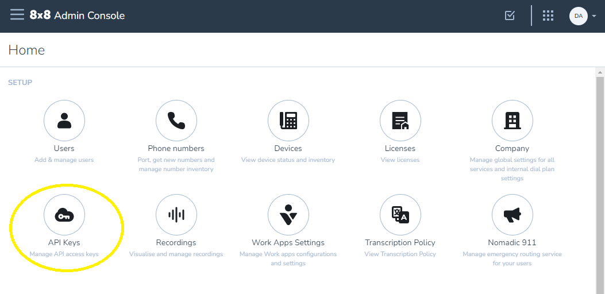
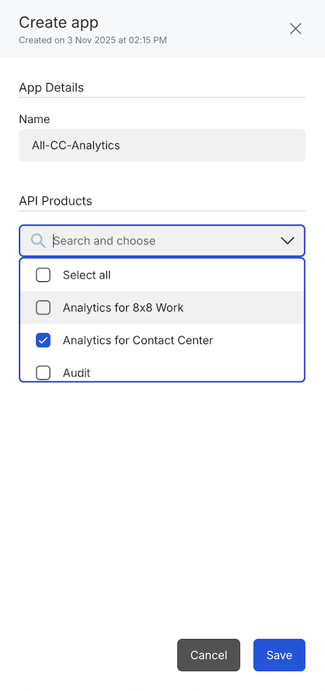
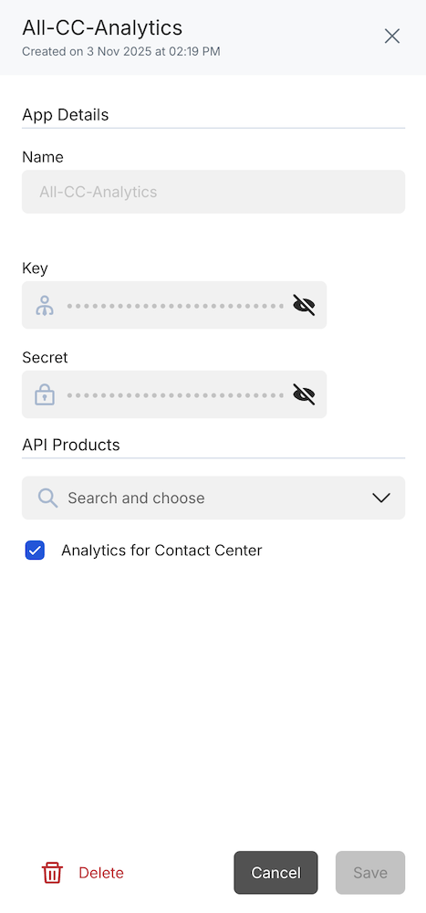

# How to get API Keys

There are a number of different Authentication Methods across the suite of XCaaS APIs today.

This document will outline how to get API keys for each API and also what the basic Authentication method is once you have your keys.

## Where to Get API Keys

| API Description                           | Key Creation Process                                                                    |
|-------------------------------------------|-----------------------------------------------------------------------------------------|
| Contact Center Historical Analytics       | [Admin Console](/analytics/docs/how-to-get-api-keys#admin-console-api-key-generation)   |
| Contact Center Realtime Analytics         | [Admin Console](/analytics/docs/how-to-get-api-keys#admin-console-api-key-generation)   |
| Cloud Storage Service                     | [Admin Console](/analytics/docs/how-to-get-api-keys#admin-console-api-key-generation)   |
| Quality Management & Speech Analytics     | [Admin Console](/analytics/docs/how-to-get-api-keys#admin-console-api-key-generation)   |
| Work Analytics                            | [Admin Console](/analytics/docs/how-to-get-api-keys#admin-console-api-key-generation)   |
| Audit Records                             | [Admin console](/analytics/docs/how-to-get-api-keys#admin-console-api-key-generation)   |
| Contact Search                            | [Admin console](/analytics/docs/how-to-get-api-keys#admin-console-api-key-generation)   |
| Contact Management                        | [Admin console](/analytics/docs/how-to-get-api-keys#admin-console-api-key-generation)   |

## Admin Console API key generation

> 🚧 **The "Application Credentials" permission is required to create/manage API Keys in Admin Console**
>
> This permission is enabled for users of the default Company Admin Role or a custom role can be created for specific users using the application: 8x8 Admin Console and the permission: "Application Credentials".
>
> To create a "Call Recording & Storage" API Keys, the user must first have the 'Cloud Storage API' assignment. **This assignment must be granted by the Super Admin.**
>
>

[Admin Console](https://admin.8x8.com) provides an ability to create API keys as follows:  

If you do not have the API Keys option you do not have the correct permission/role.

The list of available API keys and an option to create new keys will be presented:

An App is a set of credentials that have access to a specific set of APIs. You can choose to create as many apps as you wish, and each app can have access to as many or few APIs as appropriate.

To create an App:

* Give it a name that is meaningful to you, No spaces allowed.
* Assign the APIs that are appropriate for the use case (you can modify this later if/as needed)  

In this example, a single App will have access to Analytics for Contact Center API.

> 📘 **Modifying an existing App**
>
> If an existing App is modified by adding or removing an API, there can be a brief delay in the changes being globally consistent if the App key/secret are under active use. Changes will replicate and become consistent within a few minutes.
>
>

Clicking the eyeball icon will display the Key and Secret onscreen.

Clicking elsewhere on the row will bring a view of the App showing which APIs are enabled and allowing the secret/key to be revealed/copied individually

Clicking the eyeball icon besides the Key and or Secret will reveal the Key/Secret and allow them to be copied.  

APIs can be added or removed from the App on this screen  

The App can be deleted from this screen.
