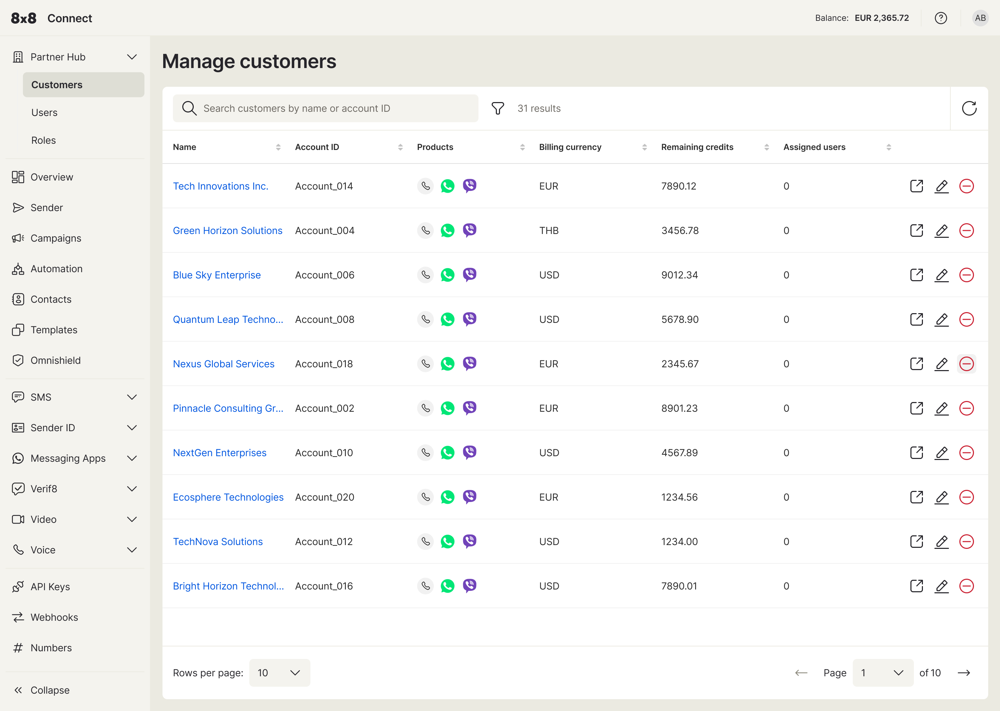
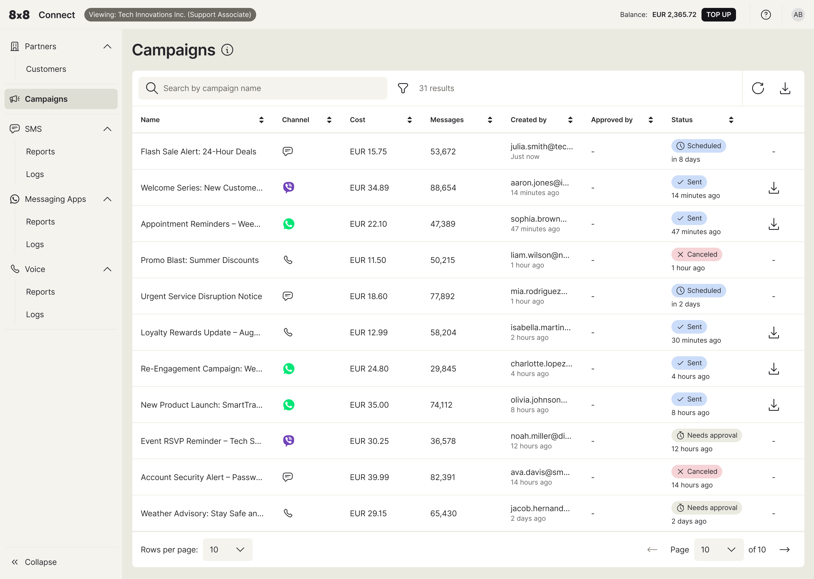

# Accessing and Viewing Your Customer List

The **Partner Hub** in 8x8 Connect is your centralised portal for monitoring your assigned end-customer (Customer) accounts. The interface is designed for view-only access, allowing you to track customer activity without the ability to make changes.

1. **Navigate to the Customer List:** From the main navigation menu on the left, expand the Partner Hub section and click on Customers..

2. **The 'Manage customers' Page:** This will take you to the "Manage customers" page. Here you will see a list of all customer accounts you have permission to view. This dashboard provides a comprehensive overview, including each customer's:

    - Customer Name and Account ID
    - Enabled Products (represented by icons)
    - Billing Currency
    - Remaining Credits
    - Assigned Users (from the partner organization)

1. **Find a Specific Customer:** Use the **search bar** at the top of the list to quickly find a specific account by their name or Account ID.

2. **View Customer Usage:** To view a specific customer's detailed usage information, simply click on the customer's name in the list.

***

## Understanding the Customer Usage Dashboard

After selecting a customer from the "Manage customers" list, you will be taken into their specific account view. The main content area will display an overview, and the navigation menu on the left will update to show the product modules available for that customer.

To view the detailed usage for a specific product, simply click on it in the left-hand menu:

- **SMS:** View logs for all SMS activity.
- **Voice:** View logs for voice calls.
- **Video:** View logs for video sessions.
- **Messaging Apps:** View logs for messages sent via apps like WhatsApp, Viber, etc.

For each log, you can typically see data such as the **Timestamp**, **Direction** (inbound/outbound), **Status** (e.g., delivered, failed), **Price**, and masked `To`/`From` numbers.

### Important Information: Data Access and Privacy

As a reminder, all data is presented with security and privacy as a top priority:

- **View-Only Access:** You cannot perform any actions or make changes on behalf of the customer.
- **Data Masking for Privacy:** By default, sensitive information is automatically masked when viewing usage logs. You will **not** see contact names, message content, or full phone numbers (MSISDN). For identification purposes, only the **last 4 digits** of a phone number will be visible.
- **Customer Pricing:** The prices shown will reflect the specific pricing configured for that customer.
