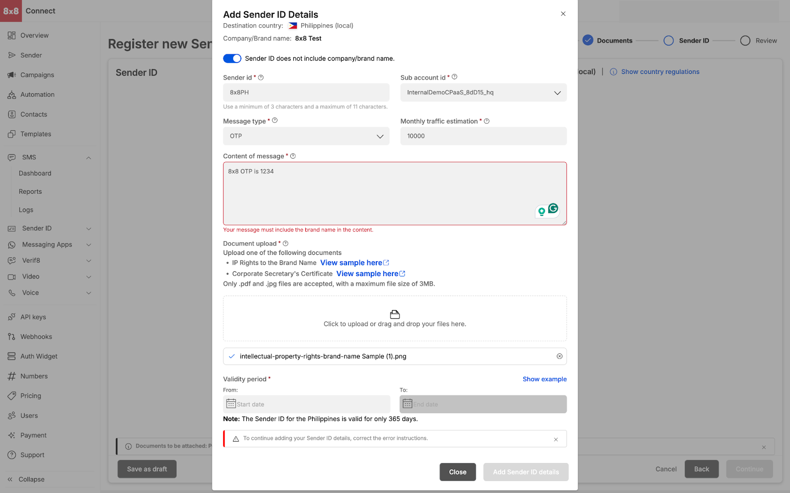
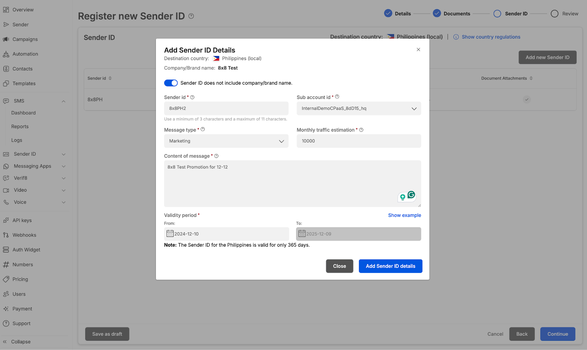
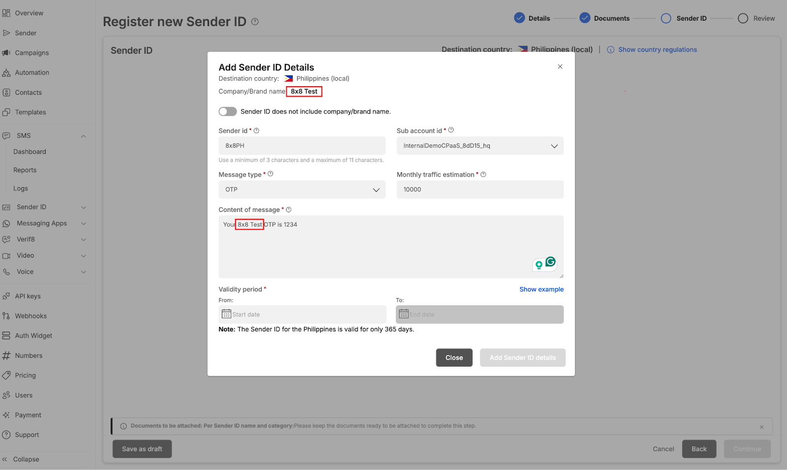

# Adding Sender ID Details

**Adding Sender ID details**

* Adding of Sender ID details allows users to define the Sender ID name, the subaccount that they wish to register the Sender ID towards

* Our self service allows you to upload multiple sender IDs

  
**Sender ID and Brand Name alignment (only for selected countries)**

* Adding of Sender ID details, users need to be mindful that for selected countries the brand name (company name) needs to be included in the message content (ie Philippines) and Sender ID needs to linked to the company name.

  
* If brands are trying to register a SenderID that is not linked to their company/brand name  

then the user needs to toggle on the `Sender ID does not include company/brand name  

user needs to upload one of the following documents for the Philippines

* IP rights to the Brand Name
* Corporate Secretary’s Certificate

