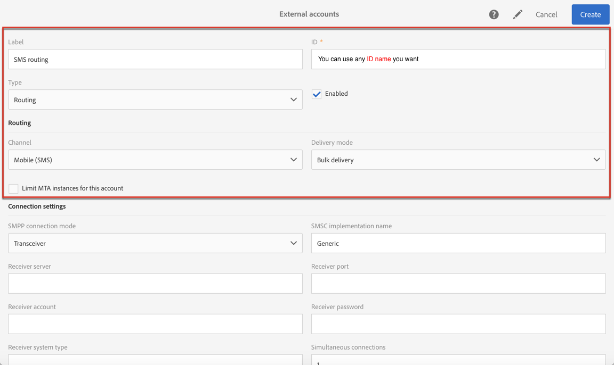
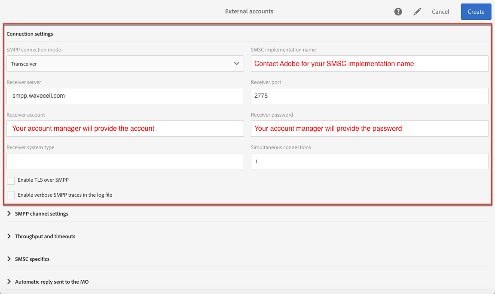
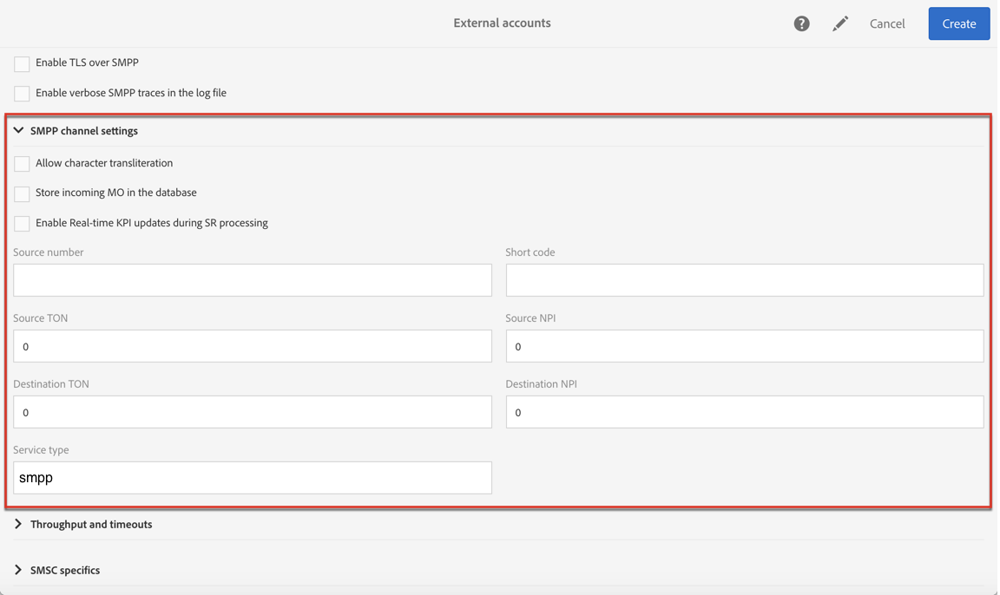

# Adobe Campaigns

[Adobe Campaign](https://www.adobe.com/sea/experience-cloud/topics/campaign-management.html) allows you to launch, measure, and automate campaigns across every channel. Harmonizing all of your marketing channels is not an impossible task. With the help of Adobe Campaign, you can bring customer data from different systems, devices, and channels into a single profile. Then, deliver timely and relevant campaigns that meet your customers in the right places and right ways along their customer journey.

With 8x8 cloud communication platform, businesses and developers alike can incorporate SMS functionality into one of their communications channels.

## Configuring SMS Channel

To send SMS messages, one or several external accounts must be configured by an administrator under the **Administration > Channels > SMS > SMS accounts** menu.

The steps for creating and modifying an external account are detailed in the External accounts section. You will find below the parameters specific to external accounts for sending SMS messages.

## Defining an SMS Routing

The external account SMS routing via SMPP is provided by default, but it can be useful to add other accounts. If you want to use the SMPP protocol, you can also create a new external account. For more information on SMS protocol and settings, refer to this [technical note](https://helpx.adobe.com/campaign/kb/sms-connector-protocol-and-settings.html).

1. Create a new external account from Administration > Application settings > External accounts.
2. Define the account type as Routing , the channel as Mobile (SMS) and the delivery mode as Bulk delivery.

3. Define the connection settings. To enter the connection settings specific to sending SMS messages.
Please enter the following details:

* SMPP connection mode: **Transceiver**
* Receiver server: **smpp.8x8.com**
* Receiver port: **2775** use **2776** if you enable TLS over SMPP (To note TLC v1.2)
* Receiver account and password will be provided by your account manager. Please contact [hello-cpaas@8x8.com](mailto:hello-cpaas@8x8.com)) if you have not been allocated someone directly.

The **Enable TLS over SMPP** option allows you to encrypt SMPP traffic, use **2776** for your **Receiver port** .  

**Enable verbose SMPP traces** in the log file allows you to dump all SMPP traffic in log files. This option must be enabled to troubleshoot the connector and to compare with the traffic seen by 8x8.  

4. **Contact Adobe** who will give you the value to enter into the SMS-C implementation name field for 8x8l.  

5. Define the SMPP channel settings. You can learn more in the [SMS encoding and formats section](https://docs.adobe.com/content/help/en/campaign-standard/using/administrating/configuring-channels/configuring-sms-channel.html#sms-encoding-and-formats).  

Enable the **Store incoming MO in the database** if you want all incoming SMS to be stored in the inSMS table. For more information on how to retrieve your incoming SMS, refer to this [section](https://docs.adobe.com/content/help/en/campaign-standard/using/communication-channels/sms-messages/managing-incoming-sms.html#storing-incoming-sms).  

The **Enable Real-time KPI updates during SR processing** option allows the **Delivered or Bounces + Errors KPIs** to be updated in real time after sending your delivery. These KPIs can be found in the **Deployment** window and are directly recalculated from the SR (Status Report) received from 8x8.  

6. Define the Throughput and timeouts parameters. You can specify the maximum throughput of outbound messages ("MT", Mobile Terminated) in MT per second. If you enter "0" in the corresponding field, the throughput will be unlimited. The values of all of the fields corresponding to durations need to be completed in seconds. Service type should be "smpp".

7. Define the SMS-C specific parameters in case you need to define a specific encoding mapping. For more information, refer to the SMSC specifics section. Enable the Send full phone number (send characters other than digits) option if you don't want to respect the SMPP protocol and transfer the + prefix to the server of 8x8 (SMS-C).
8. If needed, define automatic replies to trigger actions based on the content of a reply. For more on this, refer to this section .
9. Save the configuration of the SMS routing external account.

You can now use your new routing to send SMS messages with Adobe Campaign.
