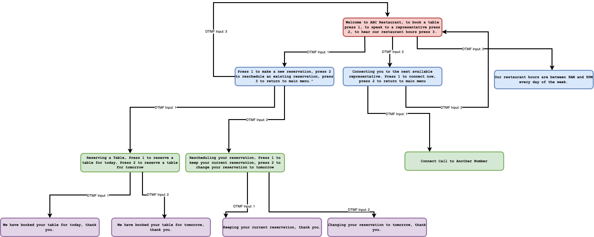
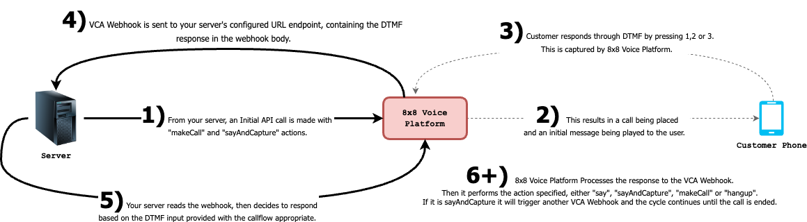
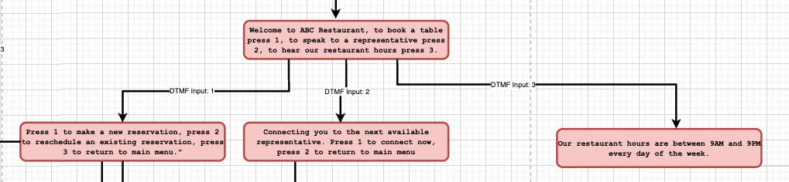
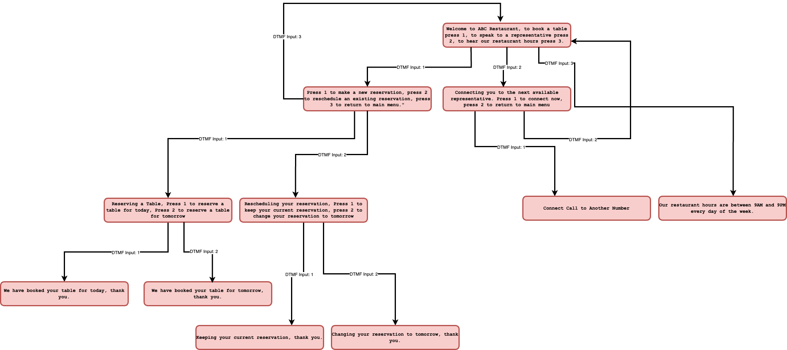
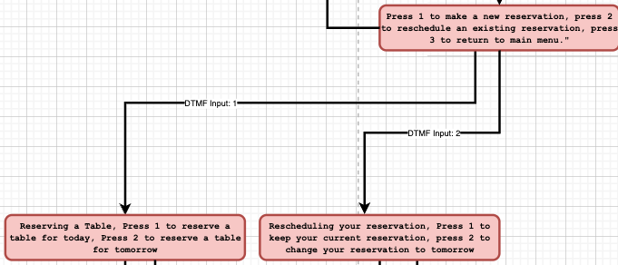
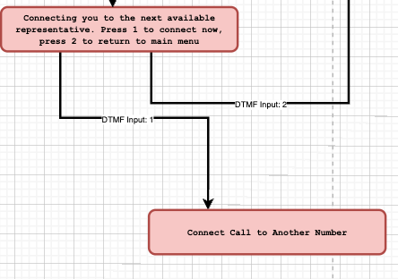
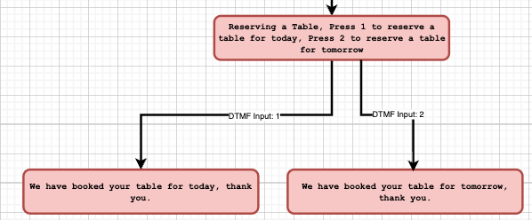
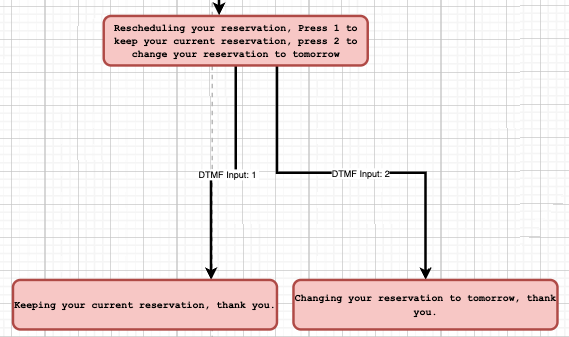

# Advanced IVR (Reservation Example)

This tutorial will cover a more advanced IVR use case with a multi-level IVR tree. It extends upon the principles in the Simple IVR page, but build upon then by taking into account the current IVR state when responding to the user.

Initial setup should be completed as per the [Webhook Setup Guide](webhook setup guide) to configure a VSS and VCA Webhook before continuing with this guide.

## Demo Video of Advanced IVR

This video will show a demo of how the Advanced IVR menu will work, including showing webhooks and the Initial API Call.

<iframe
  src="https://www.youtube.com/embed/PFNdAtqze_4?si=McsNYISF1SP3yeF2"
  height="500px"
  width="100%"
  allow="picture-in-picture; web-share"
  allowFullScreen>
</iframe>

## GitHub Repo with Sample Backend Code

In order to make use of the Callflows API, you will need to setup not only Webhooks but a backend server to respond to those webhooks. We have provided a code sample of backend code in Python that processes the webhooks and responds to them to trigger actions in the IVR.

[GitHub Repo](https://github.com/EMChamp/8x8-advanced-ivr-callsflow-api)

## Diagram of Advanced IVR Flow

Below is a diagram showing how the IVR Tree that we will build. It has potentially 3 levels in this IVR Tree and the goal is to allow a caller into a restaurant to both manage their reservation (the most common task), connect to a member of the restaurant staff and hear a message of the restaurant hours.

**Note:** What is not pictured is that any response that is not valid results in an error message and the call ending. This is done to simplify the diagram.



The colors correspond to the different levels of the IVR Tree which shows how many DTMF inputs a user will need to provide before reaching the corresponding menu item.

## Diagram of Webhooks and API Calls

The basic flow of Webhooks and API Calls will be similar to the Simple IVR tutorial, your server will have to respond to multiple VCA Webhooks as the user goes deeper into the IVR tree, so that Callflows API can play the correct IVR Tree menu back to the user.



## IVR Callflows

### Initial API Call

The initial API call to place the outbound call is here:

`/POST voice.8x8.com/api/v1/subaccounts/{sub-account-id}/callflows`

This is the request body to send with the API request. It will make an outbound call, play a message and then capture a DTMF input from a user.

```json
{
    "callflow": [
        {
            "action": "makeCall",
            "params": {
                "source": "{{Virtual Number}}",
                "destination": "{{Number to Call}}"
            }
        },
        {
          "action": "sayAndCapture",
          "params": {
              "promptMessage": "Welcome to ABC Restaurant, to book a table press 1, to speak to a representative press 2, to hear our restaurant hours press 3.",
              "voiceProfile": "en-US-BenjaminRUS",
              "speed": 1,
              "minDigits": 1,
              "maxDigits": 1,
              "digitTimeout": 10000,
              "overallTimeout": 10000,
              "noOfTries": 1
              }
        }
    ]
}

```

### IVR Tree: Level 1

#### IVR Tree: Main Menu



When the user responds to the initial DTMF input, they have a choice between 3 options. The table below shows the three menus and messages that are played for a user for a given DTMF input.

The code below the table shows the JSON that should be returned by your server to trigger the appropriate menu.

| DTMF Input | Menu | Message Played |
| --- | --- | --- |
| 1 | Reservations | Press 1 to make a new reservation, press 2 to reschedule an existing reservation, press 3 to return to main menu. |
| 2 | Connect Call | Connecting you to the next available representative. Press 1 to connect now, press 2 to return to main menu |
| 3 | Restaurant Hours | Our restaurant hours are between 9AM and 9PM every day of the week. |
| Other | Invalid | Invalid input, please call again. |



Reservations

```json
{
        "clientActionId": "ivr-1-stage-1",
        "callflow": [
            {
            "action": "sayAndCapture",
            "params": {
                    "promptMessage": "Press 1 to make a new reservation, press 2 to reschedule an existing reservation, press 3 to return to main menu.",
                    "voiceProfile": "en-US-BenjaminRUS",
                    "speed": 1,
                    "minDigits": 1,
                    "maxDigits": 1,
                    "digitTimeout": 10000,
                    "overallTimeout": 10000,
                    "noOfTries": 2
                }
            }
        ]
}   

```

Connect Call

```json
{
        "clientActionId": "connect_call",
        "callflow": [
             {
                "action": "makeCall",
                "params": {
                    "source": {{Source Phone Number}},
                    "destination": {{Destination Phone Number}}
                }
            }
        ]
    }
    

```

Restaurant Hours and Hangup

```javascript
json_body = {
        "callflow": [
          {
              "action": "say",
              "params": {
                      "text": "Our restaurant hours are between 9AM and 9PM every day of the week.",
                      "voiceProfile": "en-US-BenjaminRUS",
                      "speed": 1
                  }
          },
          {
            "action": "hangup"
          }
        ]
}

```

Invalid Input

```javascript
json_body = {
        "callflow": [
          {
              "action": "say",
              "params": {
                      "text": "Invalid input, please call again.",
                      "voiceProfile": "en-US-BenjaminRUS",
                      "speed": 1
                  }
          },
          {
            "action": "hangup"
          }
        ]
}

```

#### ClientActionID Parameter

Compared to the Simple IVR, notice the use of the **clientActionID** parameter in the callflows JSON. This parameter will also be passed by the VCA Webhook. This parameter is important to use in your server code to decide what IVR menu to play next for a user. It provides the context for where a user is in your IVR tree.

### IVR Tree: Level 2

#### VCA Webhook Received

Here is what the VCA Webhooks will look like when the user responds with a DTMF input in the main menu. Notice the **dtmf** value indicating the user input and the **clientActionId** value indicating the value passed in the Callflows API Call that triggered this DTMF webhook.

The important values to consider in your code are:  

**DTMF** - It can be 1, 2 or 3 corresponding to what the user inputs.

**ClientActionId** - It can be reservations or connect\_call depending on which option the user chooses. Restaurant hours which is DTMF Input 3 does not require additional logic and so the parameter is skipped.

VCA Webhook Example

```json
{
  "namespace": "VOICE",
  "eventType": "CALL_ACTION",
  "description": "Action request of a call",
  "payload": {
    "eventId": "77e6a667-133a-11ef-9dd4-e911cc6fc82f",
    "callId": "627e25f1-133a-11ef-b08c-e33c09483244",
    "sessionId": "a4fad4b3-b388-12ee-b217-2fb8260fcf59",
    "subAccountId": "account_x",
    "callStatus": "ACTION_COMPLETED",
    "callDirection": "OUTBOUND",
    "callType": "PSTN",
    "source": "+6568888888",
    "destination": "+6598888888",
    "sourceFormat": "MSISDN",
    "destinationFormat": "MSISDN",
    "sourceCountryCode": "SG",
    "destinationCountryCode": "SG",
    "sourceRefId": "SOME-VN-REF-ID",
    "destinationRefId": "ANOTHER-VN-REF-ID",
    "callDuration": 0,
    "eventData": {            
      "dtmf": "1",    
    },
    "sipCode": 200,
    "timestamp": "2024-05-16T04:12:11.217Z",
    "clientActionId": "ivr-1-stage-2"
  }
}

```

#### IVR Tree: Reservations



Note: DTMF Input 3 goes back to main menu

The menu that was played for the user for reservations was:

\_Press 1 to make a new reservation, press 2 to reschedule an existing reservation, press 3 to return to main menu.

\_

This table describes the menu and message played for the user depending on the DTMF input provided.

| DTMF Input | Menu | Message Played |
| --- | --- | --- |
| 1 | Book Table | Reserving a Table, Press 1 to reserve a table for today, Press 2 to reserve a table for tomorrow |
| 2 | Reschedule Table | Rescheduling your reservation, Press 1 to keep your current reservation, press 2 to change your reservation to tomorrow |
| 3 | Main Menu | Welcome to ABC Restaurant, to book a table press 1, to speak to a representative press 2, to hear our restaurant hours press 3. |
| Other | Invalid | Invalid input, please call again. |

In order to respond to the webhook with the appropriate menu for the given DTMF input, return the corresponding Callflows JSON below. You should only respond with one, choose the appropriate response based on the DTMF input.

Book Table

```json
{
        "clientActionId": "book_table",
        "callflow": [
            {
            "action": "sayAndCapture",
            "params": {
                    "promptMessage": "Reserving a Table, Press 1 to reserve a table for today, Press 2 to reserve a table for tomorrow.",
                    "voiceProfile": "en-US-BenjaminRUS",
                    "speed": 1,
                    "minDigits": 1,
                    "maxDigits": 1,
                    "digitTimeout": 10000,
                    "overallTimeout": 10000,
                    "noOfTries": 2
                }
            }
        ]
}   

```

Reschedule Table

```json
{
        "clientActionId": "reschedule_table",
        "callflow": [
            {
            "action": "sayAndCapture",
            "params": {
                    "promptMessage": "Rescheduling your reservation, Press 1 to keep your current reservation, press 2 to change your reservation to tomorrow.",
                    "voiceProfile": "en-US-BenjaminRUS",
                    "speed": 1,
                    "minDigits": 1,
                    "maxDigits": 1,
                    "digitTimeout": 10000,
                    "overallTimeout": 10000,
                    "noOfTries": 2
                }
            }
        ]
}   

```

Main Menu

```json
{
        "clientActionId": "book_table",
        "callflow": [
            {
            "action": "sayAndCapture",
            "params": {
                    "promptMessage": "Welcome to ABC Restaurant, to book a table press 1, to speak to a representative press 2, to hear our restaurant hours press 3.",
                    "voiceProfile": "en-US-BenjaminRUS",
                    "speed": 1,
                    "minDigits": 1,
                    "maxDigits": 1,
                    "digitTimeout": 10000,
                    "overallTimeout": 10000,
                    "noOfTries": 2
                }
            }
        ]
}   

```

Invalid Input

```javascript
json_body = {
        "callflow": [
          {
              "action": "say",
              "params": {
                      "text": "Invalid input, please call again.",
                      "voiceProfile": "en-US-BenjaminRUS",
                      "speed": 1
                  }
          },
          {
            "action": "hangup"
          }
        ]
}

```

#### IVR Tree: Connect Call



Note: DTMF Input 2 Goes back to the main menu.

The menu that will be played for the user for connect call is:

*Connecting you to the next available representative. Press 1 to connect now, press 2 to return to main menu*

This table describes the menu and message played for the user depending on the DTMF input provided.

| DTMF Input | Menu | Message Played |
| --- | --- | --- |
| 1 | Post Call | N/A, user is connected directly to a number |
| 2 | Main Menu | Welcome to ABC Restaurant, to book a table press 1, to speak to a representative press 2, to hear our restaurant hours press 3. |
| Other | Invalid | Invalid input, please call again. |

In order to respond to the webhook with the appropriate menu for the given DTMF input, use the corresponding Callflows JSON below.

This callflow will immediately call the destination number and then connect the user on the current call to the destination number.

Connect Call

```json
{
        "clientActionId": "post_call",
        "callflow": [
             {
                "action": "makeCall",
                "params": {
                    "source": "{{Source Phone Number}}",
                    "destination": "{{Destination Phone Number}}"
                }
            }
        ]
    }

```

This callflow will return the user to the main menu where they can start over and make a new choice.

```json
{
        "clientActionId": "main_menu",
        "callflow": [
            {
            "action": "sayAndCapture",
            "params": {
                    "promptMessage": "Welcome to ABC Restaurant, to book a table press 1, to speak to a representative press 2, to hear our restaurant hours press 3.",
                    "voiceProfile": "en-US-BenjaminRUS",
                    "speed": 1,
                    "minDigits": 1,
                    "maxDigits": 1,
                    "digitTimeout": 10000,
                    "overallTimeout": 10000,
                    "noOfTries": 2
                }
            }
        ]
}   

```

Invalid Input

```javascript
json_body = {
        "callflow": [
          {
              "action": "say",
              "params": {
                      "text": "Invalid input, please call again.",
                      "voiceProfile": "en-US-BenjaminRUS",
                      "speed": 1
                  }
          },
          {
            "action": "hangup"
          }
        ]
}

```

#### IVR Tree: Restaurant Hours


This option will play a message for a user with restaurant hours:

*Our restaurant hours are between 9AM and 9PM every day of the week.*

Afterwards the call will hang up with the user without sending a VCA webhook. A VSS webhook will be sent at the conclusion of the call.

### IVR Tree: Level 3

#### VCA Webhook Received

Just like the Level 2 IVR Menu, the server can expect a VCA webhook similar to this when the user responds to the Level 2 Menu with a DTMF Input. Again notice the **dtmf** value indicating the user input and the **clientActionId** value indicating the value passed in the Callflows API Call that triggered this DTMF webhook.

The important values to consider in your code are:  

**DTMF** - It can be 1, 2 or 3 corresponding to what the user inputs.

**ClientActionId** - This value can vary depending on the item called.

VCA Webhook from IVR Menu Level 2

```json
{
  "payload": {
    "eventId": "9cb08497-9b10-11ee-93da-17ab36848b71",
    "callId": "89279a9b-9b10-11ee-b208-69463303bb51",
    "sessionId": "88435488-9b10-11ee-950e-59620871a3a5",
    "subAccountId": "InternalDemoCPaaS_8dD15_voice",
    "callStatus": "DTMF_RECEIVED",
    "callDirection": "OUTBOUND",
    "callType": "PSTN",
    "source": "{{Source Phone Number}}",
    "destination": "{{Destination Phone Number}}",
    "sourceFormat": "MSISDN",
    "destinationFormat": "MSISDN",
    "sourceCountryCode": "PH",
    "destinationCountryCode": "SG",
    "callDuration": 0,
    "dtmf": "3",
    "sipCode": 200,
    "timestamp": "2023-12-15T06:10:14.562Z",
    "clientActionId": "ivr-1-stage-3"
  },
  "namespace": "VOICE",
  "eventType": "CALL_ACTION",
  "description": "Action request of a call"
}

```

#### IVR Tree: Book Table



This table shows the possible messages that will be played depending on the user's DTMF input. After the message is played the call will end.

| DTMF Input | Message |
| --- | --- |
| 1 | We have booked your table for today, thank you. |
| 2 | We have booked your table for tomorrow, thank you. |
| Other | Invalid input, please call again. |

Here is the corresponding callflow that the server should respond with to trigger the IVR menu. The only value to change between the choices is the **text** which is played back to the user. Since this is a terminal message, all options should use Say+Hangup actions to end the call.

```json
{
        "callflow": [
        {
            "action": "say",
            "params": {
                    "text": "{{Text to send the user}}",
                    "voiceProfile": "en-US-BenjaminRUS",
                    "speed": 1
                }
        },
        {
          "action": "hangup"
        }
        ]
    }

```

#### IVR Tree: Reschedule Reservation



This table shows the possible messages that will be played depending on the user's DTMF input. After the message is played the call will end.

| DTMF Input | Message |
| --- | --- |
| 1 | Keeping your current reservation, thank you. |
| 2 | Changing your reservation to tomorrow thank you. |
| Other | Invalid input, please call again. |

Here is the corresponding callflow that the server should respond with to trigger the IVR menu. The only value to change between the choices is the **text** which is played back to the user. Since this is a terminal message, all options should use Say+Hangup actions to end the call.

```json
{
        "callflow": [
        {
            "action": "say",
            "params": {
                    "text": "{{Text to send the user}}",
                    "voiceProfile": "en-US-BenjaminRUS",
                    "speed": 1
                }
        },
        {
          "action": "hangup"
        }
        ]
    }

```

### Voice Session Summary Webhook

Upon termination of the session the session summary([VSS](/connect/reference/session-status)) will be returned via webhook. To learn more about the Voice Session Summary, please [click here](/connect/reference/session-status).

### Glossary of Callflow Actions used in a successful Voice Messaging call scenario

* [`makecall`](/connect/docs/makecall)
* [`sayAndCapture`](/connect/reference/call-flow-actions-sayandcapture)
* [`hangup`](/connect/docs/hangup)
* [`say`](/connect/reference/call-flow-actions-say)
