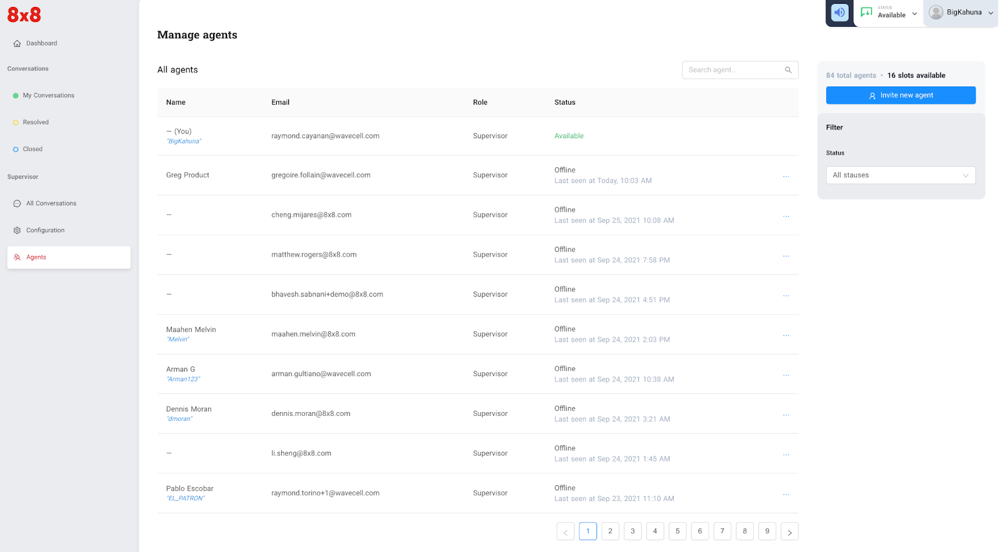
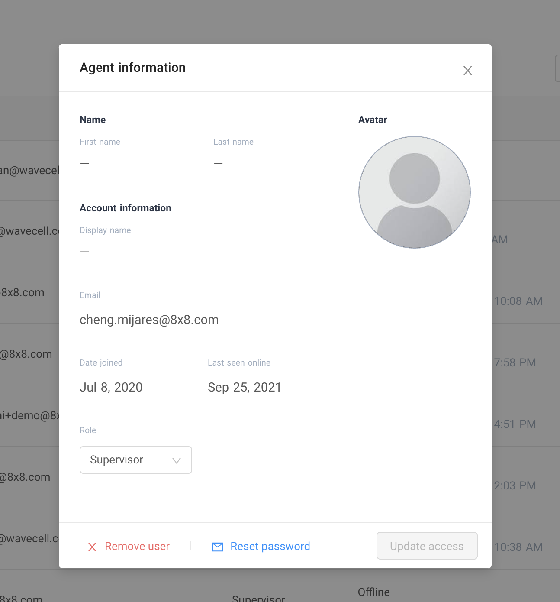
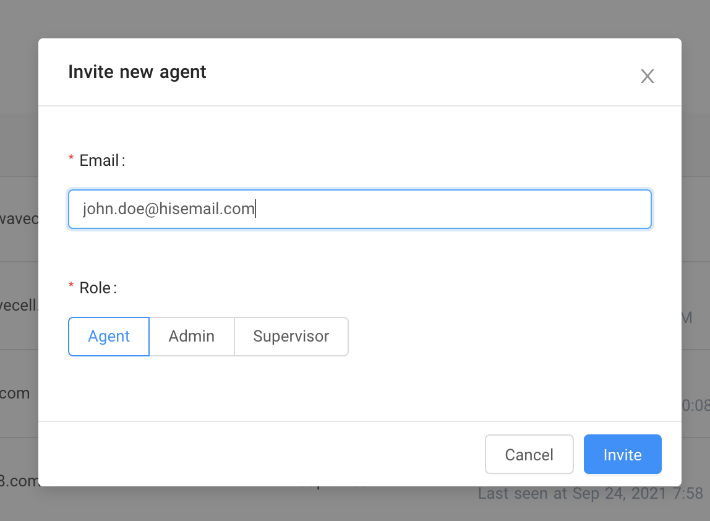
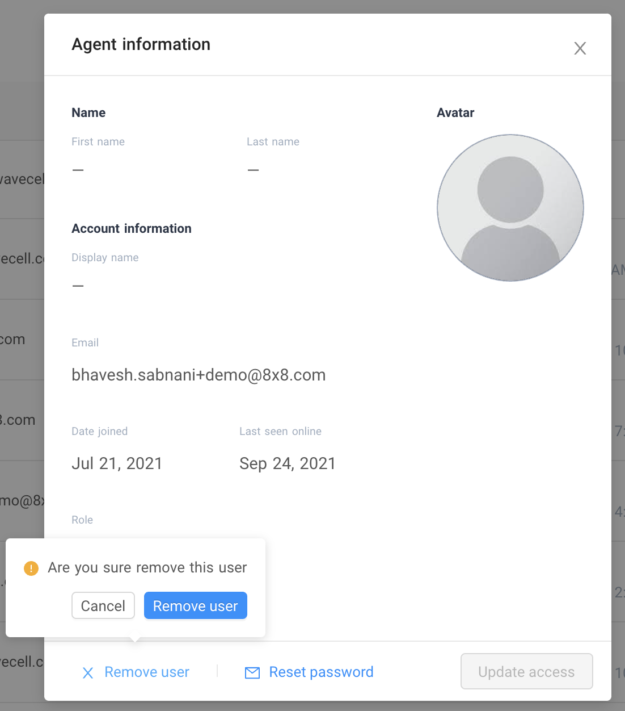
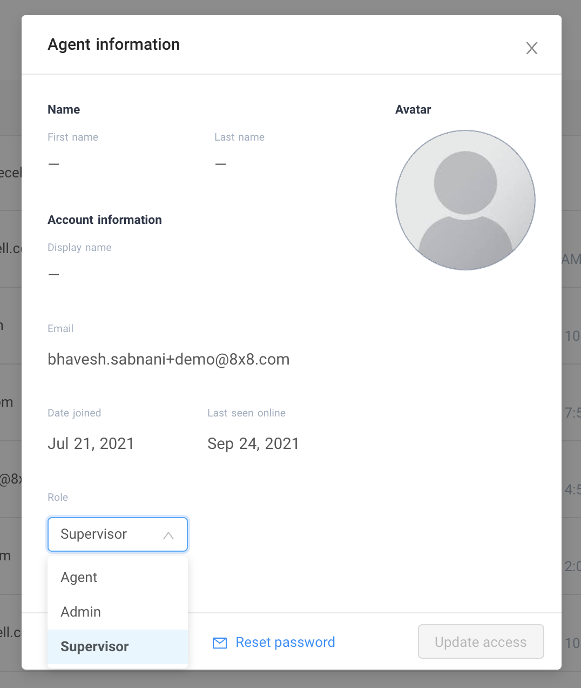

# Agent Management

## User types

***Agent*** - the most basic role in the application where a user will receive a ticket and start conversing with their customer.

***Supervisor*** - in addition to an agent’s role, a supervisor can view all conversations (accessing “All conversations” menu) and assign tickets to other agents. A supervisor is also able to assign tickets to him/herself. A supervisor can also set the application’s system configurations and manage agents.

***Administrator*** - tickets will not be assigned to users with this permission, therefore they do not directly engage with customers. However they can view or access “All conversations” menu and assign tickets to any agents or supervisors. Like a supervisor, an administrator can set the application’s system configurations and manage agents

## Converse agent management page

The converse agent management page shows you a list of agents, number of available slots to add more agents vs total number of agents that have been occupied. At a glance it also shows you the current available agents on your list vs. the ones that are offline. If you look at per agent on the list, you’ll be able to see the following:

* Date and time the agent has last been seen.
* Full name or nickname
* Email address
* Role (admin, supervisor, agent)

  
## The converse agent management page allows users with administrator or supervisor level to do the following

* *Add new agents*
* *Remove agents*
* *Change an agent’s role*
* *Help agents reset their password*

  
**Adding a new agent**

* Add the agent’s email address
* Set the agent’s role
* Once the agent is invited, he/she should receive an email with a link to set his/her password. Once set, he/she can login to start using [8x8 Converse](https://converse.8x8.com/).\*

  
**Removing an agent**

* Click an agent you want to remove from the list
* Click “Remove user” and you will be prompted if you really want to remove the agent

  
**Setting an agent’s role**

* Click an agent you want to change or set a role from the list
* Click the “role” dropdown list and select what role you want to assign to the agent.
* Click “Update access” to update the agent’s role.

