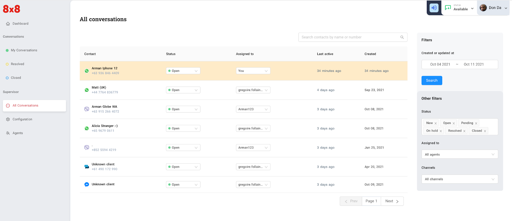
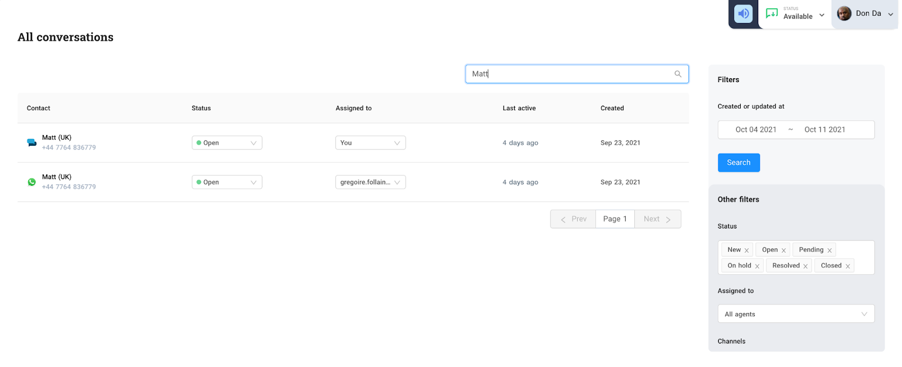
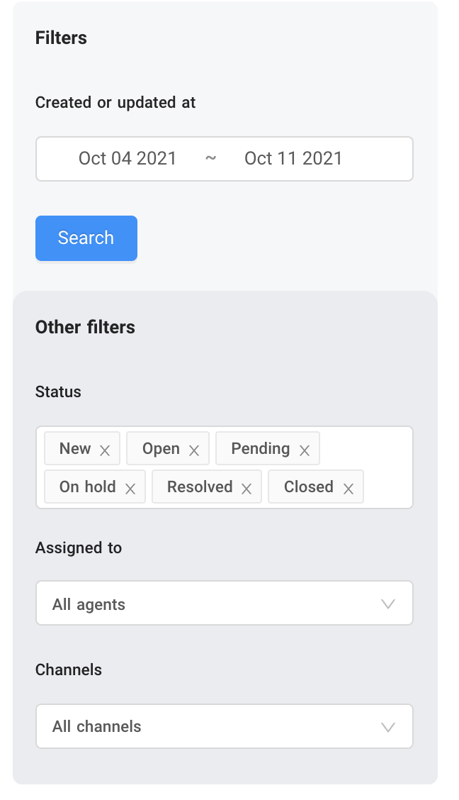

# All Conversations

Agents with supervisor or administrator privileges have access to the “All Conversations” page. This page gives you a full view and information of the tickets such as :

* Customer’s name, phone number or channel ID
* Ticket status
* Agent assigned to a particular ticket
* Date the ticket was last updated
* Date the ticket was created

  
**Search and filtering**  

Under the “All Conversations” page, an admin or supervisor can search or filter the tickets he wants to view. Search is limited to searching the name or mobile number of the customer

  
**Filtering on the other hand allows you to filter the ticket by**

* Date tickets were updated or created
* Status
* Agent assigned to the ticket
* Channel

  
You can combine both search and filtering. Let’s say you want to search for a customer named `Arman` on `Oct 8, 2021` where the tickets might have been created or updated. (refer to screen-capture below)

  
Agents and administrators can view previous conversations(closed or resolved) or current conversations(open) on all the tickets. In addition, they can also add internal notes to any open tickets to send notes to other agents during the conversation with a customer
.png")

---

What’s Next* [Configuration](/connect/docs/configuration)
