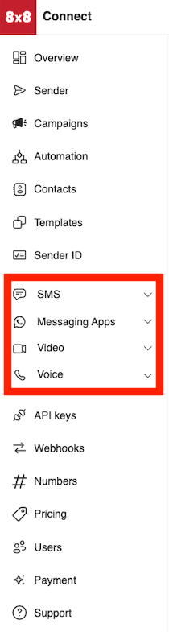

# Analytics

8x8 Connect allows users to monitor their usage, metrics and access logs, throughout the product families:

* SMS Analytics
* Chat App Analytics
* Video Interaction Analytics

This following section and it's pages will explain the analytics pages in depth.

> 📘 **Voice Analytics**
>
> The voice analytics section is currently under development, and the corresponding documentation page will be added once it is finalized.
>
>

## Location of Analytics Sections

These sections are located on the sidebar of connect under these tabs:

