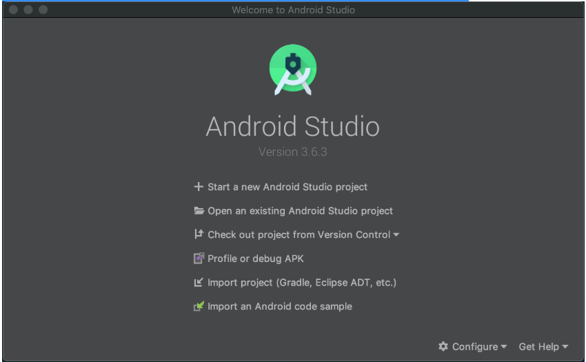
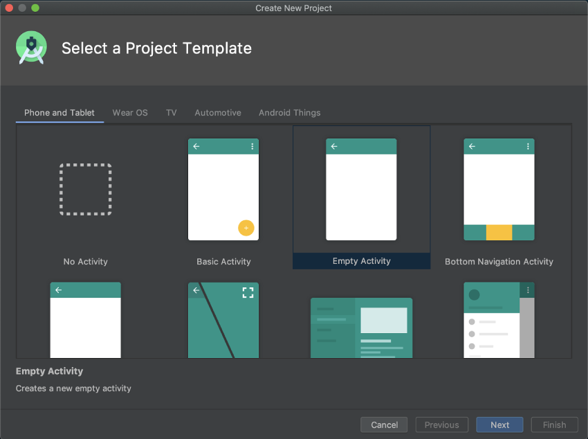
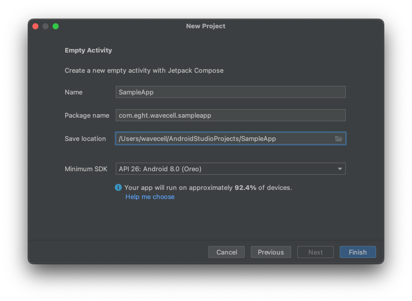
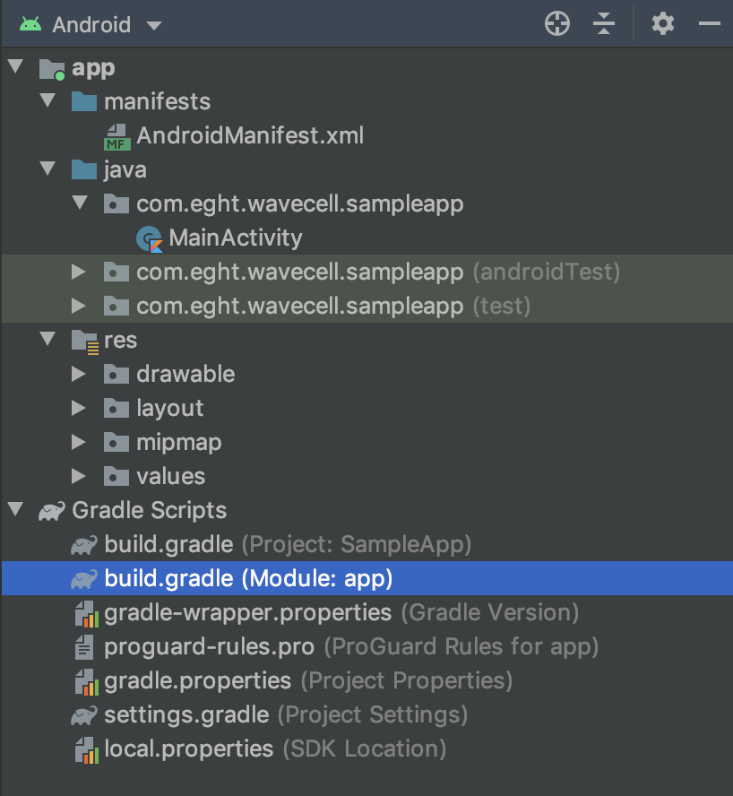

# Android - Integrating the SDK

## SDK Setup

* [Requirements](#requirements)
* [Setup the development environment](#setup-the-development-environment)
* [Add the Voice SDK as a dependency](#add-the-voice-sdk-as-a-dependency)
* [Permissions](#permissions)

### **Requirements**

To use the Voice SDK you need:

* The latest version of [Android Studio](https://developer.android.com/studio/)
* Android SDK Version **26** or above
* An Android device compatible with [Google Play Services](https://support.google.com/googleplay/answer/9037938?hl=en)

### **Setup the development environment**

Complete the following steps to setup your Android studio development environment:

1. Open **Android Studio** and click **Start a new Android Studio project**.



2. In the **Select a Project Template** window, select a template of your choice and click **Next**.



3. In the **Configure Your Project** window:

  * Enter the name of your app and your **Package name**.
  * Enter the location of where your project will be saved
  * Select either **Kotlin** or **Java** as the language
  * Select **API 26: Android 8.0 (Oreo)** as the **Minimum SDK** and click **Finish**.



>
> **Note::** The Voice SDK APIs expose Kotlin [coroutine](https://kotlinlang.org/docs/coroutines-guide.html) APIs such as [Flows](https://kotlinlang.org/api/kotlinx.coroutines/kotlinx-coroutines-core/kotlinx.coroutines.flow/-flow/) and `suspend` functions. The easiest way to consume such APIs from Java is to use [RxJava](https://github.com/ReactiveX/RxJava) in conjunction with [coroutine to Rx extensions](https://kotlinlang.org/api/kotlinx.coroutines/kotlinx-coroutines-rx3/).
>
>
>

### **Add the Voice SDK as a dependency**

Confirm you have the latest dependency version:

1. Add the following to your **top-level** **`build.gradle`** file:


```java
allprojects {
    repositories {
        ...
        maven {
            url "https://github.com/8x8Cloud/voice-sdk-android/raw/master/releases/"
        }
    }
}

```

2. Add the Wavecell dependency as well as **`sourceCompatibility`** in your **app-level** **`build.gradle`** file:



```java
android {
   ...
   compileOptions {
      sourceCompatibility JavaVersion.VERSION_1_8
      targetCompatibility JavaVersion.VERSION_1_8
   }
}

dependencies {
   ...
   implementation "com.eght:wavecell-voice-sdk:[LATEST_VERSION]"
}

```

3. Click on **File** > **Sync Project with Gradle Files**.

You can now use the Voice SDK in your application.

### **Permissions**

Add the following **`uses-permission`** elements to your **`AndroidManifest`**:

```xml
<manifest>
   ...
   <uses-permission android:name="android.permission.ACCESS_NETWORK_STATE" />
   <uses-permission android:name="android.permission.ACCESS_WIFI_STATE" />
   <uses-permission android:name="android.permission.FOREGROUND_SERVICE" />
   <uses-permission android:name="android.permission.READ_PHONE_STATE" />
   <uses-permission android:name="android.permission.RECORD_AUDIO" />
</manifest>

```

If your application is targeting API level 31+ also include the

```xml
<uses-permission android:name="android.permission.READ_PHONE_NUMBERS" />

```
