# Apple's Shortcuts

Previously known as Workflow, Apple’s new automation app, [Shortcuts](https://support.apple.com/en-au/HT209055), lets users create powerful workflows and automation with simple building blocks that can be triggered with a tap of a button. One of the best things about Shortcuts is its ability to interact with any web API.

## What you'll need

* 8x8 Connect Account
* 8x8 SMS and Chat Apps Service
* The Shortcuts app [from the App Store](https://apple.co/2DlWWv5)

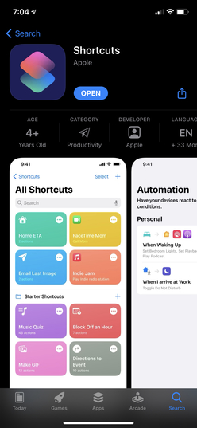

## Send Bulk SMS Using Apple’s Shortcuts

1. Open Shortcuts and tap Create Shortcut, or + from the upper-right corner of the screen.

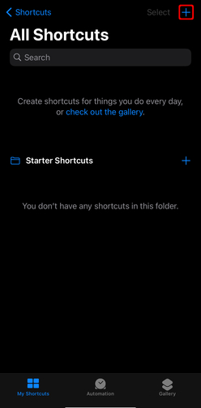
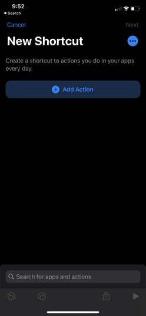

Then, search for URL, and type in your SMS API endpoint, as shown. Your endpoint can be found in your [API Keys](https://connect.8x8.com/messaging/api-keys), and will be in the following format: `https://sms.8x8.com/api/v1/subaccounts/{subAccountId}/messages`

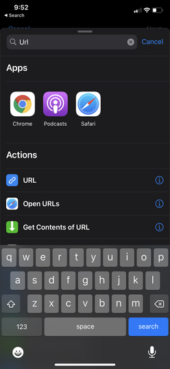
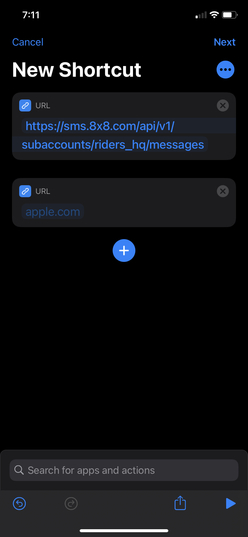

2. Add another action by searching for “Get Contents of URL”. Under Advanced, select POST as your Method.

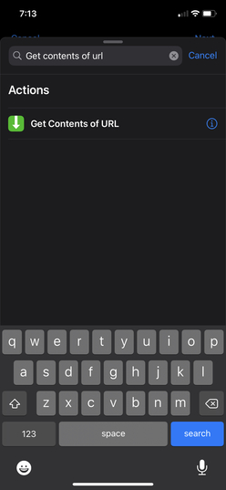
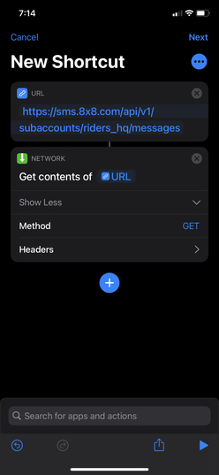
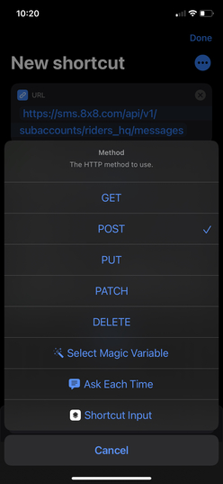

Add Headers as follows:

```text
Authorization | Bearer {api key}
Content-type | application/JSON

```

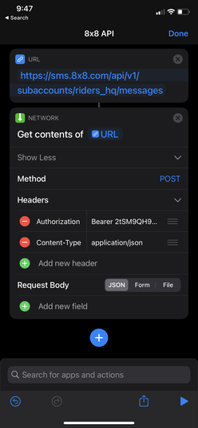

3. Add a request body by selecting JSON. Fill out the following fields in your request body:

```text
Destination – The mobile number you are sending the SMS to
Source – Your Sender ID
Text – Your text message content

```

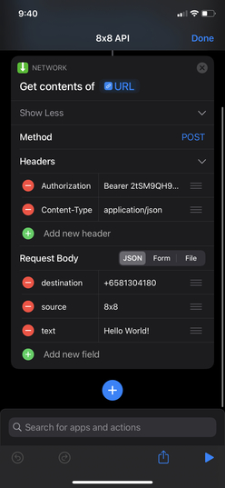

4. Now run it by clicking on the play sign on the bottom right. You should receive an SMS (if you use your own mobile phone) and see a JSON response.

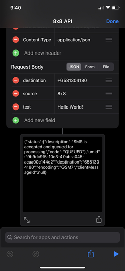
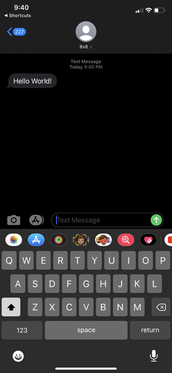

## Sending Bulk SMS Using An Excel File

8x8’s SMS API supports sending SMS for multiple numbers using a .csv or excel file. Using this [API endpoint](/connect/reference/send-many-sms), you will be able to create a Shortcut that will send SMS to multiple numbers. To simplify things for you, we’ve already made the shortcut that you can reuse or modify to your own preference. [Access our shortcut now](https://www.icloud.com/shortcuts/61ac868c82404fcc9f221ac401ebe623).

All you have to do is change the following information on the shortcut we’ve shared.  

For the SMS API endpoint, it should follow the following format: `https://sms.8x8.com/api/v1/subaccounts/{subAccountId}/messages/batch`

Your headers should be as follows:

```text
Authorization | Bearer {api key}
Content-type | application/json

```

To run your shortcut, you need an excel file with the phone numbers stored on your iOS device. Just share the excel file with Shortcuts, we’ll use [this shortcut](https://routinehub.co/shortcut/1192) to parse the excel files before sending the data to the API. Fill in the message body and sender ID that you’d like to send from, and that’s it!
