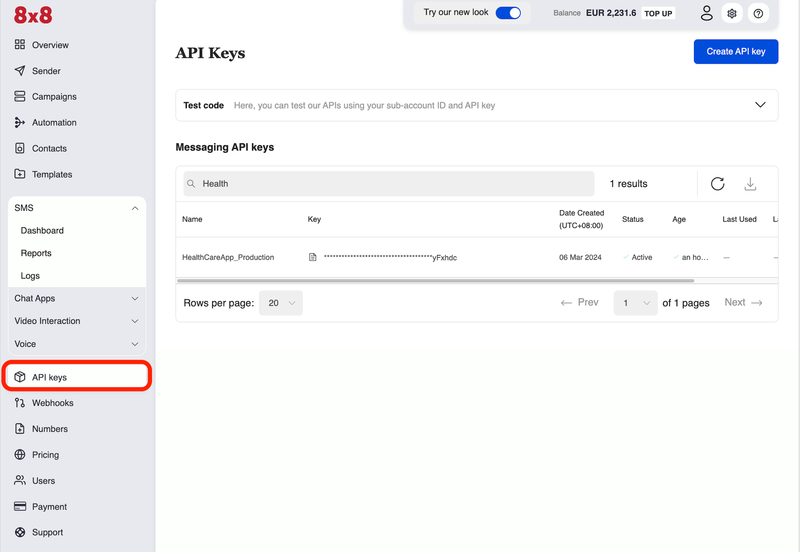
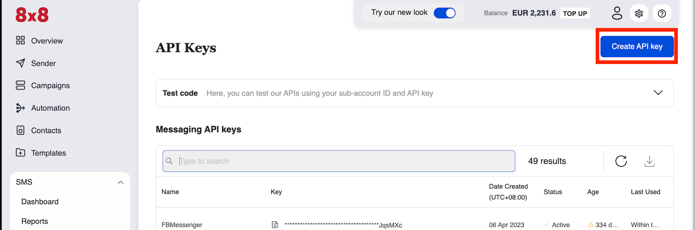
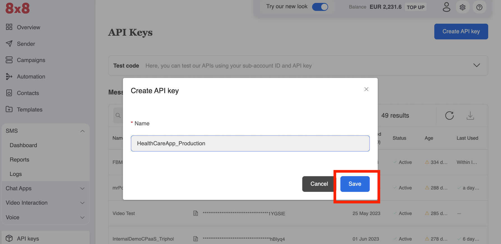
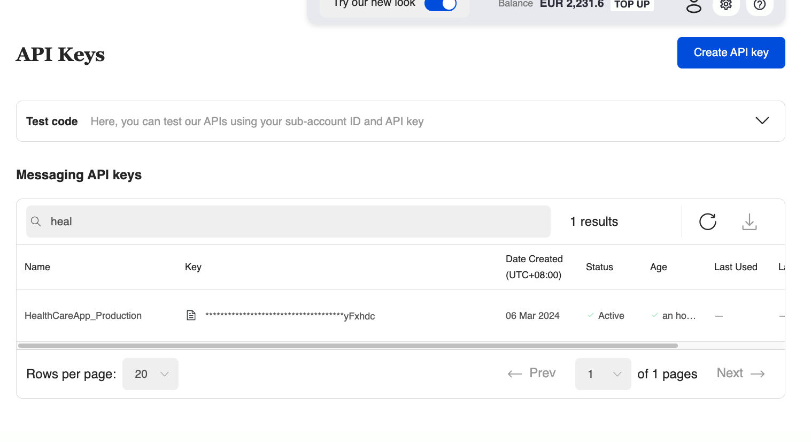
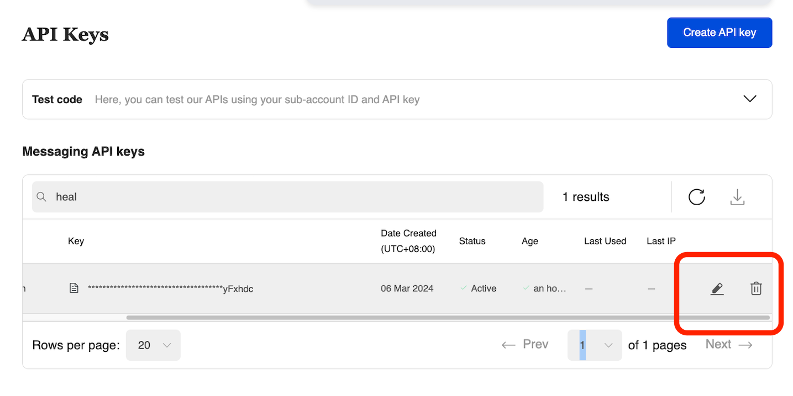

# Authentication - API Keys

## Overview

8x8 APIs accepts an **ApiKey Bearer Token** authentication method.

* You can generate tokens from your customer portal [8x8 Connect](https://connect.8x8.com/)
* You need to include the following header in your requests: `Authorization: Bearer {apiKey}`
* *NB: (replace the `{apiKey}` placeholder with the key generated from the customer portal)*

If you have not created your account yet, please head to [8x8 Connect sign-up page](https://connect.8x8.com/login/signup)

## API Key Management

### API Key Creation

**Step 1:** View the API Keys Section of the Connect Dashboard. This may be accessed [here](https://connect.8x8.com/messaging/api-keys).

**Step 2:** Click the "Create API Key" button.

**Step 3:** Name the API Key in the Pop Up, this can be any value. We recommend using a memorable name related to the API key's intended purpose such as "HealthCareApp\_Production". Once the value is entered in, click **save**.

**Step 4:** The new API key should now be located in the list, you can perform a partial search at the top for the name. Only the last 6 characters will be shown, click the document button highlighted in red to reveal the entire API key. You can return to this page to retrieve the API key's value at any time.

### API Key Delete/Disable

You can disable or even delete an API key if needed and create a new one. This may be useful if the API key has been compromised in some way or if you plan to regularly rotate the API key.

The **Pen** or the **Trash Can** button in the picture shown below would grant you access to either enable/disable the API key or permanently delete it.

