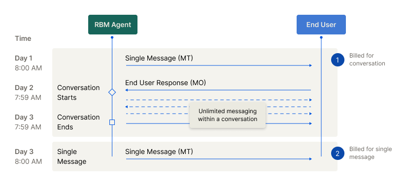

# Billing

## Global Billing

| Agent Billing Category | Definition                                                                                                                         | Details                                                                       | Common use cases                              |
| :--------------------- | :--------------------------------------------------------------------------------------------------------------------------------- | :---------------------------------------------------------------------------- | :-------------------------------------------- |
| Basic Message          | A simple text message sent via RCS.simple text message sent via RCS.                                                               | No rich media or interactivity. Usually limited to 160 UTF-8 characters.      | Alerts, OTPs, transactional notifications     |
| Single Message         | A one-off message that may include rich media, rich cards, or suggested replies/actions.                                           | Charged per message sent. Can include CTAs, media, or carousels.              | Promotions, service updates, marketing bursts |
| Conversational         | Session-based pricing model. A single charge applies for unlimited two-way messaging within a defined window (typically 24 hours). | Includes rich and basic messages. Encourages real-time customer interactions. | Customer support, lead capture, chat flows    |

**Non-Conversational Billing Categories**

Agents classified under Basic Message or Single Message billing categories are considered non-conversational. These agents are not billed per conversation. Instead, they are charged per message

**What Is a Conversation in RBM?**

In the context of Conversational billing, a conversation refers to a 24-hour window during which messages are exchanged between a user and a conversational agent. Only agents under the Conversational billing category can generate and be billed for conversations.

**Types of Conversations**  
• A2P (Application-to-Person): Starts when the user replies to a message from the agent.  
• P2A (Person-to-Application): Starts when the agent replies to a message initiated by the user.

**Conversation Window**  
• A conversation begins when either the agent or the user responds within 24 hours to a message from the other party, and there’s no active conversation.  
• The conversation remains active for the next 24 hours and includes:  
• The initial message that triggered the reply  
• All messages exchanged during that 24-hour period

**What Initiates a Billable P2A Conversation?**  
It is important to understand which user (P2A) interactions are considered billable "messages" that start the 24-hour conversational session. Not all user actions from an RCS message are billable. A conversation is only initiated when the user sends a message back to the agent. Actions like opening a web page or dialing a number do not count as messages and are not billable.

The following table clarifies which common user actions will trigger a billable P2A session:

| User Action                                             | Considered a P2A Message? | Billable Outcome                                                                  |
| :------------------------------------------------------ | :------------------------ | :-------------------------------------------------------------------------------- |
| Sends a freeform text response                          | Yes                       | Yes. This message initiates a single, billable 24-hour conversational session.    |
| Clicks a suggested response/reply                       | Yes                       | Yes. This message initiates a single, billable 24-hour conversational session.    |
| Sends a file (e.g., image, video)                       | Yes                       | Yes. This message initiates a single, billable 24-hour conversational session.    |
| Clicks a suggested action (e.g., Open URL, Dial number) | No                        | No. This action does not send a message and does not initiate a billable session. |
| Shares location via a location push request             | No                        | No. This action does not send a message and does not initiate a billable session. |

**Conversation-Based Billing**  
• For agents with Conversational billing, charges apply per conversation session, not per message.  
• This pricing model encourages rich, two-way engagement without inflating cost per interaction.

**Important Notes  
** • Non-conversational agents are billed per message, not per conversation, even if replies occur.  
• Billing data for conversational agents (e.g., logs and reports) may be delayed by up to 48 hours to ensure all messages in the session are accounted for before billing is finalised.

**Important Billing Considerations**

The RCS billing models described on this page represent the standard framework. However, the global messaging ecosystem is complex. Specific billing rules, rates, and the implementation of conversational sessions can sometimes vary depending on the destination country and the recipient's mobile network operator (MNO).

8x8 works to standardise these models for our customers, but underlying carrier policies can occasionally affect the final billing treatment.

For the most accurate and detailed billing information applicable to your specific use cases and target regions, we strongly recommend that you speak with your 8x8 Account Manager or contact our sales team. They can provide precise details and help you forecast your messaging spend effectively.

## US Billing

| Agent Billing Category | Definition | Details | Common use cases     |
| --- | --- | --- |----------------------|
| Rich Message | A message that contains only text and a limited set of interactive actions. | • Bills in segments of 160 UTF-8 bytes.    • Contains only text. No rich media is supported.    • Can contain suggested replies.    • Can contain the following suggested actions:         ◦ Dial phone         ◦ Open URL (without Webview)          Note: A rich card containing only a title/description is not considered a text-only rich message and would be classified as a Rich Media Message.\" | Alerts, OTPs, transactional notifications, simple service prompts.|
| Rich Media Message | A message that message that contains multimedia, text, and a full range of interactive actions. | • Charged per message sent.    • Contains multimedia or text.    • Media assets can be up to 100 MB.    • Can contain all suggested replies and suggested actions (e.g., Open URL with Webview, Show location, Request location).          Note: A message is automatically classified as a Rich Media Message if it contains any multimedia. A text-only message is also classified as a Rich Media Message if it includes suggested actions not supported by the Rich Message tier (e.g., Open URL with Webview).\" | Promotions, service updates, marketing bursts, rich transactional receipts, interactive product carousels. |
