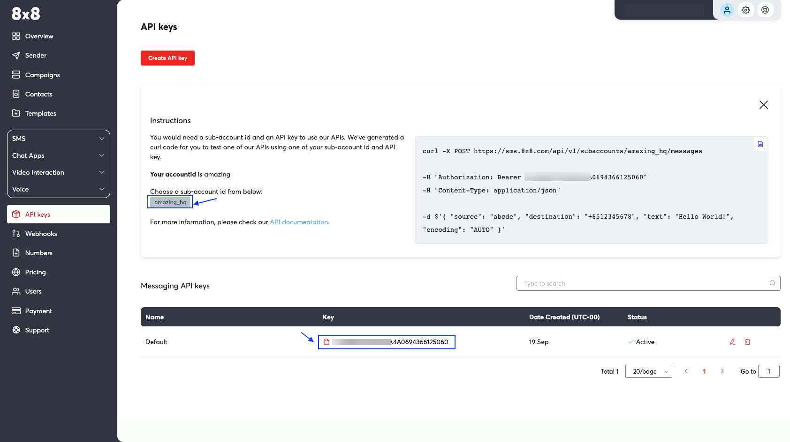
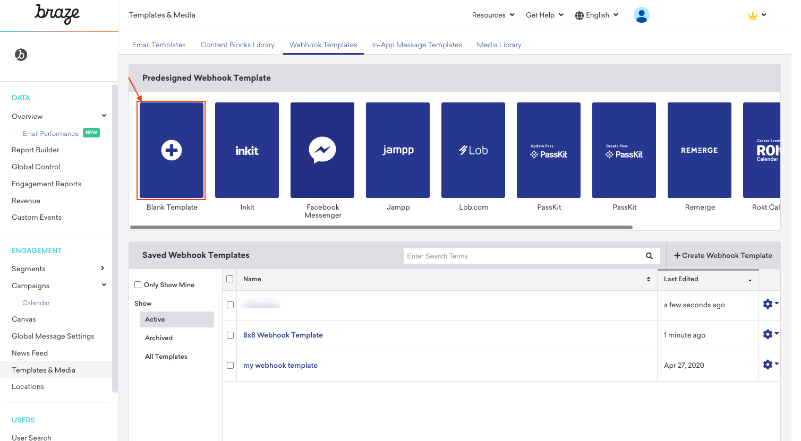
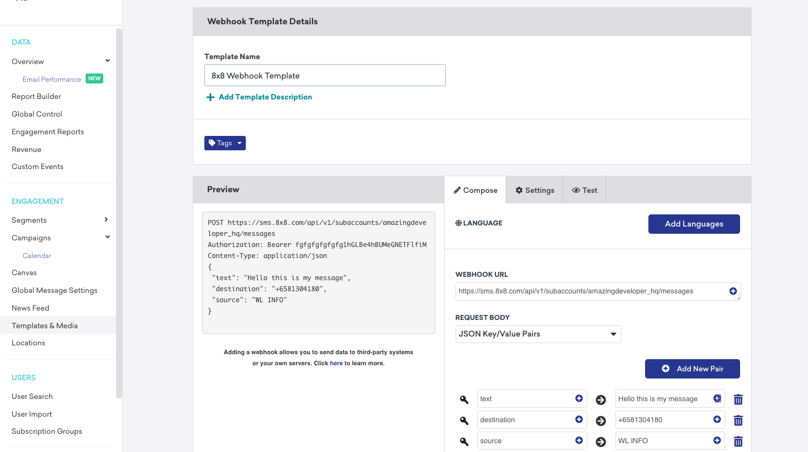
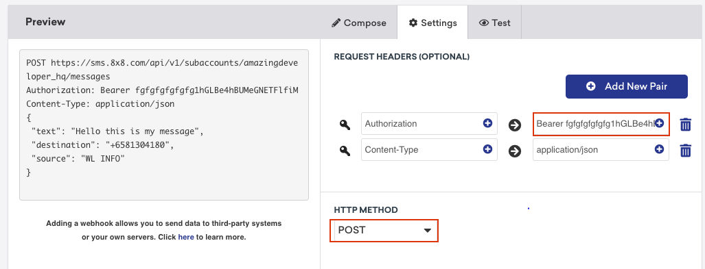
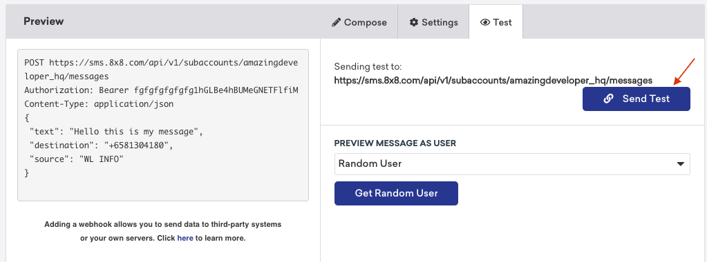
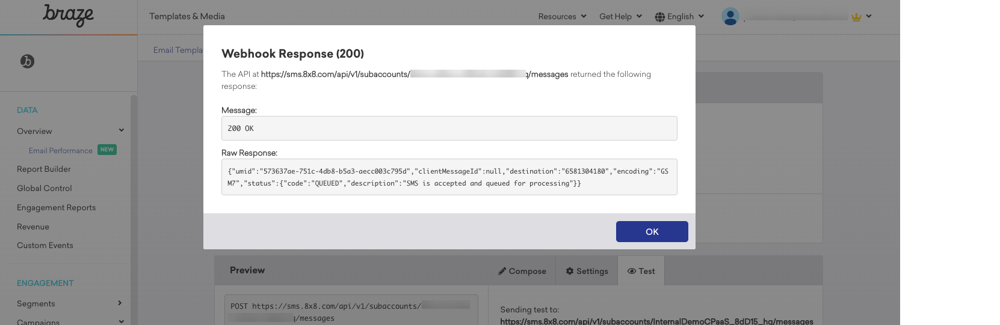
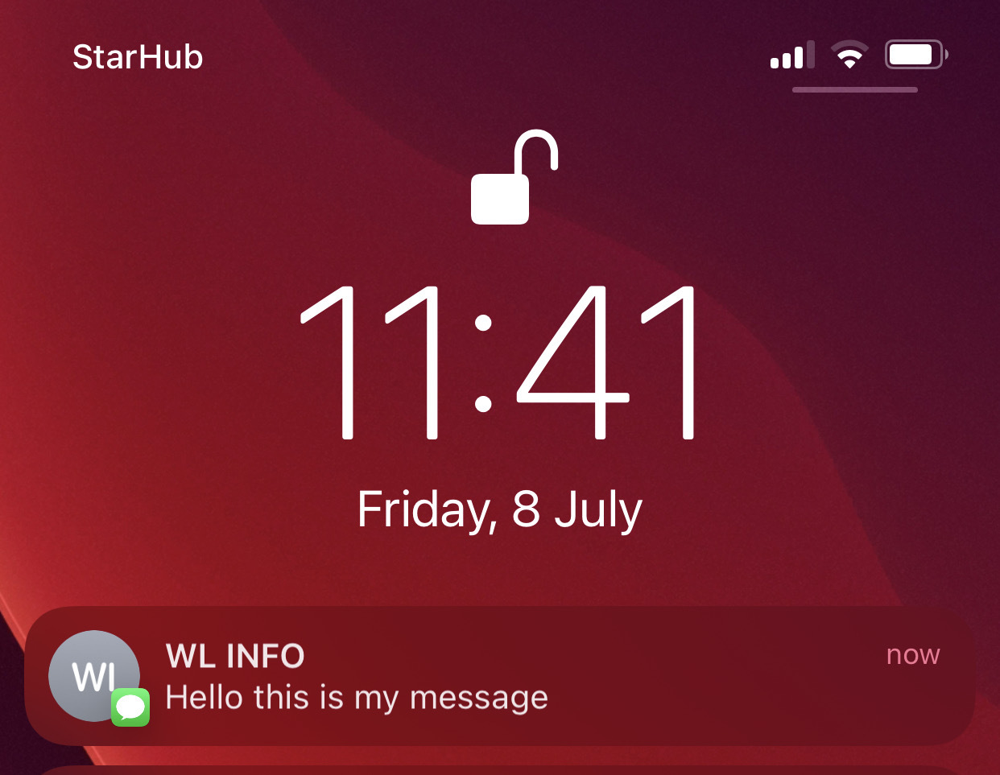
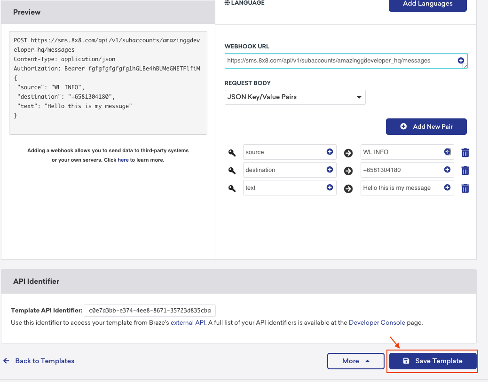

# Braze

[Braze](https://www.braze.com/) is a comprehensive customer engagement platform that powers relevant and memorable experiences between consumers and the brands they love.

With 8x8’s cloud communication platform, businesses and developers alike can incorporate SMS functionality into their user engagement strategies.

## Some use cases

* Send a personalized SMS message to potential customers triggered from an app or web
* Send SMS notifications to customers based on app or web event

## Product scope

* Braze products

## What you'll need

* A 8x8 customer Portal account
* Your Braze account

## Creating a Braze webhook

1. Head to [8x8 Connect](https://connect.8x8.com) to get your API Key and Subaccount Id
2. Navigate to the webhook template editor in Braze Portal
3. Create a new template in Braze Portal
4. Save your template in Braze Portal

Get your subaccount id and API key from [8x8 Connect](https://connect.8x8.com). Enter your email address and password to get access to your account dashboard. Head over to the **side menu > API keys** section. Create an API key if empty and then keep the API Key value.  

After retrieving the Sub-Account ID and API key from 8x8 connect, navigate to your Braze account, and under **Engagement** click **Templates & Media** and select the **Webhook Templates** tab to create a new webhook template.  

From there, select **Blank Template** to set up a new webhook.  

Add `https://sms.8x8.com/api/v1/subaccounts/{subAccountId}/messages` under **WEBHOOK URL**, where **subAccountID** is the Sub-Account ID from your API Keys page which can be found in the **API Keys** menu. **REQUEST BODY** should be the default option which is **JSON Key/Value Pairs**. Now add three new pairs in any order named **source, destination, and text**. The source should be the sender ID which is the name or number you will see when you receive an SMS, the destination is the mobile number in an international format where you are sending the SMS and text is the body message of your SMS. After it’s successfully set up, it should look similar to the image below:  

Now, from the​ **Settings**​ tab, add two new request headers named **Authorization**​, which has the value **Bearer** and **Content-Type** which has the value **application/json**.

Finally, to perform a test on the webhook, navigate to the ​**Test**​ tab and click on the **Send Test** button.  

If everything is set up properly, a successful webhook response (200) message should appear as shown below.  

Your test sample message should look like this on the receiver's mobile phone.

After a successful test, click the **Save Template** button and your webhook will be established for future use within your app.  

