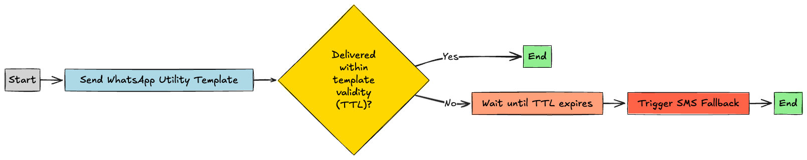

# Messaging Apps Fallback management

The 8x8 Messaging API enables you to define a fallback sequence, orchestrating message delivery across multiple channels such as WhatsApp, Viber, and SMS.

Fallback configurations can be set at the subaccount level (contact your account manager for assistance) or specified per message via the [Messaging Apps Send API](/connect/reference/chatapps-send-api).

> 🚧 **Note**
>
> Fallback sequences defined in the Send API override any existing subaccount-level settings.

***

## Configuring a Fallback Sequence

To define a fallback sequence, include the `channels` array in your message payload. Each channel object can specify:

- **`channel`**: The messaging channel (e.g., `WhatsApp`, `Viber`, `SMS`).
- **`fallbackAfter`** *(optional)*: Time in seconds to wait before triggering the next channel.
- **`successStatus`** *(optional)*: The message status considered as successful delivery (`Accepted`, `Sent`, `Delivered`, `Read`).

Example:

```json
{
  "channels": [
    { "channel": "WhatsApp", "fallbackAfter": 60, "successStatus": "Read" },
    { "channel": "Viber", "fallbackAfter": 60, "successStatus": "Delivered" },
    { "channel": "SMS" }
  ],
  "user": {
    "msisdn": "+65000000"
  },
  "type": "text",
  "content": {
    "text": "Hello World!",
    "sms": {
      "encoding": "AUTO",
      "source": "SENDERID"
    }
  }
}
```

In this configuration:

1. The message is first sent via **WhatsApp**. If not **read** within 60 seconds, it falls back to:
2. **Viber**. If not **delivered** within 60 seconds, it finally falls back to:
3. **SMS**.

***

## Message Status Reference

The `successStatus` parameter determines which message status is considered a successful delivery, preventing fallback to the next channel. Possible values include:

- `Accepted`: Message accepted by 8x8's platform.
- `Sent`: Message sent to the operator; acknowledgment pending.
- `Delivered`: Message delivered to the recipient.
- `Read`: Message read by the recipient.

For detailed status definitions, refer to the [Message Status Reference](/connect/reference/message-status-references).

***

## Conditional Fallback Based on Message Delivery

To attempt delivery via WhatsApp and fallback to SMS only if the message is not delivered within a specific timeframe, configure as follows:

```json
{
  "channels": [
    {
      "channel": "WhatsApp",
      "fallbackAfter": 60,
      "successStatus": "Delivered"
    },
    {
      "channel": "SMS"
    }
  ],
  "user": {
    "msisdn": "+65000000"
  },
  "type": "text",
  "content": {
    "text": "Hello World!",
    "sms": {
      "encoding": "AUTO",
      "source": "SENDERID"
    }
  }
}
```

In this setup:

1. The message is sent via **WhatsApp**.
2. If the message is not **delivered** within 60 seconds, it falls back to **SMS**.

This configuration ensures that the fallback to SMS occurs only if the WhatsApp message isn't delivered within the specified timeframe.

***

## Single-Channel Messaging

If you intend to send a message exclusively through a single channel without any fallback options, you can specify only that channel in the `channels` array.

In such cases, the `fallbackAfter` and `successStatus` parameters are **optional** and typically **unnecessary**, as there are no subsequent channels to fallback to.

Example:

```json
{
  "channels": [
    { "channel": "WhatsApp" }
  ],
  "user": {
    "msisdn": "+65000000"
  },
  "type": "text",
  "content": {
    "text": "Hello World!",
    "sms": {
      "encoding": "AUTO",
      "source": "SENDERID"
    }
  }
}
```

In this configuration, the message is sent solely via **WhatsApp**, with no fallback to other channels.

***

## Aligning Fallback Timing with WhatsApp Template TTL

When using WhatsApp Utility or Authentication templates, it's crucial to configure the template's Time-To-Live (TTL) appropriately. Setting a TTL ensures that WhatsApp will attempt to deliver the message within a specified timeframe. To prevent delivering duplicate messages, ensure that your fallback duration (`fallbackAfter`) exceeds the template's TTL. This strategy allows WhatsApp to attempt delivery within its validity period before triggering fallback channels like SMS.

For detailed guidance on configuring TTL, refer to the [WhatsApp Template Validity Period (TTL) Guide](/connect/docs/guide-whatsapp-template-validity-period-ttl).

### **Example: Coordinating WhatsApp Template Validity with SMS Fallback Timing**

Consider a scenario where you send a delivery notification via a WhatsApp Utility template with a validity of 10 minutes (600 seconds). To prevent duplicate messages, set the `fallbackAfter` duration to exceed the WhatsApp template validity. For instance, setting `fallbackAfter` to 900 seconds ensures that the fallback to SMS occurs only after WhatsApp's delivery window has expired.

Here's a simplified flow diagram illustrating this process:



In this flow:

- **Start**: Initiate the process.
- **Send WhatsApp Utility Template**: Dispatch the message via WhatsApp with a TTL of 10 minutes.
- **Delivered within TTL?**: Check if the message was delivered within the TTL.

  - **Yes**: If delivered, end the process.
  - **No**: If not delivered, proceed to wait until TTL expires.
- **Wait until TTL expires**: Hold until the TTL period concludes.
- **Trigger SMS Fallback**: Send the message via SMS as a fallback.
- **End**: Conclude the process.

This setup ensures that the fallback to SMS occurs only after the WhatsApp message's validity period has expired

***

> ❗️ **Important**
>
> Ensure that your fallback settings align with the channels you intend to use and that all necessary configurations (e.g., sender IDs, templates) are properly set up for each channel.
>

For a comprehensive list of supported messaging channels, refer to [Supported Messaging Apps](/connect/reference/list-of-supported-chatapps-channels).
