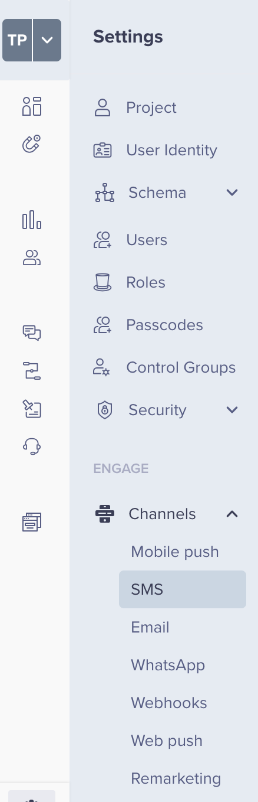
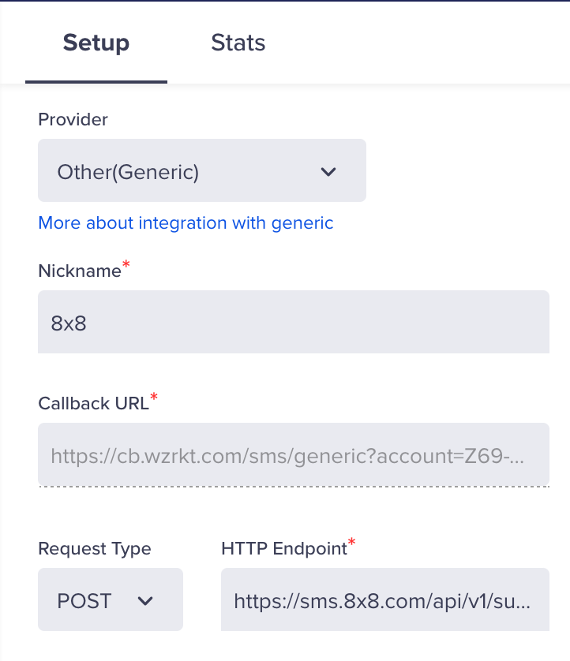
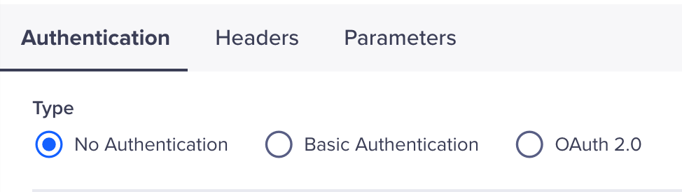
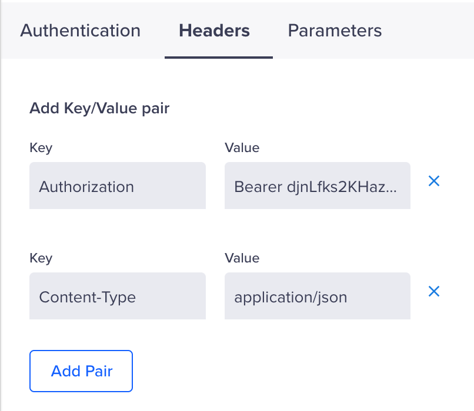
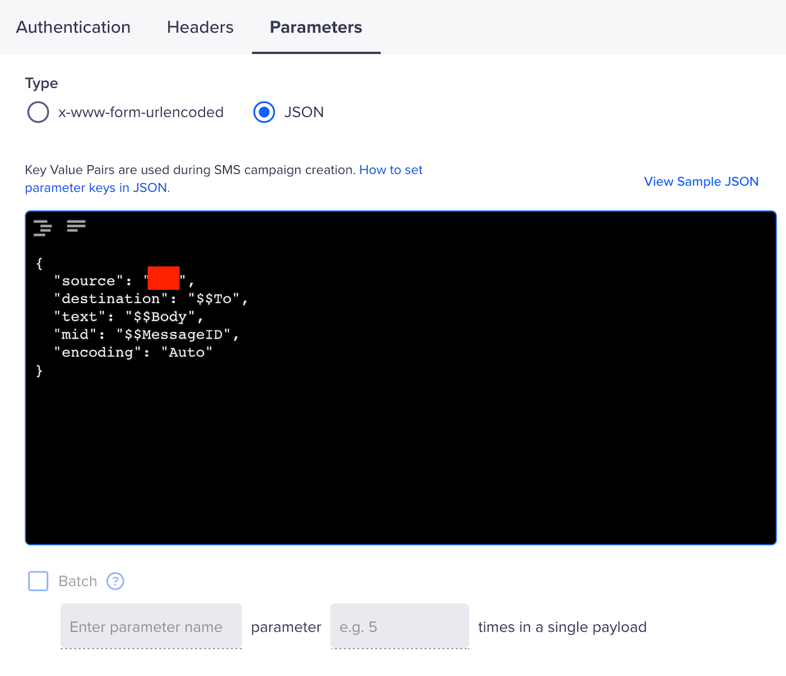
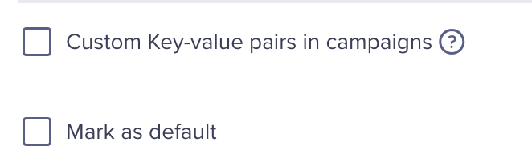
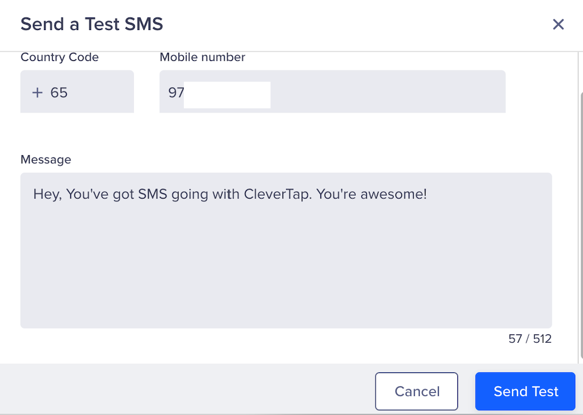
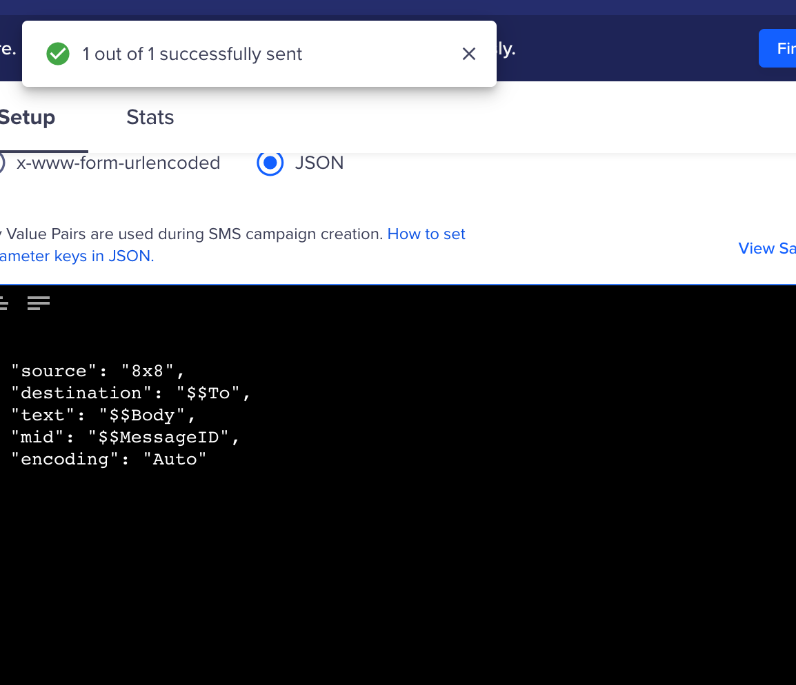

# CleverTap - SMS Integration

Clevertap is a Mobile Marketing Platform with app marketing automation helping app marketers to retain user engagement.

CleverTap supports any SMS provider via an HTTP integration. The SMS provider should support receiving messages via the HTTP protocol.

## Some use cases

* Send an SMS or Chat Apps message marketing offers from an event being tracked.
* Send an SMS or Chat Apps message notifications to customers triggered from the mobile or web app.

## Product scope

* Clevertap

## What you'll need

* 8x8 SMS or Chat Apps
* Clevertap (paid or trial)

## Video Guide

This video serves as a companion to this documentation page.

<iframe
  src="https://www.youtube.com/embed/xJbyrkfReNc?si=3FqfcpypISYaFx8V"
  height="500px"
  width="100%"
  allow="picture-in-picture; web-share"
  allowFullScreen>
</iframe>

## Setup Clevertap's SMS generic integration

In the CleverTap Dashboard, navigate to **Settings > Engage > Channels > SMS**



## Setup

In the **Setup** Tab, enter the following:

**Provider:** Other (Generic)  

**Nickname**: Any value is fine  

**Callback URL**: Default  

**Request Type:** POST  

**HTTP Endpoint:** [https://sms.8x8.com/api/v1/subaccounts/{subAccountId}/messages/batch](https://sms.8x8.com/api/v1/subaccounts/%7BsubAccountId%7D/messages/batch)

Replace **`{subAccountId}`** above with the subaccountID you would like to use. You can find your subAccountID in your 8x8 [Customer Portal](https://connect.8x8.com) under API Keys.



## Authentication

Navigate to the Authentication section and fill in the following field.

**Type:** No Authentication



## Headers

For headers, fill in the following key value pairs.

**Authorization:** Bearer

You can find or generate your API Keys in your 8x8 [Customer Portal](https://connect.8x8.com) under API Keys.

**Content-Type:** application/json



## Parameters

Fill in the following values for Parameters

**Type:** JSON

**Input Box:**

```json
{
  "source": "<Any Sender ID or Virtual Number>",
  "destination": "$$To",
  "text": "$$Body",
  "mid": "$$MessageID",
  "encoding": "Auto"
}

```

You will need to use a Sender ID or Virtual Number that is registered to your 8x8 account in the source value.

**Batch:** Unchecked



## Other Parameters

These can be left unchecked/checked depending on your desired settings in Clevertap.

**Custom Key-value pairs in campaigns**: Unchecked or Checked, depending on your preference.

**Mark as default:** Unchecked or Checked, depending on your preference.



## Testing SMS and Saving Channel Settings

Before leaving, you can send a test SMS using the Send test SMS link at the bottom of the page.






Once the test is successful you can hit save to use 8x8 as an SMS Provider.
