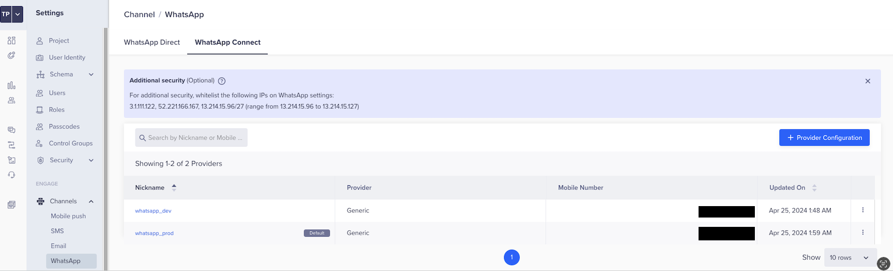
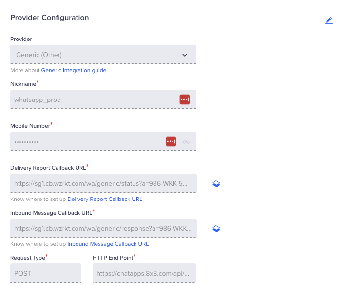
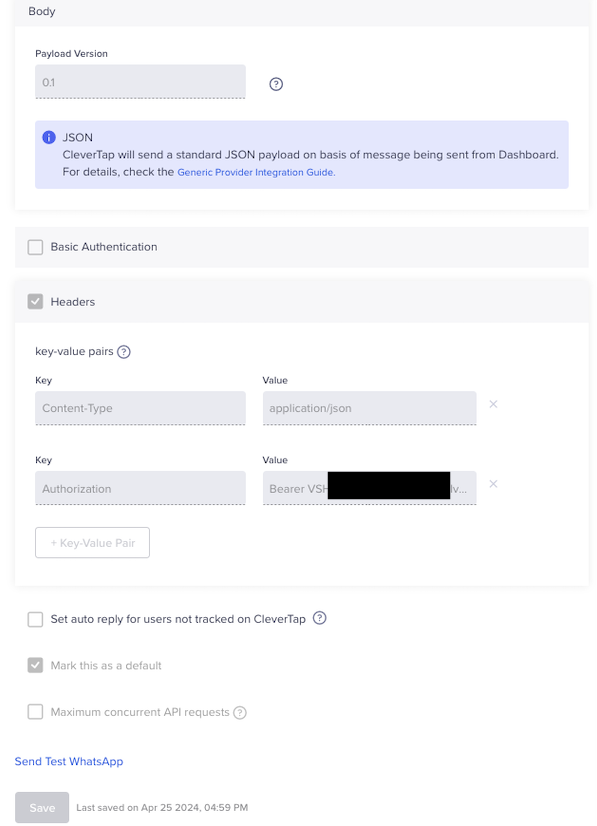
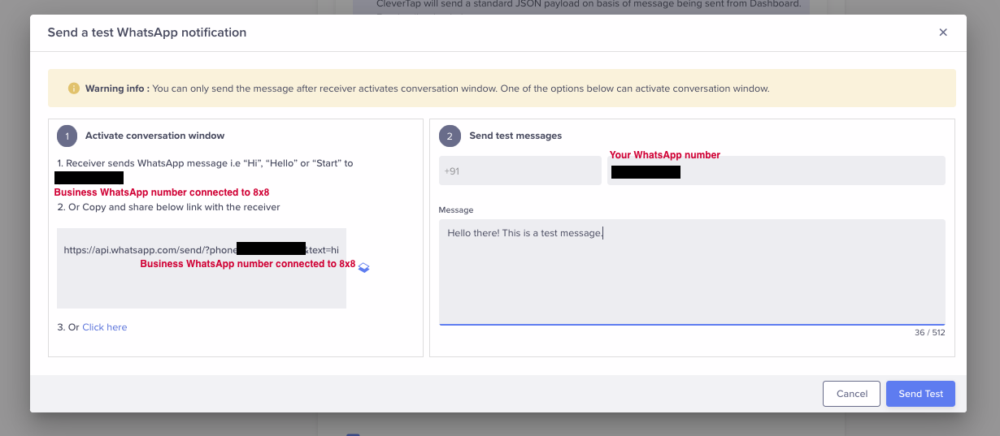
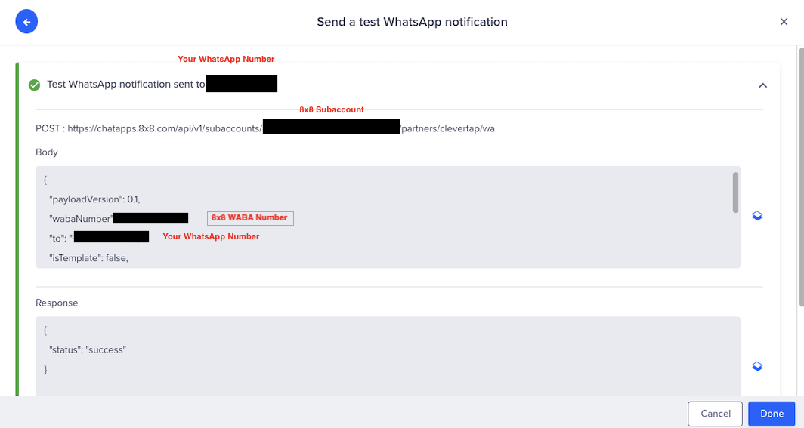
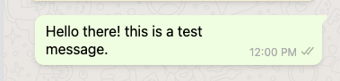
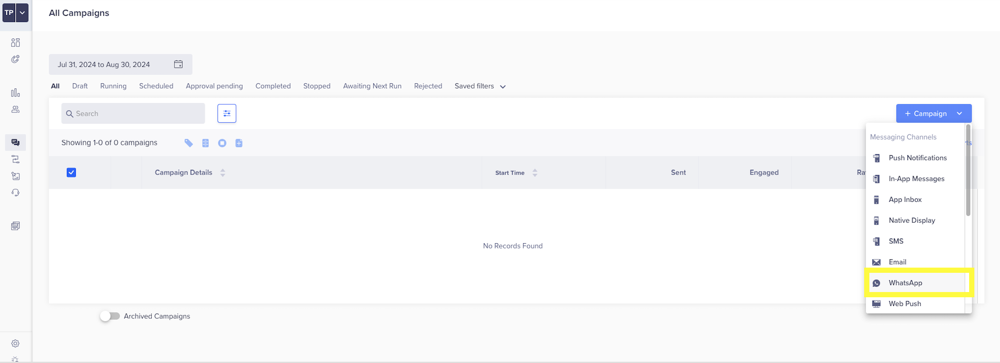
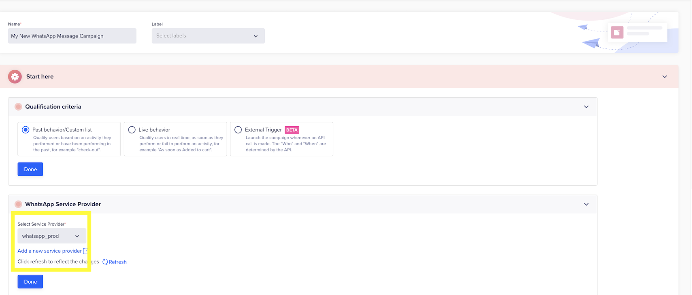

# Clevertap - WhatsApp Integration

## Overview

Clevertap is a Mobile Marketing Platform with app marketing automation helping app marketers to retain user engagement.

CleverTap supports WhatsApp Business API integration.

## Some use cases

* Send a WhatsApp message containing marketing offers from an event being tracked.
* Send a WhatsApp message to customers triggered from the mobile or web app.

## Product scope

* Clevertap

## What you'll need

* 8x8 Account
* WhatsApp Business Account (WABA) with 8x8
* Clevertap (paid or trial)

## Setup

### Setup WhatsApp Connect Provider

In the CleverTap Dashboard, navigate to **Settings > Engage > Channels > WhatsApp > WhatsApp Connect Tab**

Click on the **Provider Configuration** button to set up a new provider. In the Setup Tab, enter the following values:

| Field | Value |
| --- | --- |
| Provider | Other (Generic) |
| Nickname | Any Value |
| Delivery Report Callback URL | Leave as Default, Copy value to send to 8x8 |
| Inbound Message Callback URL | Leave as Default, Copy value to send to 8x8 |
| Request Type | POST |
| HTTP End Point | [https://chatapps.8x8.com/api/v1/subaccounts/{{subaccountid}}/partners/clevertap/wa](https://chatapps.8x8.com/api/v1/subaccounts/%7B%7Bsubaccountid%7D%7D/partners/clevertap/wa) |

After entering the values, ensure that you copy the value for the **Delivery Report Callback URL** and the **Inbound Message Callback URL** and send an email to [cpaas-support@8x8.com](mailto:cpaas-support@8x8.com) with a request to enable the Clevertap integration for WhatsApp for your 8x8 account.

After inputting the values above, click **Send Test WhatsApp** to test the integration by sending a WhatsApp message.

Follow the directions in the dialog box to send the test WhatsApp message. This WhatsApp message should be sent to your test WhatsApp Number which can be your personal WhatsApp Account for example.

If the message is sent successfully, you should see the following dialog:

As well as a corresponding WhatsApp Message sent to your WhatsApp Account.

## Using Campaigns

To use this new WhatsApp Provider in campaigns, select **WhatsApp** as a Messaging Channel when you create a new campaign.

In the next screen you should see the new WhatsApp Provider available as an option

Afterwards you can proceed to send WhatsApp messages in the campaign. For further details on how to send a campaign, please refer to [Clevertap's guide](https://docs.clevertap.com/docs/intro-to-campaigns).

## Templates

In order to send Template messages you will need to register your 8x8 WhatsApp Templates on Clevertap. Please see [Clevertap's guide](https://docs.clevertap.com/docs/generic-whatsapp#adding-message-template) for further details on how to add templates for a Generic WhatsApp Provider.
