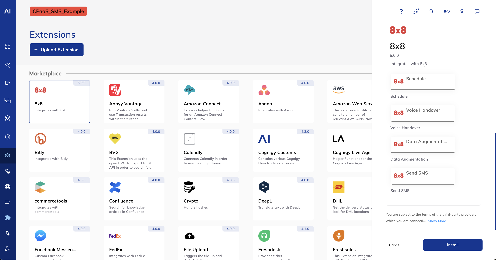
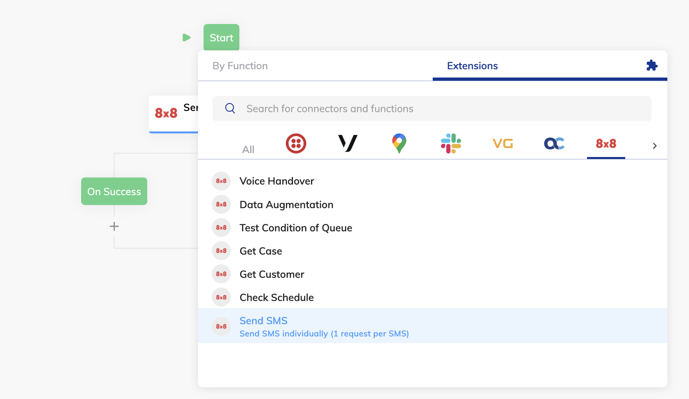

# Cognigy

Cognigy is a premier Conversational AI platform that empowers organizations to build and deploy advanced virtual agents, streamlining customer interactions across various channels without the need for deep technical expertise. Among its robust capabilities, Cognigy Extensions stand out by enabling seamless integration with external services and systems, such as the 8x8, to enhance conversational experiences with functionalities like sending SMS messages directly from the conversational interface

This document will outline the pre-requisites, and how to install and use 8x8 Send SMS node

## Pre-requisites

* Cognigy subscription
* 8x8 Connect account

## Installing the 8x8 Extension

1. Login to [Cognigy](https://app.cognigy.ai/)
2. On the left menu, click on **Manage**, then **Extensions**
3. In the Marketplace section, select 8x8 and on the right panel that pops up, select **Install**



## Node: Send SMS

This node enables you to send outbound SMS messages to enhance customer engagement and deliver timely notifications. Configure it with your 8x8 Connect credentials, define message content, and specify recipient numbers for personalized communication.

### Important requirement

This Extension needs a Connection to be defined and passed to the Nodes. The Connection must have the following keys:

* API Key
  * key: **apiKey**
  * value: Your 8x8-Connect API Key
* Subaccount Id
  * key: **subAccountId**
  * value Your Subaccount Id

### Setup Steps

1. In your flow, click the (+) icon to add a node. Select Extensions, scroll to the right and select **8x8**
2. In the dropdown list, select **Send SMS**
  
3. Click on the Send SMS node.
4. In the Edit Node section on the right, click on the (+) icon under **8x8 SMS Connection**.
5. Set up the node connection with apiKey and subAccountId from your [8x8 Connect](https://connect.8x8.com/) account.  

**Optional**: Set up the Sender ID in the **Source** field if you have a Sender ID depending on your country's regulations. Reach out to [cpaas-support@8x8.com](mailto:cpaas-support@8x8.com) if you need help.

This Flow Node sends an SMS message to a provided destination, while the result is stored in the `input` or `context` object:

```json
{
    "umid": "158ebe36-14f6-4b51-8121-b099006d829a",
    "clientMessageId": null,
    "destination": "+6512345678",
    "encoding": "GSM7",
    "status": {
        "code": "QUEUED",
        "description": "SMS is accepted and queued for processing"
    }
}

```

### Exit Points

The node will confirm successful message dispatch or failure, allowing for appropriate flow actions.

* SMS Success
* SMS Error
