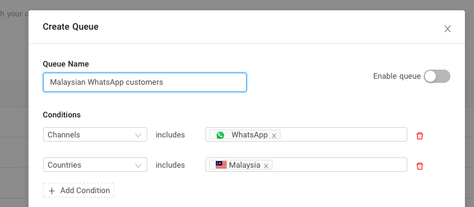
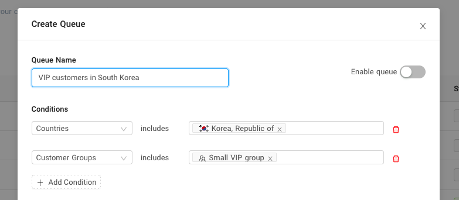
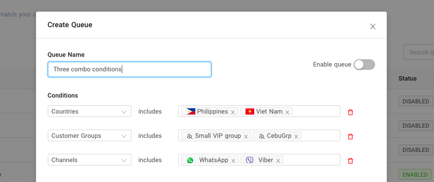

# Combining different queue conditions

You can create a queue using a combination of different conditions

For example, you want a queue where your channel and country condition is specific to WhatsApp and Malaysia.

Another example might be a combination of Country and Customer group (South Korea, Small Vip Group).

You can also combine all three conditions like the example below where Countries include the Philippines and Vietnam. Customer groups include the Small VIP group and CebuGrp. Finally, Channel condition includes WhatsApp and Viber.

