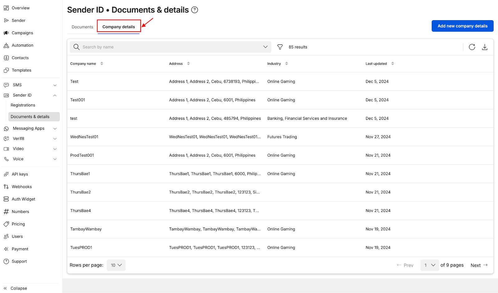
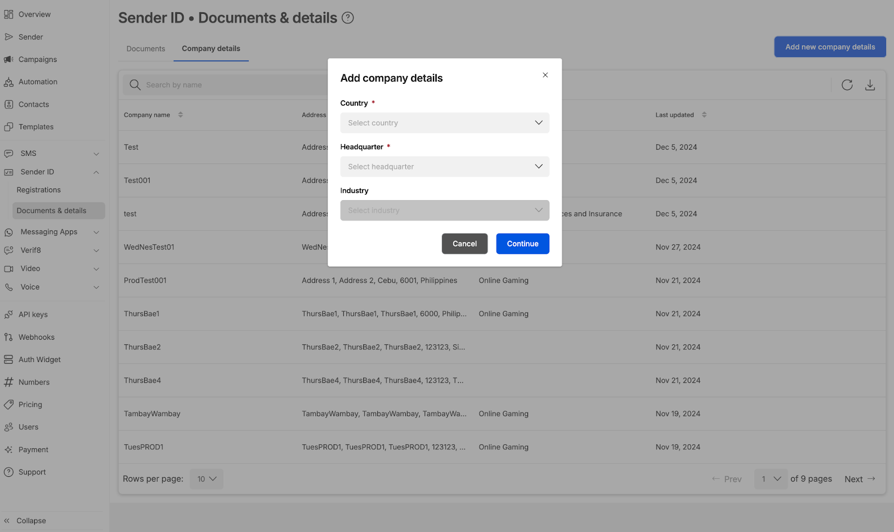
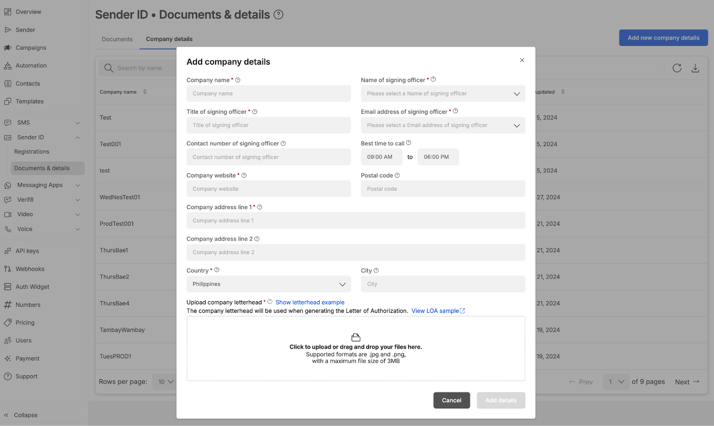

# Company Details Tab

**Accessing Company Details Tab**

* Add company details ahead of time by selecting `Company details` on the Documents & details module
* Alternatively, you can access the `Company details` module via URL: [https://connect.8x8.com/messaging/sender-id/documents-details?tab=sender-id-company-details](https://connect.8x8.com/messaging/sender-id/documents-details?tab=sender-id-company-details)

**Adding Company Details**

* Select Destination country name (Currently Indonesia, Philippines, Singapore and Thailand are offered)
* Select the Headquarters (this depends if your company has a local entity in the country). For some countries, headquarters is not a required field
* For selected countries, Industry is a required field (this depends on the industry of your company)

* Fill up relevant details
* Click Save details when done
* It is mandatory to include the company letter hand (sample of a letterhead is shown and is also reflected on how letter head is used in LOA generation)

