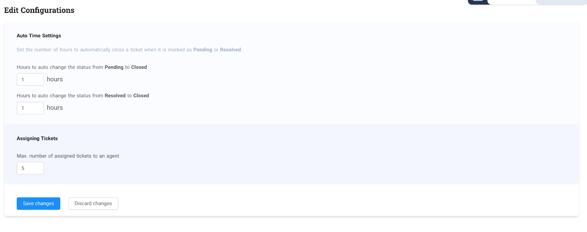

# Configuration

Only agents with a **supervisor** or **administrator** role can access the configuration page.

  
**You can do the following from the configuration page such as**

* Set number of hours a ticket will change its status from Resolved to Closed
* Set number of hours a ticket will change its status from Pending to Closed
* Set Maximum number of assigned tickets to an agent

###### Editing Configurations

To do this simply click the “Edit configuration” button on the top right corner. By default ticket resolutions are set to 1 hour. The maximum number of assigned tickets by default is five(5) for each agent. Once you set your desired configuration, simply click “Save changes” to instantly apply the changes or click “Discard changes” if you don’t want to apply your changes.

