# Security (SSO)

## Single Sign-On (SSO)

This assumes that you already have an SSO application that will be used to configure your SSO. If you do not have one yet, you might want to check these popular SSO services like OKTA and OneLogin

Only users with “admin” access are allowed to configure SSO. If you do not have “admin” access, please contact your system administrator or any user from your account that has “admin” access to the customer portal (8x8 Connect).

SSO is only available to enterprise customers. If you want to check your account, please contact our support team [cpaas-support@8x8.com](mailto:cpaas-support@8x8.com) or get in touch with your account manager.

### Steps

1. Login to the customer portal with an admin role
2. Click the upper-right gear icon and select “User management”

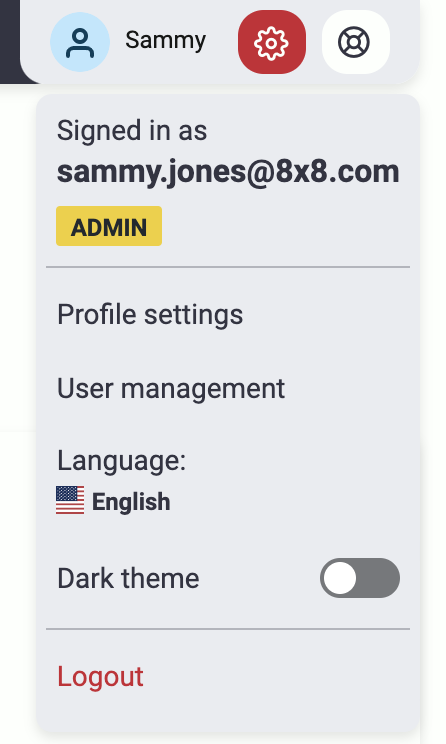

3. Once you are inside the user management page, click the “Configure Single Sign-On” button.

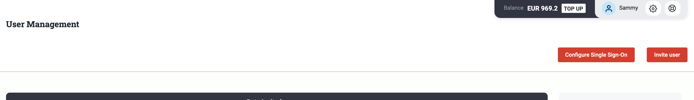
4. An overlay SSO configuration page will appear where you will need to fill different information needed.

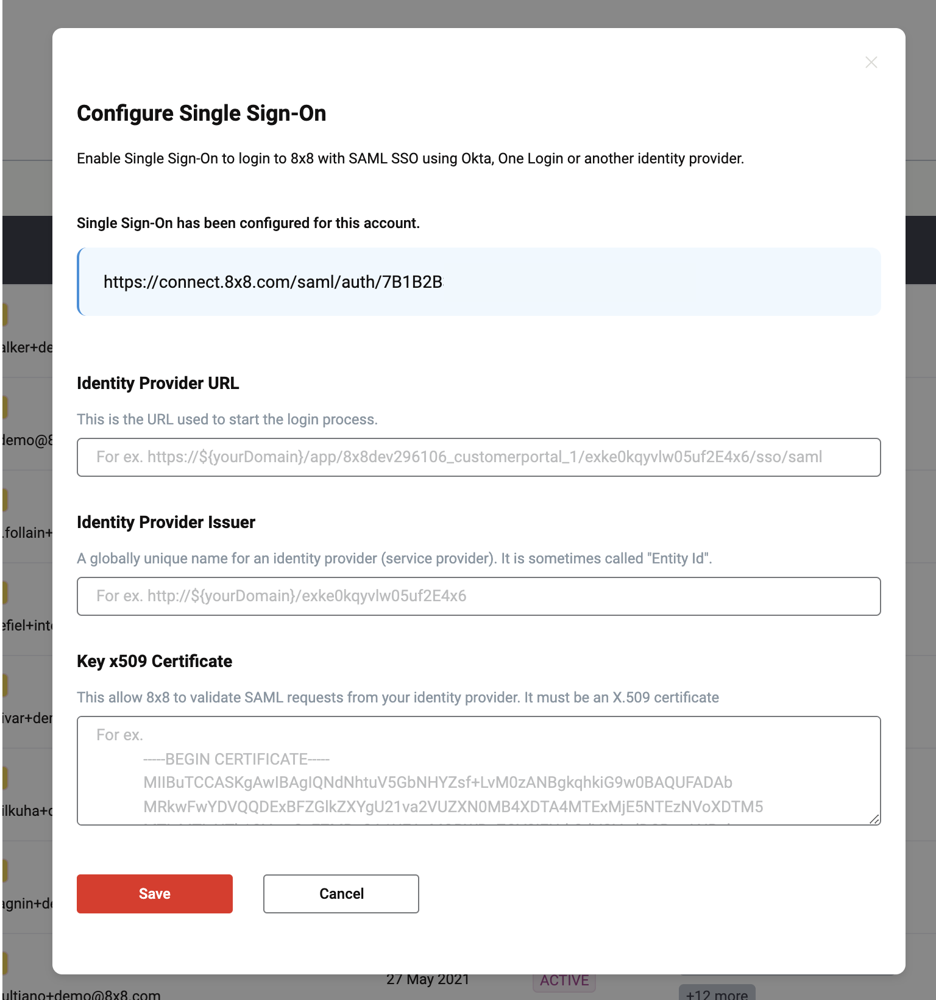
5. Login to your SSO application that you are using and go to your identity provider SAML settings. Copy the url we’ve generated for you and paste it into the Single Sign-On URL

As an example, here I pasted the value under OKTA SAML settings

6. Next copy the identity provider url which is basically your SAML endpoint from your SSO application. Paste it on the “Identity Provider URL” input field.

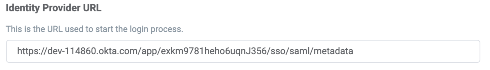

7. Next copy the provider issuer id or “entity id” from your SSO application and paste it on the “Identity Provider Issuer” input field.

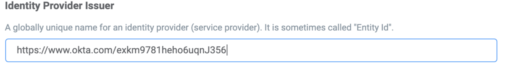

Most SSO applications generate and provide these information. On OKTA they are provided by clicking Identity provider metadata

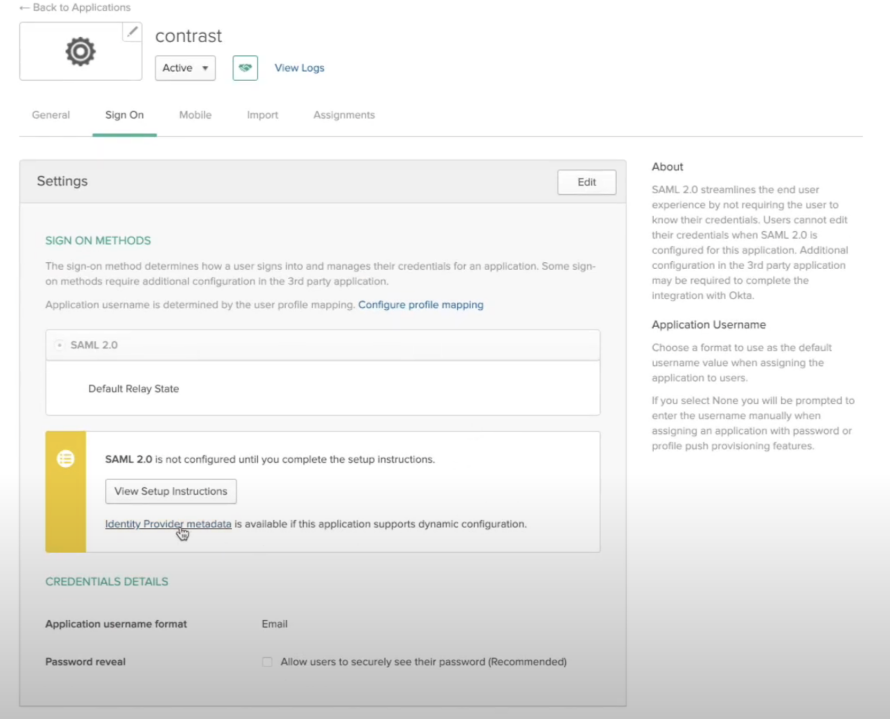OKTA Provider Metadata

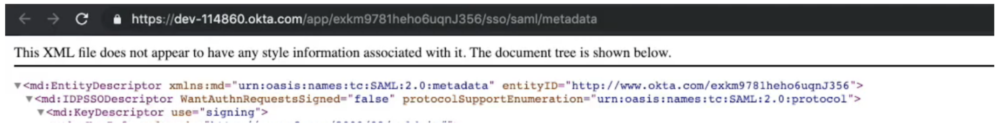Result after clicking metadata

The url itself is your **Identity provider URL** while an XML key called **entityID** is your **Identity Provider issuer**

8. Most SSO apps provide x509 certificates, just copy the contents of this certificate which looks something like this image below and paste it on the “Key x509 certificate” text area field.

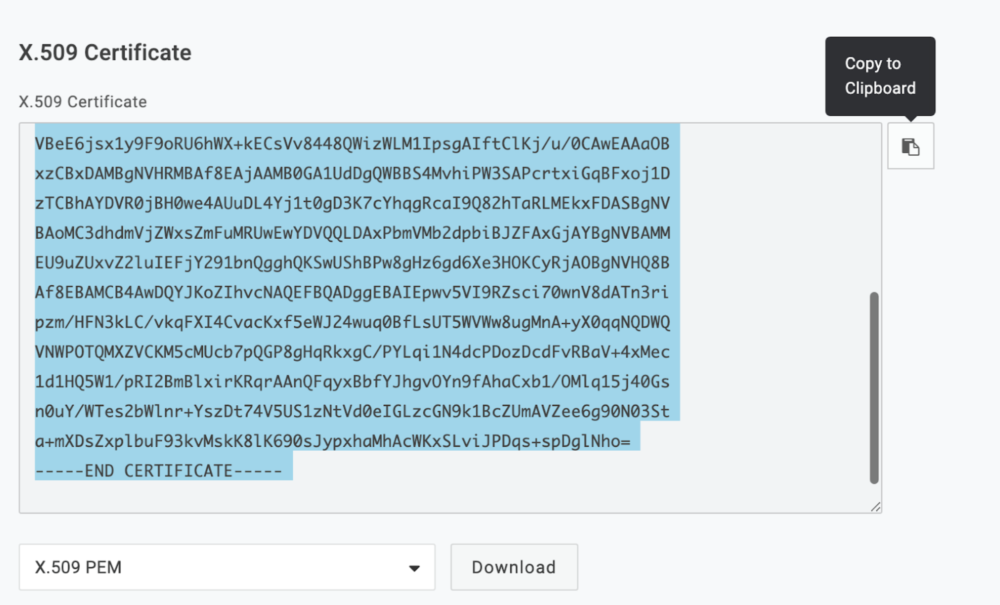
9. Once everything has been filled up, click “Save”

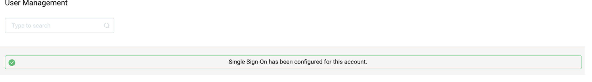

10. Log out of the customer portal and now try to log in using SSO.

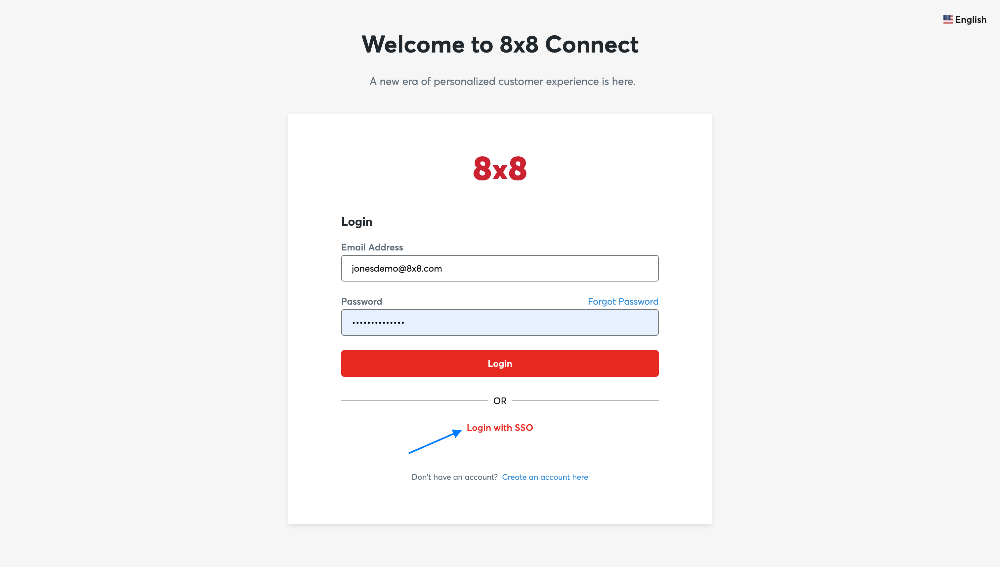
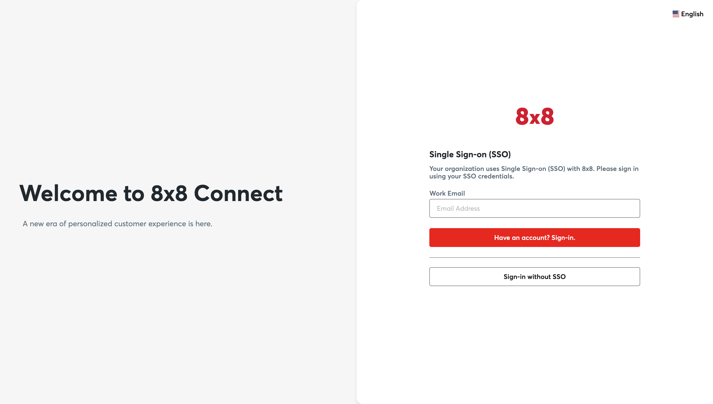
**Notes when logging in using SSO:**

By default, all users without “admin”(administrator) access will be forced to login via SSO once it is configured. Forl users with “admin” access, they can choose to use the normal login using a username/password combination or via SSO.
