# Contact Management

Contact Management is a feature inside Connect that allows you to manage your contacts in bulk whether you will use them to send messages or for Converse(converse.8x8.com). You can also use this feature to group or blacklist your contacts.

## Video Guide

<iframe
  src="https://www.youtube.com/embed/hp3zm-iJ0pI?si=nDW3Q8jQQ8pliS-9"
  height="500px"
  width="100%"
  allow="picture-in-picture; web-share"
  allowFullScreen>
</iframe>

We have a video guide below to accompany this documentation page.

## Creating contacts

There are two(2) ways to add your contacts, either you bulk upload or enter.

**Steps in creating a single contact**  

*(This assumes you have access to contacts management and that you are already logged in)*

1. On the left navigation menu click "Contacts" and you should be redirected to the Contact Management page as shown below

2. Click "Create Contact" and a pop-up form will appear where you will be able to enter all the information about your contact. You can start with the basic user information, channel information and any additional information that you might want to add for your contact.

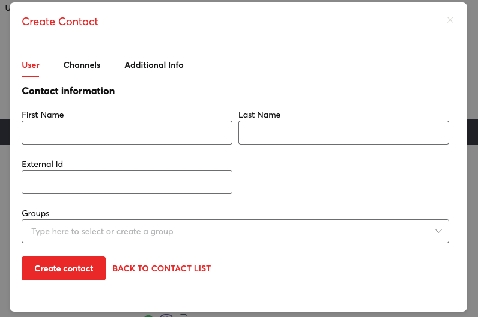

The channels tab

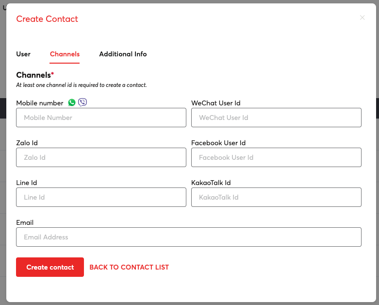

Additional information tab (You can add as many information as you want)

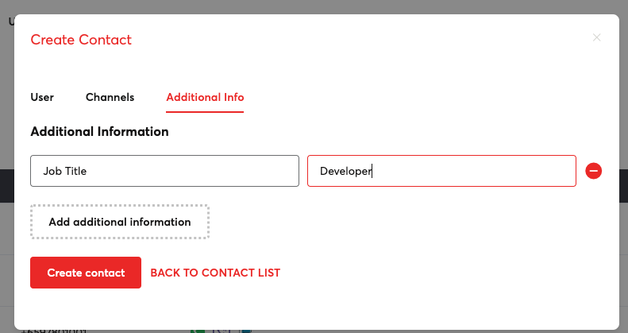

3. Just click on "Create contact" to save. That's it, you just created your new contact.

**Create bulk contacts by uploading a file**  

Our bulk upload method only supports mobile number, first name and last name fields.

1. Start bulk upload, go to Upload contacts tab.

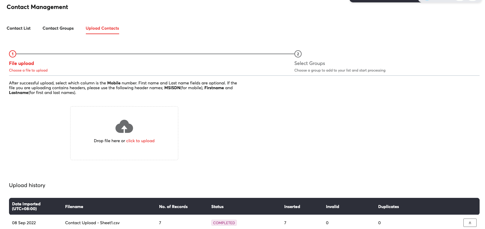

2. Drag the file on the space provided or click the link that says "click to upload". We recommend that you use a .csv file to make sure all your contacts are uploaded.
3. Tag the column where your mobile number is present.

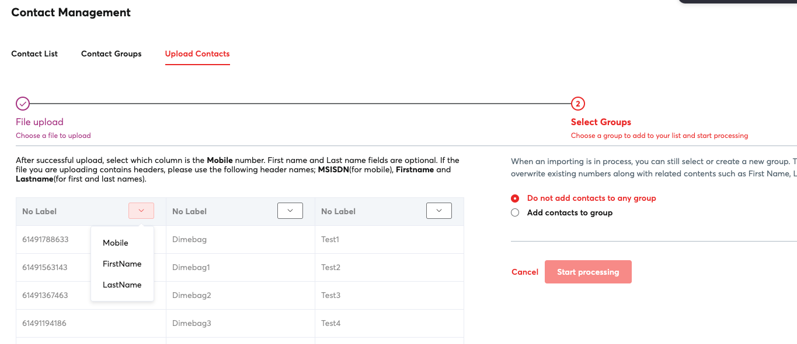

4. You have an option to add your contacts to an existing group. If that group doesn't exist, you can easily type the name and the group will be created automatically once you start processing your file.

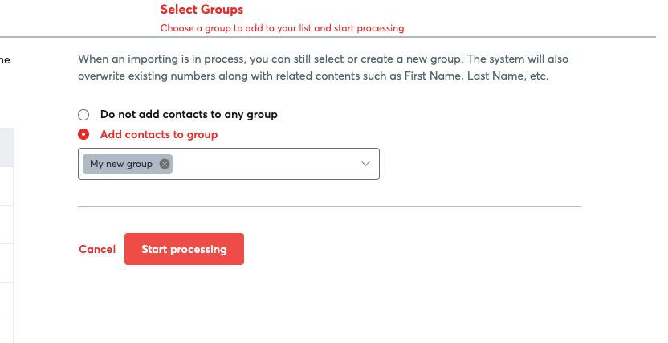

5. Once everything is done, then you can just click "Start processing". The status of your upload is shown below if it is still in progress or completed.

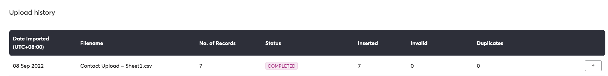

## Creating groups

You can easily group your contacts by creating a new group. Once a group is created you can easily tag your contacts for that group you just created.

1. Click "Contact Groups" tab and then click "Create group"

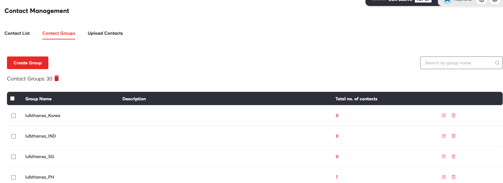

2. Enter the group name on the field provided. As an option you can enter the description for that group.

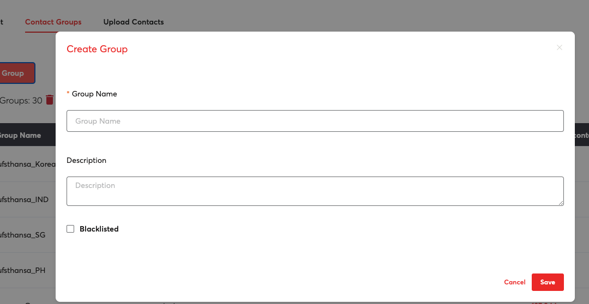

3. Click "Save" and that's it, you're done creating your group.

## Blacklisting your contacts

Blacklisting is useful when you want to avoid sending messages to some of your customers. Usual use-case for this is customer subscriptions where some of your customers want to unsubscribe to your marketing messages.

1. Start by selecting a number of contacts from your contacts list.

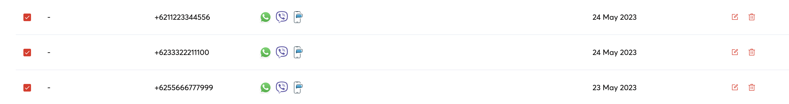

2. Scroll to the top and click "Action items", select "Add to Groups"

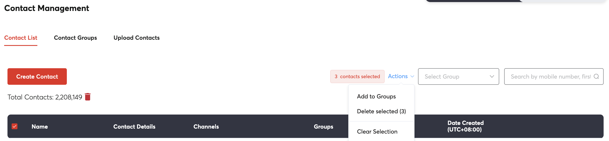

3. You will be prompted to select a group by typing the name or create a new group. Click "Confirm".

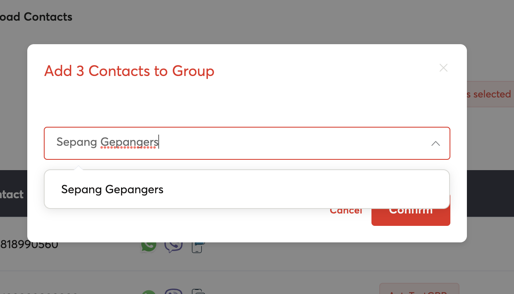

4. Go to "Contact Groups" tab and edit the group you just selected or added. Mark "Blacklisted" by clicking it and then save.

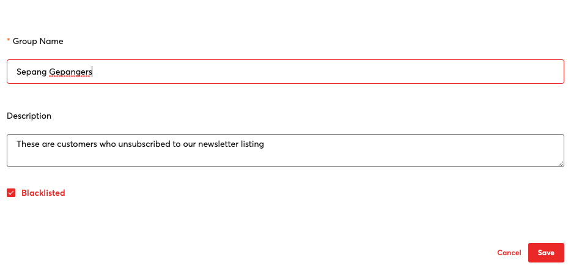That's it you just blacklisted a number of contacts. If you have existing contacts that you want to blacklist on a certain group, simply edit that group and mark them as "Blacklisted".
