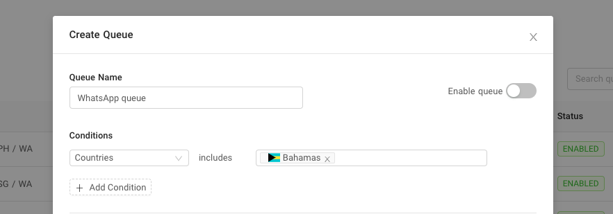
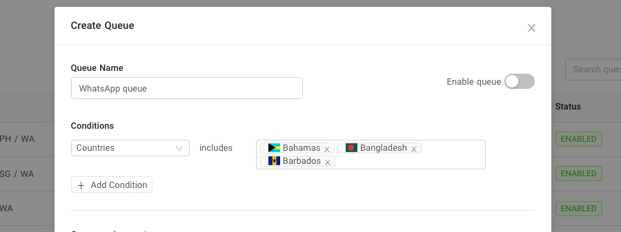

# Country based queueing

Country-based queuing allows you to match agents with your customers in a specific country. It works by identifying the customer's mobile country code(MSISDN country code). WhatsApp and Viber are the two most popular Chat Apps channels that uses mobile number as user identification.

A familiar use case for this condition is to group agents that can speak a group of your customer's local language. For example, to address issues from your customers coming from South Korea, you would add this queue using the Country condition where the country is equal to South Korea and select several agents that can speak Korean.

Queue with multiple countries

