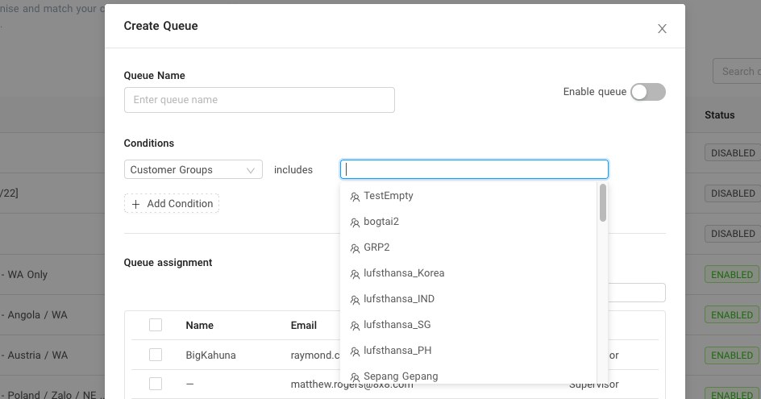

# Customer group based queueing

Customer group-based queuing allows you to match agents with a group of customers. This condition uses Connect's contacts group management(Please see [Contact Management](/connect/docs/contact-management) for more information)

