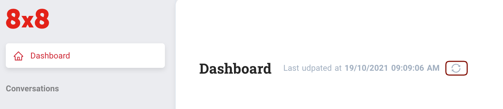
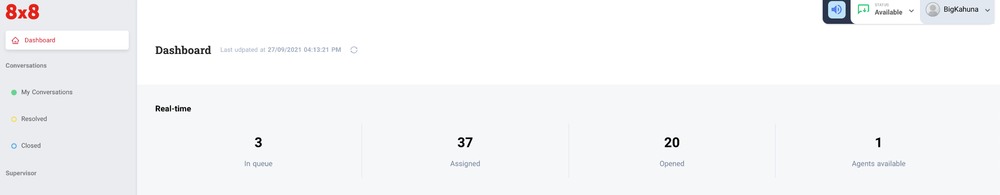
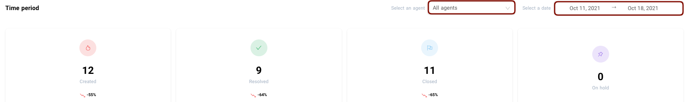
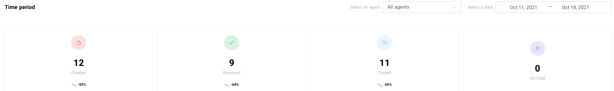
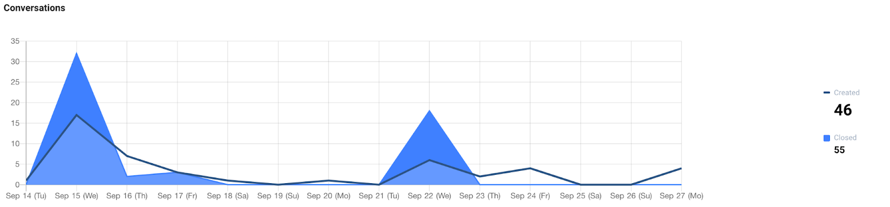

# Dashboard

The dashboard page can only be accessed by agents with administrator or supervisor roles. The dashboard has three(3) sections  

### Real time

This section gives you live information about your Conversations and agents, the data can be updated by using the refresh icon

  
*In queue* - the current number of tickets that are waiting to get assigned to any available agents  

*Assigned* - total number of tickets that are currently assigned to any agents  

*Opened* - total number of tickets that currently have the status Open  

*Agents* - total number of available agents that are currently online

  
### Time period

This is the section where an admin or supervisor can view the stats within a selected period of date and specific agent. By default, it shows all of the agents’ stats. Users can select a specific agent to view his/her stats.

  
**Stats includes**  

*Created* - total number of tickets created  

*Resolved* - total number of resolved tickets  

*Closed* - total number of closed tickets  

*On-hold* - total number of tickets that were put on hold

If you have more tickets closed than created during a period, it means that you are clearing backlogs (closing tickets created before the period). If you have more created than closed tickets, then your backlog (tickets not closed) is growing during the period.

  
### Conversations graph

The graph will depend on the selected date period and specific agent you’ve selected from the section above (Time period). The graph only shows Created vs Closed tickets.

---

#### What’s Next

[My Conversations](/connect/docs/my-conversations)
