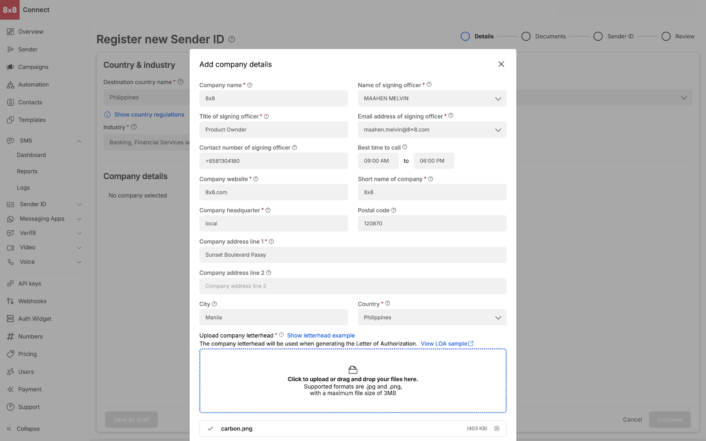

# Details

**Filling Up Details**

* Select Destination country name (Currently Indonesia, Philippines, Singapore and Thailand are offered)
* Select the Headquarters (this depends if your company has a local entity in the country). For some countries, headquarters is not a required field
* For selected countries, Industry is a required field (this depends on the industry of your company)
* Once the above fields are filled `Company details` will appear. Here you can can choose to add pre added company details as before by selecting `Select company` or you can choose to `Add company details`. This has been covered in `Company Details` portion

