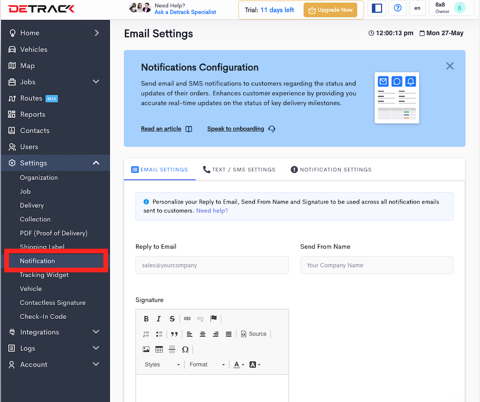
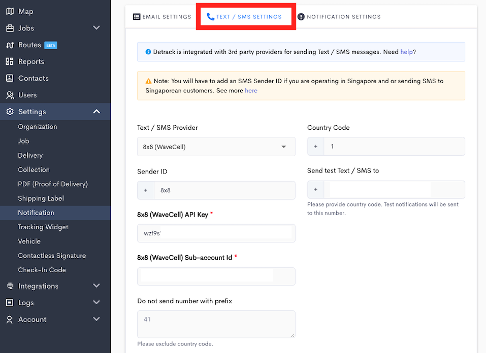
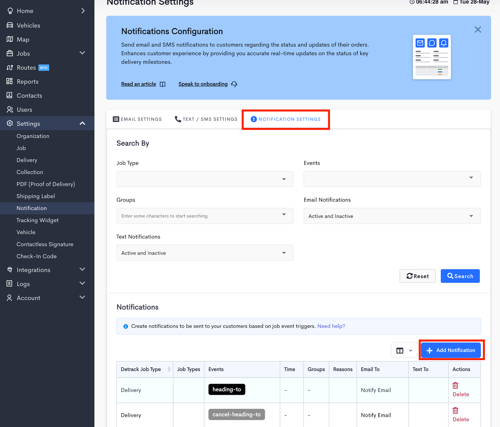
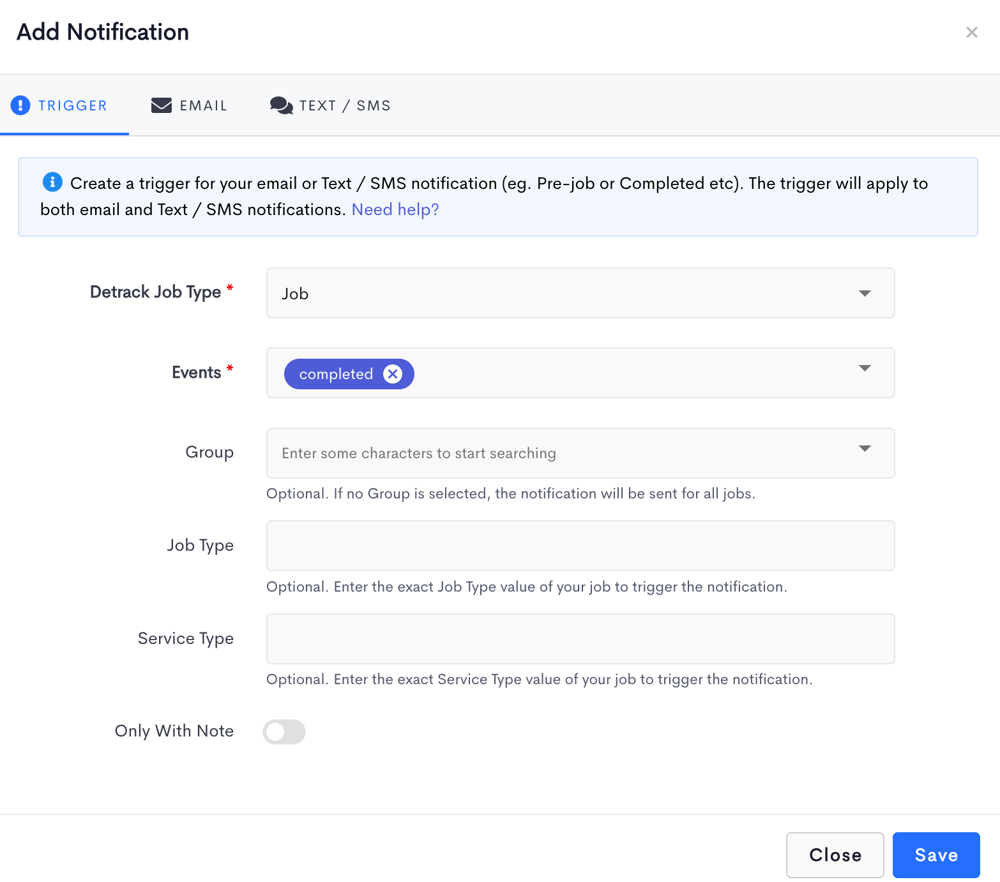
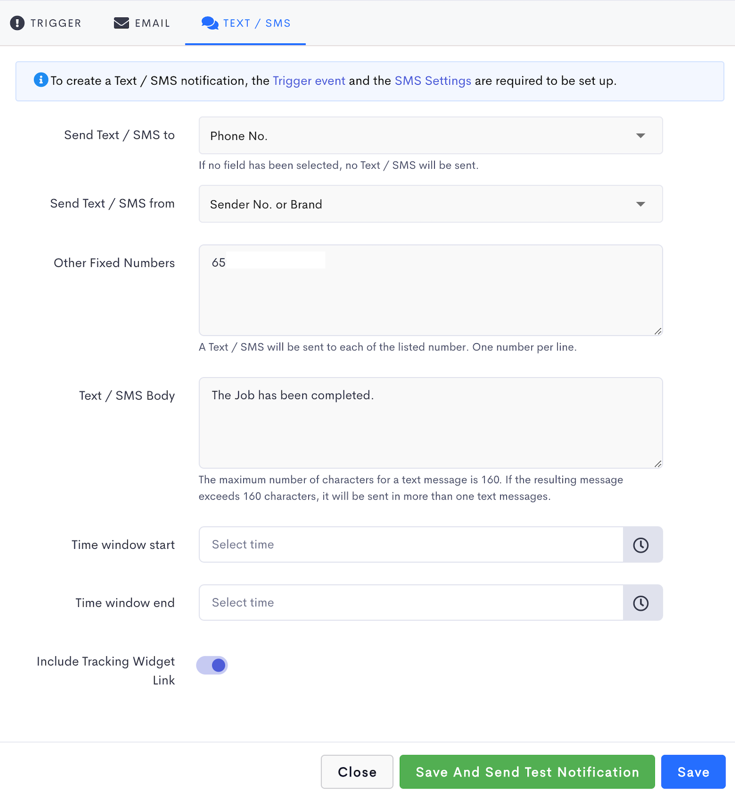

# Detrack - SMS Integration

## Introduction

**Detrack** is a scalable, smart, and easy to use tracking service with automatic real-time notifications when orders are delivered.

**Detrack** provides a rule-based email and text / SMS notification feature, that allows users to send email and text messages to customers, company staff, or any other person who needs to receive those messages based on event triggers.

With this integration, we can leverage the Detrack event triggers and 8x8 API to send SMS when an event occurs.

---

## Video Demo

This video demo will show how you can integrate 8x8's SMS API with Detrack in order to send SMS notifications.

<iframe
  src="https://www.youtube.com/embed/P6KdARiTcm8?si=BYVewXn3aP58tiiN"
  height="500px"
  width="100%"
  allow="picture-in-picture; web-share"
  allowFullScreen>
</iframe>
  
---

### Integrating Detrack notifications with SMS

1. From the Detrack Dashboard, Go to **Settings > Notifications**.

2. Go to **Text / SMS settings** tab and fill out the following **required** values.

| Field | Value |
| --- | --- |
| Text / SMS Provider | 8x8 (Wavecell) |
| Country Code | Country Code of your Sender ID |
| Sender ID | Your Sender ID or Virtual Number |
| Send test Text / SMS To | The number you would like to send your test notifications to. |
| 8x8 (WaveCell) API Key | Your 8x8 API Key. Please generate one from the following [page](/connect/docs/authentication#api-key-management) if you do not have it. |
| 8x8 (WaveCell) Sub-account Id | The Subaccount ID containing the Sender ID / Virtual Number you would like to send from. |

Text / SMS Settings Example

3. Then go to the **Notification** settings tab for a list of notifications that have been pre-set for you. You can click on any existing notification to edit it or click on the **Add Notification** button to add a new notification (or trigger event).

The steps to configure a Notification are continued in the following section below.

---

### Configuring your Detrack Notifications

1. From the **Add Notification** form, go to the **Trigger** tab.
2. Select the Detrack **Job Type** i.e Job (Delivery + Collection) / Delivery / Collection. In this example we select a Job.
3. Select the **Events** that will trigger the notification. In this example we select a completed event.
4. Select the **Group** that you wish to filter. If no Group is selected, then notifications are sent for all jobs regardless of Group.
5. If the **Failed** event is selected, you will be able to select a failed Reason to filter. If no Reason is selected, then notifications will be sent for all failed jobs regardless of Reason.
6. If the **Pre-job** event is selected, you will be able to select which day and what time to send notifications.
  * For the **Pre-job Sending Date** option, you can select up to 5 days prior to the scheduled date to send the notification.
  * For the **Pre-job Sending Time** option, you can select the time of the selected day (above) to send the notification.

---

### Customizing text / SMS notifications

1. Go to the **Text / SMS** tab.
2. For the **Send Text / SMS to** option, select the field containing the mobile number that you wish to notify when the event is triggered. This field is **optional** – you can choose not to send any text by not selecting any field.
3. If you wish to notify other recipients such as internal staff or 3rd party contractors, enter their mobile numbers (one per line) in the **Other Fixed Numbers** box provided. This field is **optional** – you can choose not to send any text to others by leaving the field empty.
4. Type your customized text message in the **Text / SMS body** field.
5. A tracking link will be included in your text message after the text body. The link, when tapped on smartphones, will send the recipients to a direct tracking page where they can easily track the status of their deliveries. The recipients will also be able to rate the Goods / Service, the Driver, as well as provide feedback regarding the delivery to you.
6. Click **Save and send a text notification** button to send a sample text notification to the test phone number or click **Save** to save your settings.

