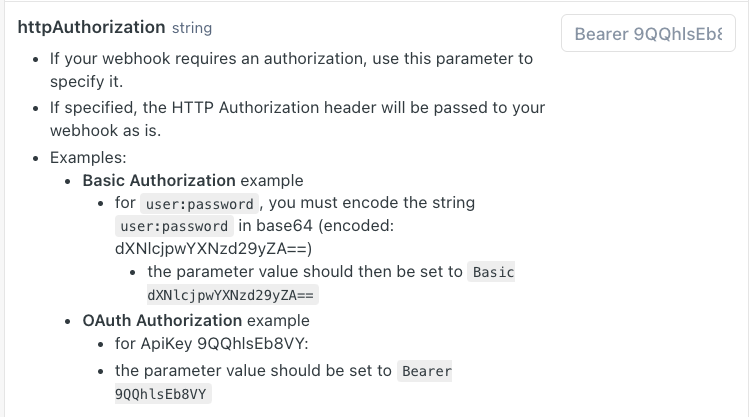
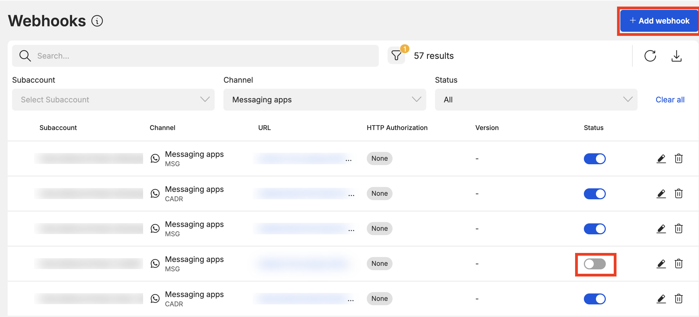
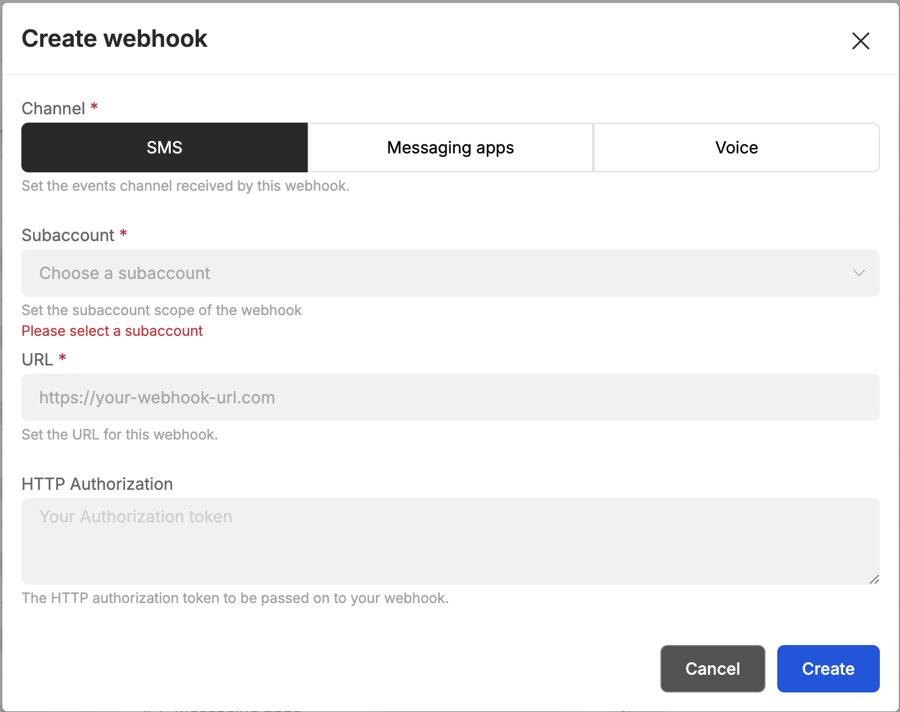
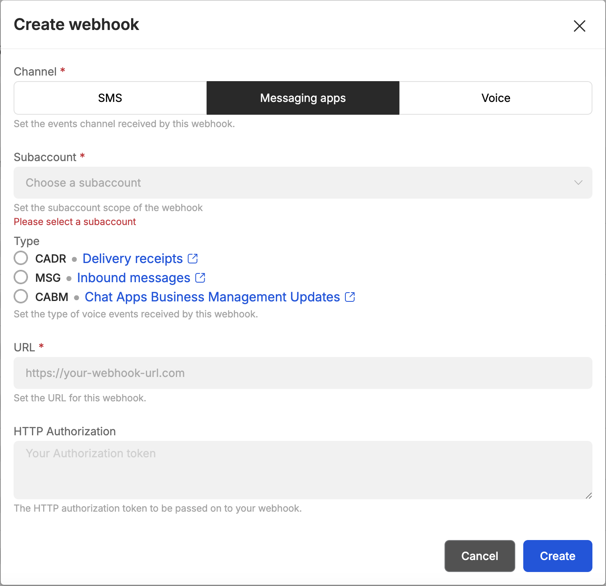
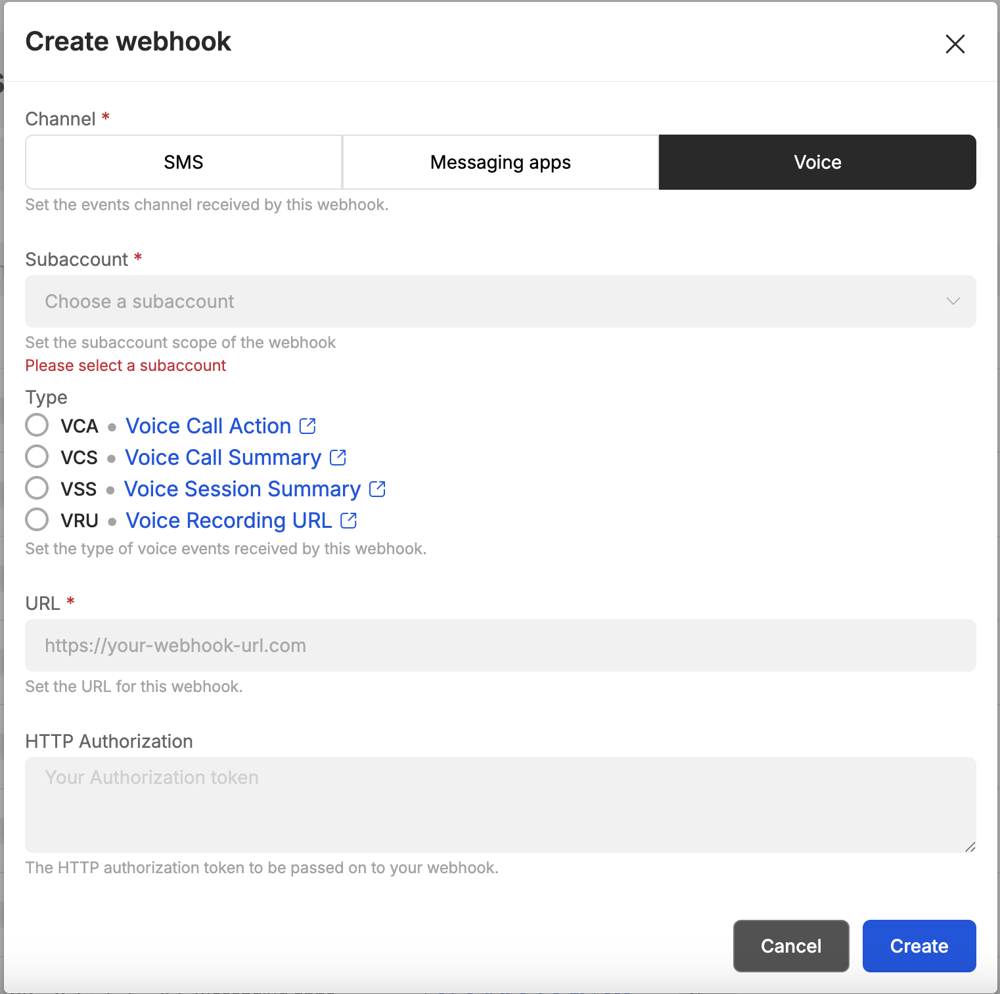
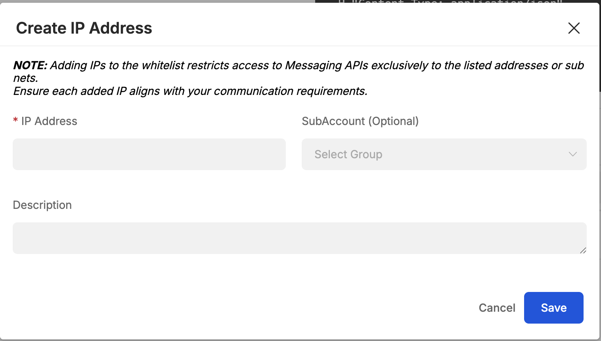

# Developer Tools

8x8 Connect allows developers to manage their API Keys, Webhook endpoints, and IP Whitelisting easily through their respective pages.

## API Keys

This [page](https://connect.8x8.com/messaging/api-keys) allows to see, create and manage any API keys associated to your account.  

API keys are used to authenticate with all 8x8 APIs, more information can be found [here](/connect/docs/authentication).

## Webhooks

This [page](https://connect.8x8.com/webhooks) allows you to see, create and manage your webhooks.

Webhooks are used for 8x8 to automatically send you information such as delivery receipt and incoming messages. You can find more informations on webhooks [here](/connect/reference/webhook-object-structure) .

The webhook list will show you information such as:

* **Subaccount:** The subaccount the webhook is attached to.
* **Type:** The type of webhook which relates to the API it is tied to (Chat Apps, SMS).
* **URL:** The URL the webhooks are being sent.
* **HTTP Authorization:** The HTTP Authorization (if any) that is being used. For now the HTTP Authorization is a string that is added to the header that your server can use to authenticate the webhook.
  * You can find more information on the parameter [here](/connect/reference/add-webhooks-2) under the **Body** Params Object.
* 
* **Content Type (Deprecated):** No longer used in newer webhooks.
* **Status:** Whether the webhook is enabled/disabled

When you click on the **Add webhook** button, you will see this pop up.

  
The popup above allows you to create new webhooks, it can be enabled for all sub-accounts or for a specific one only.

You can then select if you want to setup this webhook for SMS, Messaging Apps, or Voice. If you select SMS you will receive both incoming SMS and SMS delivery information on this webhook.

For Messaging Apps and Voice, you can customize your configuration for each type of webhook.

The **HTTP Authorization** field is an **optional** parameter, in case your webhook requires authentication.

Webhooks can also be managed via API, [here](/connect/reference/get-webhooks-1) for ChatApps and [here](/connect/reference/get-webhooks-2) for SMS, and [here](/connect/reference/get-webhooks-information-1) for Voice.

## IP Whitelisting

With 8x8, your communication is secure, even in the unlikely event that someone gets hold of your API key. That's because only authorised devices from your approved locations (whitelisted IPs) can access our platform.

You can set this up using your  **8x8 Connect** portal [here](https://connect.8x8.com/messaging/api-keys).

Under **IP Whitelisting** section. You may click the **Create IP Address** button.

You will be prompted to input the IP Address and SubAccount. If you do not input a SubAccount, the IP Address will be whitelisted for all SubAccounts. Click **SAVE** once done.

