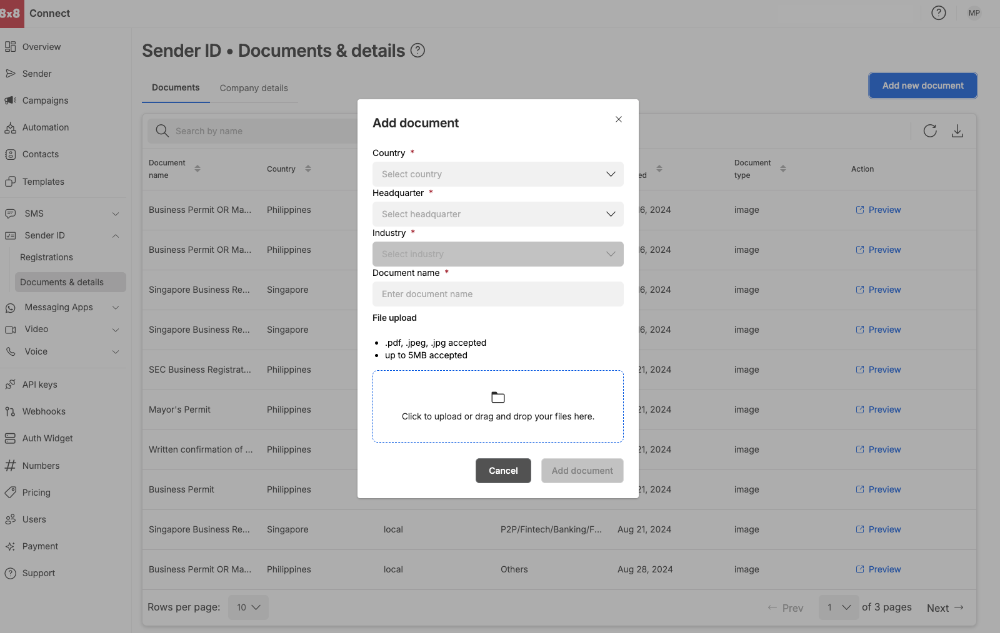
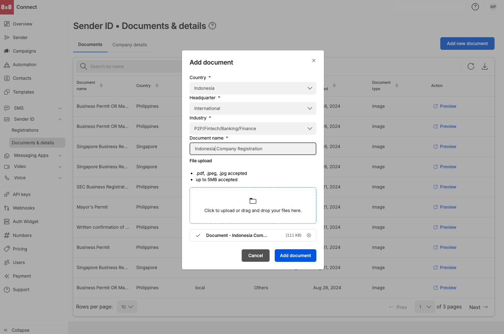

# Documents & Details Dashboard

**Accessing Documents & Details Dashboard**

* Select `Documents & details` under the Sender ID module on your left hand side menu
* Alternatively you can access the Documents& Details Dashboard via URL: [https://connect.8x8.com/messaging/sender-id/documents-details?tab=sender-id-documents-details](https://connect.8x8.com/messaging/sender-id/documents-details?tab=sender-id-documents-details)
* Add Documents for a particular country and headquarter before hand so that your documents are updated.  

Preview Documents that have been uploaded

* Download the current page into a CSV

**Documents can be added ahead of time**

* Country (Indonesia\*, Philippines, Singapore and Thailand)
* Headquarter (Local or International)
* Industry (where applicable)
* Provide a document name

**File type and limits**

* Accepted file types are .pdf, .jpg and .jpeg
* up to 5MB per file

