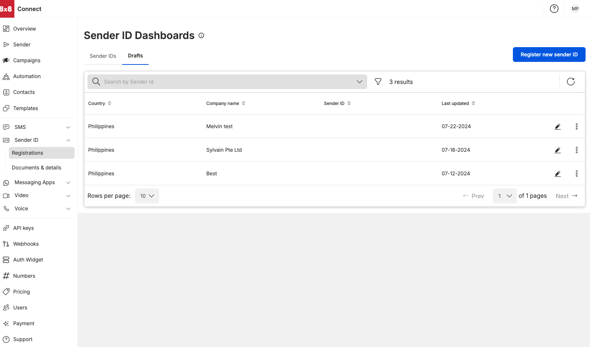

# Drafts Tab

**Sender ID Drafts Dashboard**

* Allows user to view the drafts (unsubmitted sender ID registrations that were saved as drafts)
* View drafts sorted by company, country and on last updated date (default view is by the latest updated draft)
* Clicking on the edit button allows user to access the unsubmitted registrations (higlighted in the red box)

**Sorting filters**

* Country (sort in ascending order [a-z] or in descending order [z-a] of the destination name)
* Sender ID (sort in ascending order [a-z] or in descending order [z-a] of the Sender ID name)
* Company name (sort in ascending order [a-z] or in descending order [z-a] of the company name)
* Last Updated Date sort in ascending order [earliest date - latest date] or in descending order [latest date - earlier date]

---
