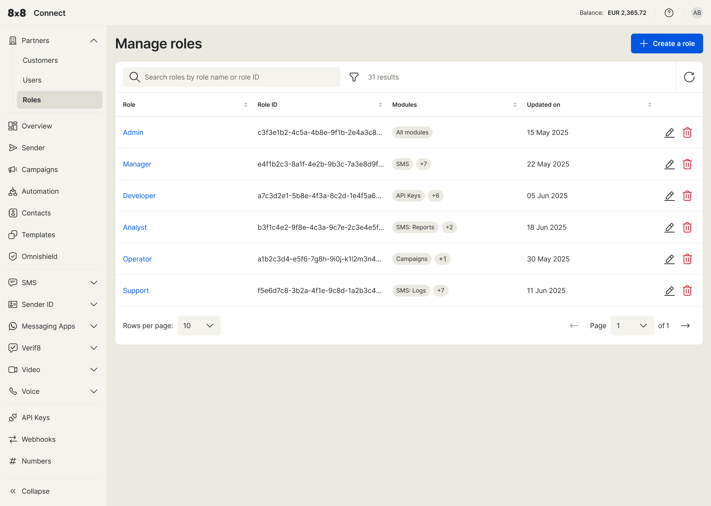
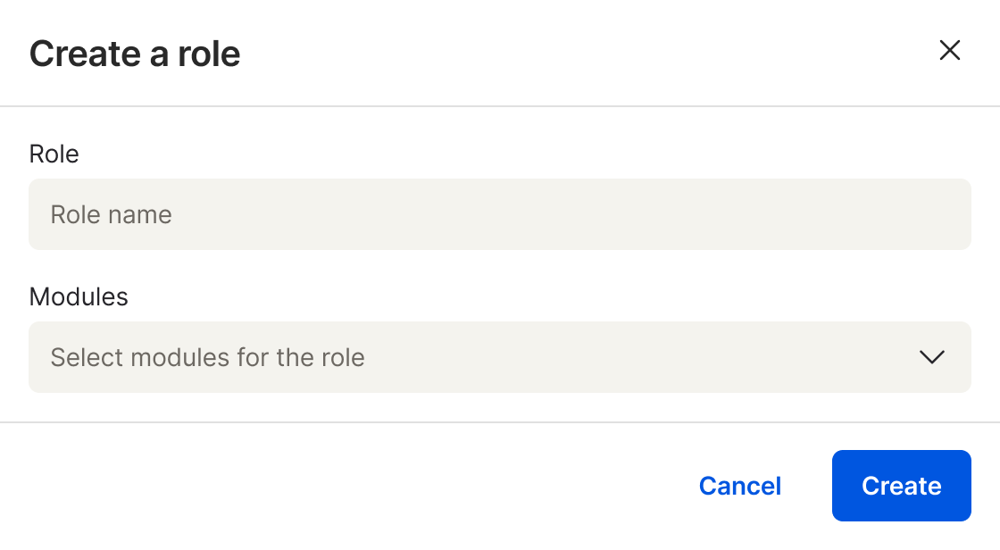
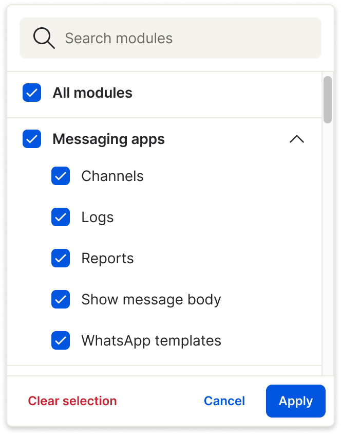
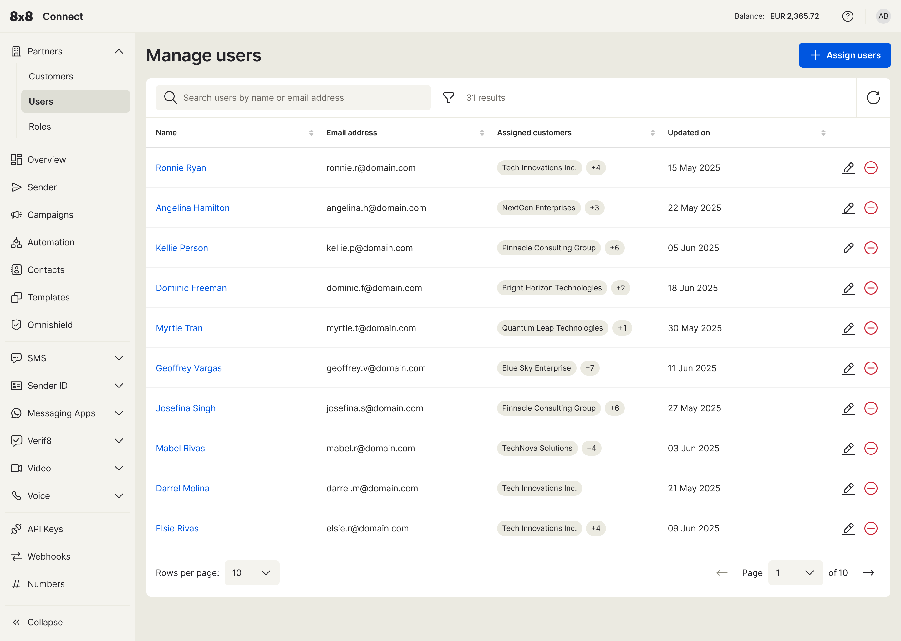

# For Partner Admins: Managing Your Team

As a Partner Admin, you have full control over your team's access to customer accounts and specific features. This is managed through **Roles** and **Users**.

### Setting Up and Managing Roles

Roles allow you to create templates of permissions that can be assigned to your team members. This is the best way to ensure consistent access levels across your organization.

1. **Navigate to Roles:** Go to **Partners > Roles** in the left-hand menu.

2. **Create a New Role:**

    - Click the **+ Create a role** button.
    - Give the role a descriptive name (e.g., 'Support Analyst', 'Sales Viewer').
    - Click on the **Modules** section to open a detailed checklist of permissions.
    - Select the specific modules and sub-permissions this role should have. You can grant access to entire product areas or select granular permissions like 'View Logs' or 'View Reports'.
    - Click **Apply** and save the new role.

1. **Editing a Role:** To modify an existing role, find it in the list and click the **edit icon**.

 

### Managing Users

Once your roles are defined, you can manage your users' access.

1. **Navigate to Users:** Go to **Partners > Users** in the left-hand menu.
2. **Assign Access:** Select a user from the list to manage their permissions. From their profile, you can:
    - **Assign a Role:** Apply a pre-defined role to grant them a standard set of permissions.
    - **Assign Customer Accounts:** Select the specific customer accounts that this user should be able to view.

