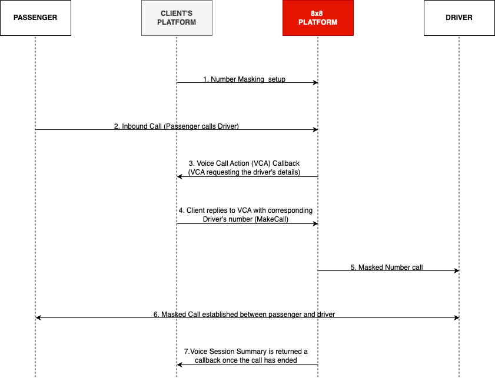

# Getting started with Number Masking

The Number masking service enables your users to connect in a phone call while keeping their phone numbers private. By implementing 8x8's Number Masking service, you can track all conversation metadata in your system while maintaining your customers' privacy.

The main advantages of number masking solutions are:

* Customer privacy
* In platform transactions
* Cost efficiency

This solution is ideal for the ridesharing, delivery or e-commerce industries where you want to connect your users without revealing any personal data. 8x8 Number Masking API allows you to configure a virtual or proxy number from your pool of numbers to receive call events, status callbacks and respond with your preferred call flow function.

## Prerequisites

Before you get started, please contact your account manager to ensure that your account has access to this product and that the following points have been managed:

* You will need a new voice `subAccountId` which has to be set up for 8x8's Number Masking service
* To use our Number Masking API, you require a Virtual Number that will be allocated to your sub-account by the 8x8 team
* You must set up and configure an endpoint where the call action handles will be sent (via the [webhooks API](/connect/reference/create-a-new-webhook) - Voice Call Action). After that, you can use our Number Masking product to begin building your call flows.

If you have not already done so, please visit the 8x8 website at [https://connect.8x8.com](https://connect.8x8.com) to sign up for your account. Do take note that number masking requires an account manager for set up.

## Number Masking flow

On the diagram below a simple number masking call diagram is shown for a call between a Passenger and Driver.

