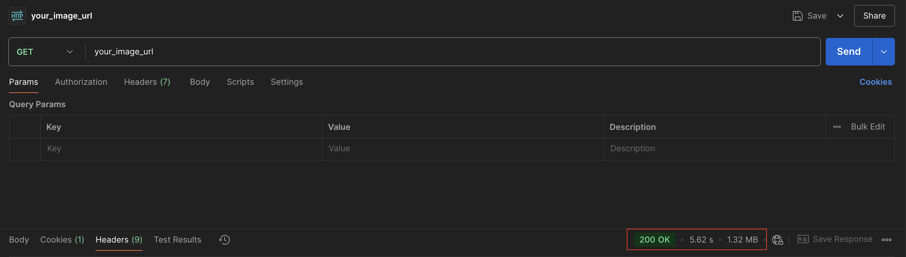

# WhatsApp Image Optimization

When sending WhatsApp messages with media content, the speed and reliability of your image delivery directly impacts message success rates. This guide will help you optimize your images for WhatsApp campaigns and troubleshoot common performance issues.

## Image Requirements

### File Specifications

* Maximum file size: 5 MB, **( below 1 MB** **recommended)**
* [Supported formats](/connect/docs/supported-chat-apps-content-type#whatsapp): JPEG, **PNG (recommended)**
* Recommended dimensions: 1200x630 pixels

## Performance Benchmarks

### Server Response Expectations

* Ideal response time: below 2 seconds
* Recommended server latency: Consistently under 2 seconds

## Troubleshooting Methodology

### Diagnostic Tools

1. **Postman Testing**

Create GET request to image URL

```bash
curl -v -X GET "YOUR_IMAGE_URL" 

```

**Example:**

```bash
curl -v -X GET "https://filesamples.com/samples/image/jpeg/sample_5184%C3%973456.jpeg"

```

It took 5.62 seconds to fetch the image which should be optimized further.

After going through this guide, you should be able to repeat the test above and achieve < 1 second response time.

---

## Common Performance Bottlenecks

### Image-Related Issues

* Oversized image files and/or dimensions
* Non-optimized image compression
* Slow hosting infrastructure
* Geographical server distance or geo restriction

### Recommended Optimization Strategies

1. **Image Compression**

* Use tools like *TinyPNG* or *Squoosh* to reduce file size without compromising visual quality
* More often than not, your graphic design tool might have a built-in functionality to compress images while preserving quality
* Target < 500 KB for optimal performance

2. **Hosting Optimization**

* Implement [Content Delivery Network (CDN)](https://www.pingdom.com/blog/a-beginners-guide-to-using-cdns-2/)
* Choose geographically distributed hosting if you're a multinational brand
* Ensure global accessibility
* Use high-performance cloud storage

---

## Debugging Checklist

### Quick Diagnostic Steps

* Verify image URL accessibility
* Check image file size
* Test server response time
* Validate image [format compatibility](/connect/docs/supported-chat-apps-content-type#whatsapp)
* Confirm public accessibility without authentication

---
