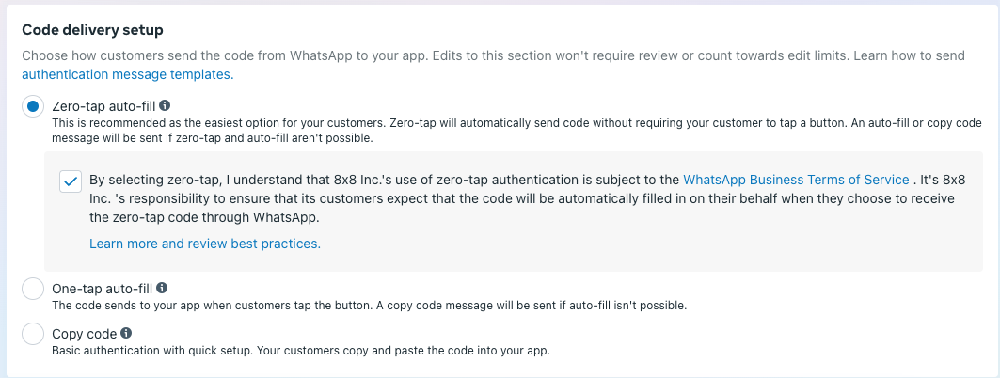
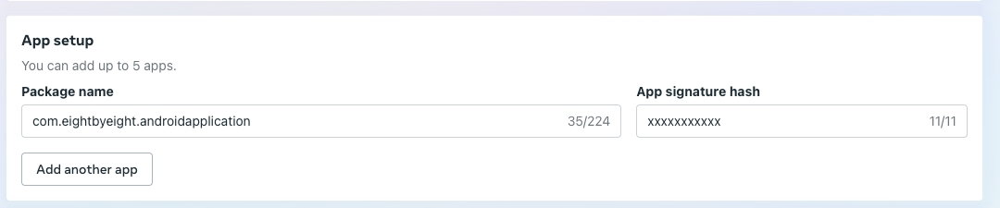
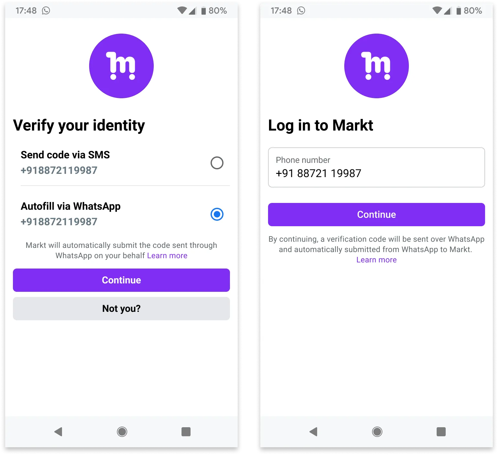

# Zero-tap and One-tap WhatsApp Authentication Template

## WhatsApp Zero-tap and One-tap Authentication Templates

WhatsApp authentication templates can be configured to provide a more seamless authentication experience on Android devices through Zero-tap (automatic code insertion) or One-tap (user confirms code insertion) methods. This guide explains how to modify your existing Copy Code authentication templates to enable these features.

>
> If you're new to WhatsApp as an authentication method for your app, we recommend starting with the standard 'copy code' delivery method and evaluating its performance. Consider implementing Zero-tap/One-tap delivery after you've established your baseline authentication flow and identified opportunities to reduce drop-off rates.
>
>
>

> ⚠️ **Important: Zero-tap and One-tap authentication methods only work on Android devices. Non-Android devices will automatically fall back to Copy Code button.**
>
>

### Getting Started

#### When to Use Zero-tap/One-tap

Zero-tap and One-tap delivery methods are particularly beneficial when:

* The majority of your users are on Android devices
* Your authentication funnel shows significant drop-offs during the authentication code entry step
* You want to reduce friction in critical user journeys like registration or purchases
* User experience and conversion speed are key priorities

#### Prerequisites

* An approved WhatsApp authentication template, created via [API](/connect/reference/add-whatsapp-template) or [Connect Portal](/connect/docs/whatsapp-templates-management#creating-templates)
* Access to Meta Business Suite with appropriate permissions
* Android app package name and signature hash information

#### Before You Begin

This guide covers template configuration in Meta Business Suite. However, to enable Zero-tap/One-tap functionality, you'll need to implement additional components in your Android app after completing this guide. Details about the implementation will be covered in the **Next Steps** section.

---

### Delivery Methods

* **Zero-tap**: Code is automatically inserted without user interaction. Best for scenarios where users have explicitly agreed to automatic authentication.
* **One-tap**: Users approve code insertion with a single tap. Provides additional security while maintaining convenience.
* **Copy Code**: Users copy the code and paste it into the browser or application. Good for scenarios where most of your users are not on Android. This is the default method.

---

### Configuring Your Template

1. Log in to [Meta Business Suite](https://business.facebook.com/latest/settings/)
2. From the left panel, select "WhatsApp accounts" and choose your WhatsApp account

3. Click "WhatsApp Manager" on the right side of the screen
4. In WhatsApp Manager, select "Manage templates" from the left panel

5. Locate and click on your approved authentication template that was created via 8x8 platform, then select "Edit template". If you don't see one, please follow the [guide](/connect/docs/whatsapp-templates-management#creating-templates) and ensure you meet all other pre-requisites mentioned at the beginning of this guide.

6. Choose your preferred Code Delivery method:

  * Zero-tap autofill
  * One-tap autofill
  * Copy code (default)  

>
> Note: For Zero-tap authentication, ensure compliance with Meta's [best practices](https://business.facebook.com/business/help/285737223876109)
>
>
>

7. Enter your Android app information:

* Package name
* App signature hash

8. **Optional**: Adjust the message validity period (time-to-live) at the bottom of the page. This ensures the WhatsApp message doesn't get sent beyond the validity period, which allows you to orchestrate alternative channels such as SMS OTP or Voice OTP

9. Click Submit to save your changes

---

### Implementation Guide

The following sections contain technical details for Android app implementation and should be reviewed by your development team.

#### Testing Your Template

Before implementing in your own app, you can:

* Use WhatsApp's official [sample OTP app](https://github.com/WhatsApp/WhatsApp-OTP-Sample-App) to validate your template configuration
* Test with both Android and iOS devices

#### Next Steps

After validating your template configuration, you'll need to implement the required WhatsApp OTP handshake in your Android app. This security mechanism enables Zero-tap/One-tap functionality through either:

1. WhatsApp's OTP Android SDK (Recommended)

  * Simpler implementation
  * Available through Maven Central
  * Handles most of the complexity for you
2. Manual Implementation

  * Implement custom Android activities and intent filters
  * Handle the handshake process directly
  * More flexibility but requires more code

> 📘 **For technical implementation details and code examples for both approaches, refer to Meta's [OTP handshake documentation](https://developers.facebook.com/docs/whatsapp/business-management-api/authentication-templates/autofill-button-authentication-templates#handshake).**
>
>

#### Troubleshooting

* Verify package name and signature hash match between template configuration and your Android app
* Ensure [handshake](https://developers.facebook.com/docs/whatsapp/business-management-api/authentication-templates/autofill-button-authentication-templates#initiating-the-handshake) is initiated before sending the authentication message (within 10 minutes)
* Check that the user has [WhatsApp installed](https://developers.facebook.com/docs/whatsapp/business-management-api/authentication-templates/autofill-button-authentication-templates#checking-if-whatsapp-is-installed) and is logged in
* Confirm your app has the proper activity defined to receive the authentication code

#### Best Practices

* Clearly inform users about automatic code insertion in your message
* Allow users to choose their preferred authentication method

See example below:

#### Using the Template

You can send authentication messages using the same [Authentication template payload](/connect/reference/send-message) regardless of the delivery method chosen. The delivery method will be automatically determined based on the user's device type.
