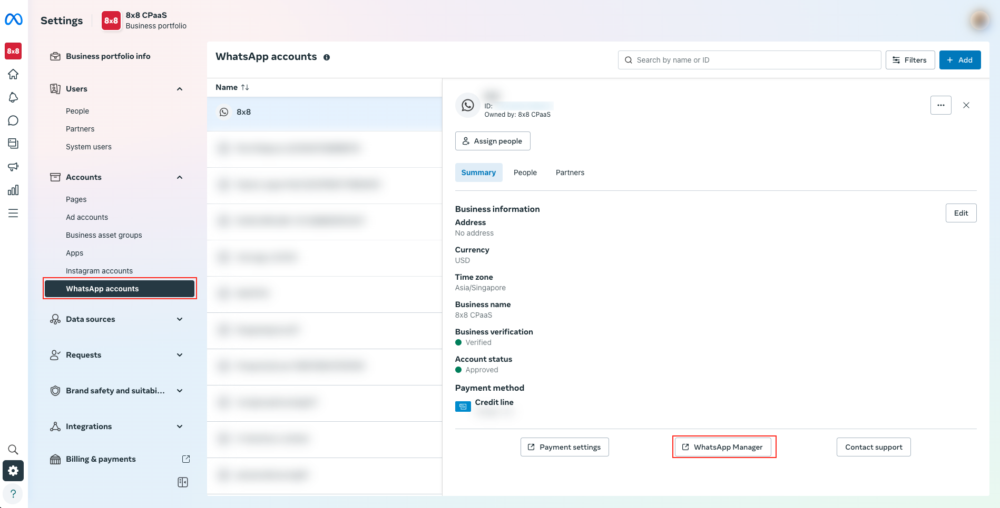
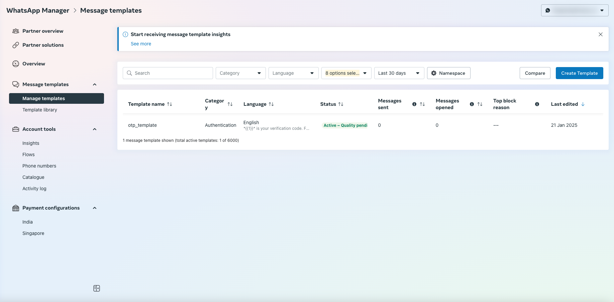
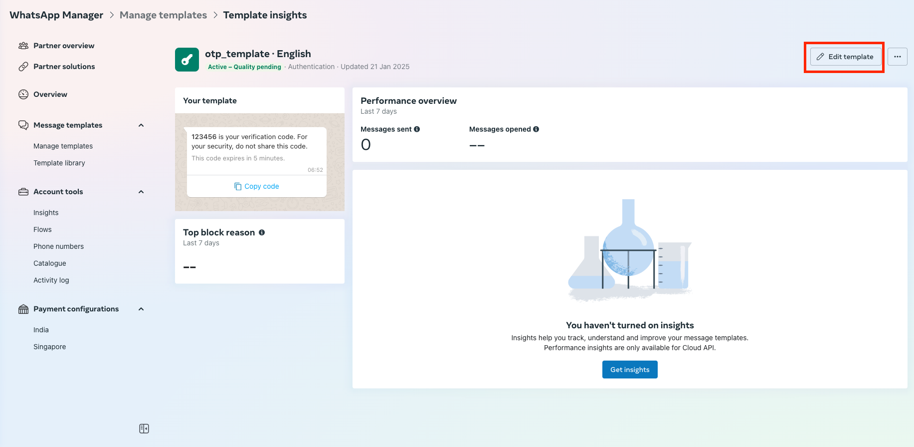
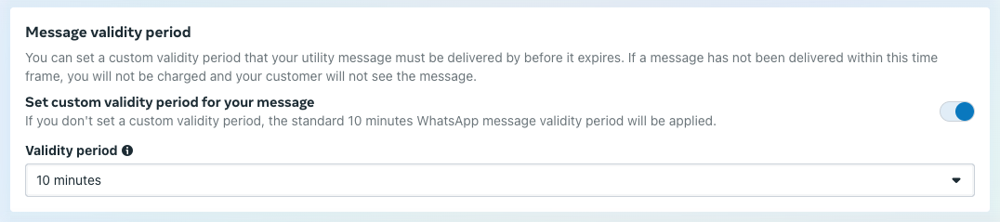

# WhatsApp Template Validity Period (TTL)

## Configuring Validity Period for WhatsApp Templates

WhatsApp allows you to define a specific validity period or delivery window, also known **Time-To-Live (TTL)**, for **Utility** and **Authentication** message templates. This determines how long WhatsApp will attempt to deliver the message to the recipient's device.

Setting an appropriate validity period is crucial for:

* **Time-sensitive messages:** Ensuring One-Time Passwords (OTPs), notifications or critical alerts aren't delivered after they become irrelevant.
* **Coordinating fallback strategies:** Triggering alternative channels (like SMS, email, or voice) only *after* the WhatsApp message validity period has expired, preventing duplicate messages.

This guide shows you how to configure the validity period for your templates within the Meta Business Suite.

---

> 👍
>
> Refer to [Messaging Apps fallback management guide](/connect/reference/chatapps-fallback-management) to ensure your message delivery orchestration align with the WhatsApp template validity period, preventing duplicated messages
>
>

### TTL Defaults, Ranges, and Compatibility

The ability to customize Time-To-Live (TTL), the specific ranges allowed, and the default behavior depend on the template type and potentially the API being used:

| Feature                | Authentication             | Utility                | Marketing                        |
| :--------------------- | :------------------------- | :--------------------- | :------------------------------- |
| **Default TTL**        | 10 minutes                 | 30 days                | 30 days                          |
| **Compatibility**      | Cloud API + On-Premise API | Cloud API only         | Marketing Messages (MM) Lite API |
| **Customizable Range** | 30 seconds to 15 minutes   | 30 seconds to 12 hours | 12 hours to 30 days              |

*Note: This guide focuses primarily on configuring TTL for **Utility** and **Authentication** templates, where customization is most impactful for time-sensitive delivery and fallback orchestration.*

---

### Prerequisites

* Access to [Meta Business Suite](https://business.facebook.com/latest/settings/) with appropriate permissions for your WhatsApp Business Account.
* An existing, approved **Utility** or **Authentication** WhatsApp template created via the 8x8 platform ([API](/connect/reference/add-whatsapp-template) or [Connect Portal](/connect/docs/whatsapp-templates-management#creating-templates)).

---

### Configuring the Template Validity

1. Log in to [Meta Business Suite](https://business.facebook.com/latest/settings/).
2. Navigate to **WhatsApp accounts** from the left-hand menu and select the relevant WhatsApp account.

3. Click the **WhatsApp Manager** button, usually located on the right side of the screen.
4. In the WhatsApp Manager interface, select **Message templates** from the left-hand navigation panel.  

5. Locate the specific **Utility** or **Authentication** template you wish to configure. Click on the template name or an associated 'Edit' button.  

6. On the template editing screen, scroll towards the bottom to find the **Message validity period**
7. Adjust the value in the input field to your desired TTL. You can typically specify the duration in seconds, minutes, hours, or days.  

>
> **Tip:** Consider the nature of your message. OTPs often require a short TTL (e.g., 5-15 minutes), while appointment reminders might allow for a longer TTL (e.g., several hours before you fall back to making a phone call).
>
>
>
8. After setting the desired validity period, ensure you save your changes by clicking **Submit**.

---

### Important Considerations

* **Manage Fallbacks & User Preferences:** For the best user experience and to manage expectations, consider allowing users to select their preferred communication channel (e.g., WhatsApp, SMS, Email) during signup or within profile settings. If you *do* implement automated fallback channels, ensure your logic triggers them **only after** the specified validity period has passed (and no delivery status webhook received) to avoid sending duplicate messages across channels.
* **Default TTL:** If not explicitly set, WhatsApp applies the default validity period listed in the table above.

By carefully configuring the TTL for your Utility and Authentication templates, you gain finer control over message delivery timelines and can better orchestrate multi-channel communication strategies.
