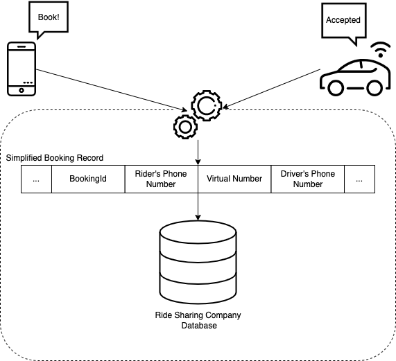

# How to implement 8x8 Number Masking?

## Introduction

Although a simple phone conversation is hardly cutting-edge technology, it is nevertheless necessary for business-to-customer communication in today's world.

Even more so today, because individuals keep the same phone number for extended periods of time, phone numbers are intrinsically tied to a user's identity. As a result, we're seeing a rise in the usage of phone numbers to authenticate a user's online identity.

It has become a matter of great importance for most businesses to protect the customer's identity and privacy, especially if day-to-day business communication with their users is key to the company's success.

Number Masking is ideal to help any company to achieve that goal of "**Privacy in business communication**". From our experience, Number Masking is especially effective for businesses that share customer's phone numbers with 3rd parties, which is common in the following industries:

* Ride Sharing
* Logistics / Delivery
* E-commerce

## Overview Video

In this section, we will see a few videos of number masking and how it can be used for certain use cases.

### Overview Video - Logistics / Delivery

This video covers a common example of logistics/delivery where a business like a bank needs to deliver a card to their customer through a third-party courier. Number masking allows their third-party courier to contact customers to resolve last-mile delivery issues while maintaining the anonymity of the numbers.

<iframe
  src="https://www.youtube.com/embed/1n1QA4EjdbM?si=o134SMpP5xVXrS2D"
  height="500px"
  width="100%"
  allow="picture-in-picture; web-share"
  allowFullScreen>
</iframe>

### How to implement 8x8's Number Masking?

As an example, let's take a look at the business case that is applicable for most ride-sharing businesses. When a business event takes place (read: the user has booked a ride) one Virtual Number is assigned for that booking. That Virtual Number is shown to both the rider and the driver, and if they want to engage in a phone call they can simply dial the Virtual number and get connected to the other user.



One Virtual Number can be associated with multiple business events (read: bookings). In the image above a simplified booking record is shown, that remains active for as long as the booking is not marked as completed. The [Get My Virtual Numbers](/connect/reference/number-health-service) API provides a detailed overview of the Virtual Numbers available in your account.

There are a few things to consider when assigning a Virtual Number to a booking. The most important thing is to avoid conflicts. Because the Virtual Number will be utilized as a search parameter to identify the second user, assigning the same Virtual Number to the same driver/user at the same time would result in a conflict. Another factor to consider is the volume of incoming calls. Spreading the incoming calls over multiple Virtual Numbers in the Number Pool is a good idea. We can avoid having one Virtual Number overloaded with incoming calls this way.

When a rider or driver initiates a call to the Virtual Number (assigned to their booking) 8x8's platform will deliver a [Call Action Request](/connect/docs/call-action-handling#call-action-request) to the Ride Sharing company's endpoint. The Call Action Request from 8x8 is an HTTP POST request that contains all of the call data for the incoming call. The [Create a new webhook](/connect/reference/create-a-new-webhook) API can be used to specify the endpoint to which the Voice Call Action webhook will be delivered. The Ride Sharing company's endpoint should respond to the Call Action Request with the "makeCall" [Call Actions](/connect/docs/call-action-handling#makecall) that contains the other user's phone number to establish the call between the rider and the driver.

Once the Call Action is received, 8x8 will connect the second user, allowing the rider and the driver to communicate without having to share their real phone numbers.

Here's a small web server solution that shows how the Ride Sharing company's business logic can be implemented:

```python
import os
from flask import Flask, request, jsonify
import requests

my_secret = os.environ['Apikey']
app = Flask(__name__, template_folder='templates', static_folder='static')


# Index page
@app.route('/')
def hello():
    return "Number Masking Customer Endpoint"

# Defining the customer endpoint where all the Call Handles 
# for each Number Masking request will be send to 
@app.route('/numbermasking', methods=['POST'])
def respond():
    request_data = request.get_json()
    
    # Get the Calling User's Phone Number from the 8x8 Call Handle
    Rider_Phone_Number = request_data['payload']['source']
    
    # Get the Called Virtual Number from the 8x8 Call Handle
    VLN = request_data['payload']['destination']
    
    db_API_URL = 'http://numbermasking-ddcf.restdb.io/rest/numberMaskingDb?q={"User1":'
    URL = db_API_URL + Rider_Phone_Number[1:] + ', ' + '"VLN":' + VLN[1:] + '}'
    
    # Query Database API to get booking record based on Calling User and VLN
    query_db = requests.get(URL, headers={'Apikey': my_secret})
    booking_record = query_db.json()
    
    Driver_Phone_Number = "+" + str(booking_record[0]['User2'])
    VLN = "+" + str(booking_record[0]['VLN'])

    # Define Call Handle Reply to 8x8's Platform
    Call_Action = {
        "callflow": [{
            "action": "makeCall",
            "params": {
                "source": VLN,
                "destination": Driver_Phone_Number
            }
        }]
    }
    
    # Send Call Handle Reply to 8x8 with the Driver's Phone Number 
    # to connect the 2 users and enable business communication between them
    return jsonify(Call_Action)


if __name__ == '__main__':
    # Run the Flask app
    app.run(host='0.0.0.0', debug=True, port=8080)

```

Each time a call is initiated to a Virtual Number, 8x8 will send a Call Action Request that includes details about the calling user and the called Virtual Number. With that "phone numbers pair" it should be easy to uniquely calculate the third phone number (the phone number of the second user). In the web server example from above, we do that by querying our "simplified database" and getting the booking record that was created when the booking was confirmed.

The only thing remaining is to define the CallAction that includes the Virtual Number set as "source" and the second user's phone number set as "destination" and send it inside the Call Handle reply. Once that is completed 8x8's platform will establish the call between the rider and the driver.

If one of the users does not answer the call, their phone will show a missed call entry. The number shown in the Missed Calls list will be the assigned Virtual Number. If the user dials that number again, they will be connected to the second user using the same process as before. This way, 8x8 Number Masking ensures that the user's identity and privacy are protected in all cases.

Full details about individual call statuses will be sent by 8x8's platform as [Call Status](/connect/reference/call-status) and once the Number Masking session has been completed full session summary will be delivered as [Session Status](/connect/reference/vm-session-status)
