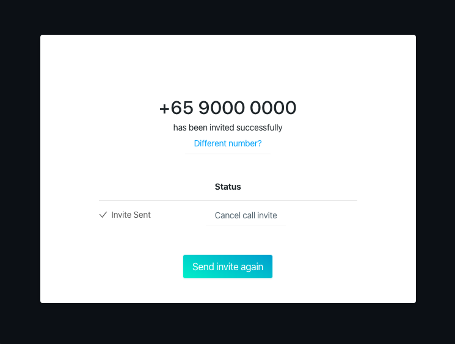

# iframe integration

In order to provide a seamless experience to Agents, the Agent portal can be embedded in another web application.

This allows Video Interaction capabilities to be easily added to another system (claim management system, customer support tool, banking application…).

The following method provides a way for an agent to login and/or to join the room without manually entering his password and generating an invite.

We recommend to use the following method while opening the agent console in an iframe, inside your existing application.

Your users must be logged in and identified, in your application, before opening the iframe.

You can load the Agent Portal in an iframe using the following URL:

```text
https://video-agent.8x8.com/?user=product@8x8.com&token=eyJiJIUzI1NiME5B87.qPWXyNNDHBxLftaHarcSgm0c
```

“User” is the login of the agent who is joining the call. This agent needs to be already existing in the Video Interaction directory.

“token” is the auth_token that you have created previously.

**Example:**

```html
<iframe height="850px" width="90%" src="https://video-agent.8x8.com?user=product@8x8.com&token=eyJiJIUzI1NiME5B87.qPWXyNNDHBx_LftaHarcSgm0c" allow="microphone; camera"></iframe>
```

**Embedded Mode:**

When using the iframe mechanism, you might want to display a simplified UI, more adapted to iframe size.

In order to do this, you can use the URL parameter ?mode=embedded to display the again portal without the left menu and top bar.

When doing so, agent won’t be able to generate new invite, hence this should be used with a token.

**Example:**

```html
<iframe height="850px" width="90%" src="https://video-agent.8x8.com?mode=embedded&user=product@8x8.com&token=eyJiJIUzI1NiME5B87.qPWXyNNDHBx_LftaHarcSgm0c" allow="microphone; camera"></iframe>
```


