# iOS - Integrating the SDK

The following sections describe installation and setup of the Voice SDK:

* [Requirements](#requirements)
* [Create an iOS project](#create-an-ios-project)
* [Integrate the Voice SDK](#integrate-the-voice-sdk)
* [Enable VoIP capabilities](#enable-voip-capabilities)
* [Build and run](#build-and-run)
* [Push notification setup](#push-notification-setup)

## Requirements

To use the Voice SDK you need:

* Xcode (14.3.1 or later)
* Swift (5.8.1 or later)
* iOS (15.5 or later)
* Supported architectures (arm64, x86_64)

## Create an iOS project

To get started, create an iOS project using the following steps:

1. Open Xcode and click **Create a new Xcode** project
2. Select **Single View App** as the template and click **Next**
3. Choose the folder where to store the project and click **Create**
4. Go to the **TARGETS > Project Name > General > Signing** menu and select **Automatically manage signing**
5. Click **Enable Automatic** on the displayed pop-up window

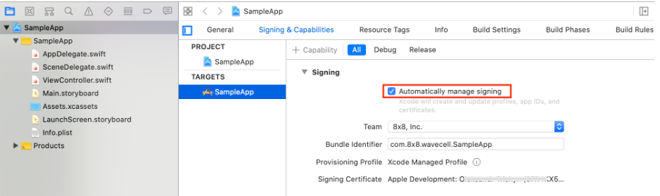

## Integrate the Voice SDK

To integrate the Voice SDK:

1. Go to [SDK Releases](https://github.com/8x8/voice-sdk-releases-ios/releases) and download the latest version of the Voice SDK for iOS.
2. Unzip the downloaded Voice SDK package.

You should have the following contents from the extracted **`.zip`** file:

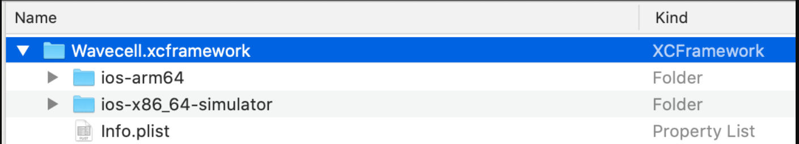

3. Copy the **`Wavecell.xcframework`** bundle to the Frameworks folder as shown:

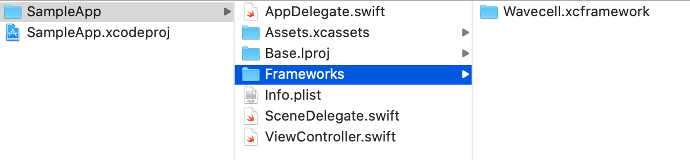

4. Go to the menu at **TARGETS > Project Name > General > Frameworks, Libraries, and Embedded Content**:

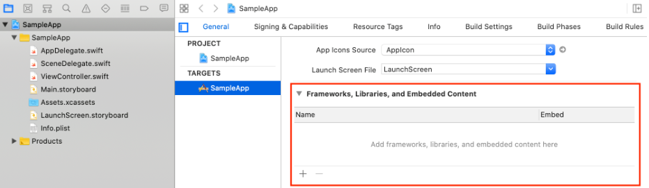

5. Drag the **`Wavecell.xcframework`** bundle from the **`Frameworks`** folder into the **`Frameworks, Libraries, and Embedded Content`** section.

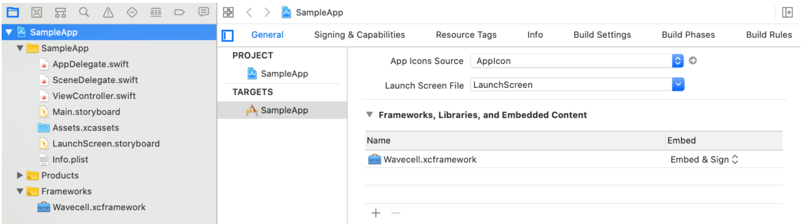

## Enable VoIP capabilities

To enable VoIP capabilities:

1. Go to **TARGETS > Project Name > Signing & Capabilities** and then add **Background Modes**.

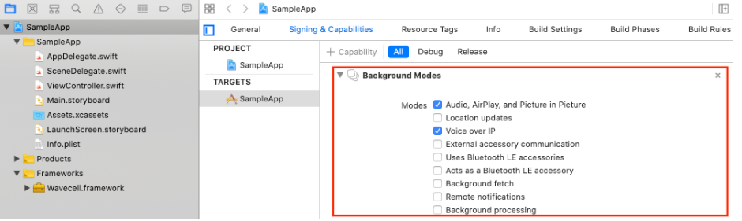

```text
You can also enable Audio, AirPlay Voice over IP and other attributes while in this directory.

```

2. Go to **TARGETS > Project Name > Info** and add your privacy description for push notification usage.

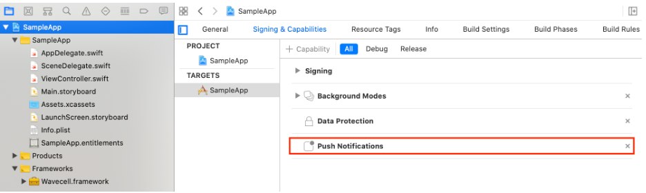

```text
Note: This step is only required for receiving incoming calls.

```

3. Go to **TARGETS > Project Name > Info** and add your privacy description for microphone usage.

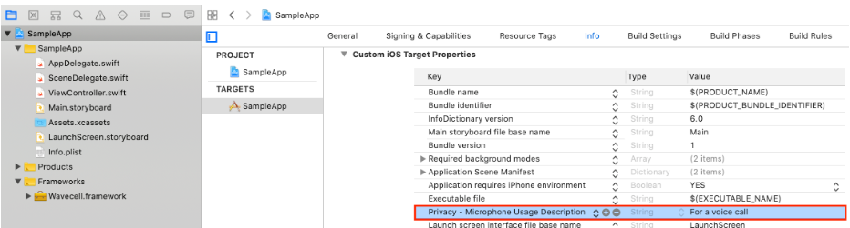  

The **`NSMicrophoneUsageDescription`** property describes the reason your app needs to access the phone microphone. When the system prompts the user to allow access, this string is displayed as part of the alert. Therefore, it cannot be left empty.

## Build and run

After you have completed the previous integration tasks, you can verify if your app can invoke functions from the **`Wavecell.xcframework`** by doing the following:

1. Modify **`AppDelegate.swift`** by adding the following lines:

```swift
import Wavecell
print("\(VoiceSDK.shared.version())")

```

2. Build (**Cmd+B**) and Run (**Cmd+R**) the app project
3. If successful, your Xcode console displays the following type of message:

```text
0.1.0b50-r629e3e4

```

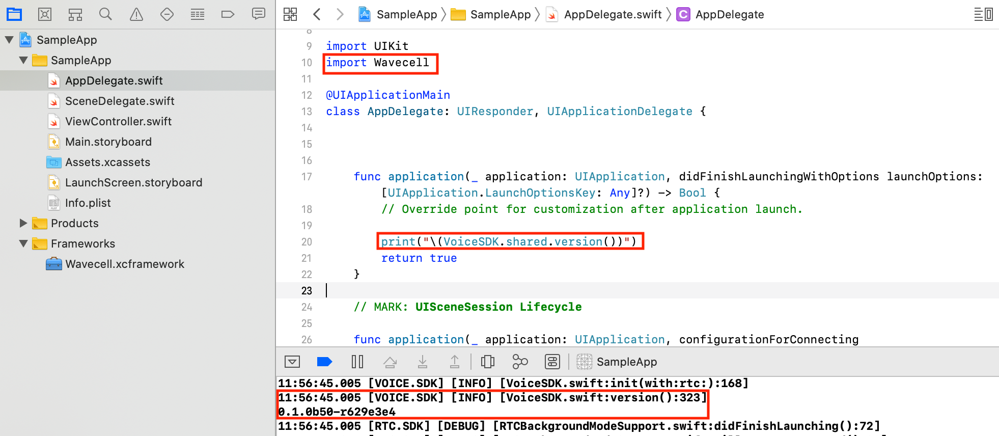

## Push notification setup

The 8x8 backend solution includes the notification server. The notification server establishes secure connection with APNS in order to send push notifications to your application.

There are two types of secure connections:

* [certificate-based](https://developer.apple.com/documentation/usernotifications/setting_up_a_remote_notification_server/establishing_a_certificate-based_connection_to_apns)
* [token-based](https://developer.apple.com/documentation/usernotifications/setting_up_a_remote_notification_server/establishing_a_token-based_connection_to_apns)

The backend supports both types of secure connections.

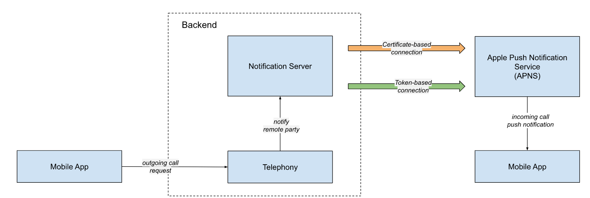

### Certificate-based

For the certificate-based type of connection, generate [VoIP Service Certificate](https://help.apple.com/developer-account/#/dev9249db258)  

with your Apple developer account:

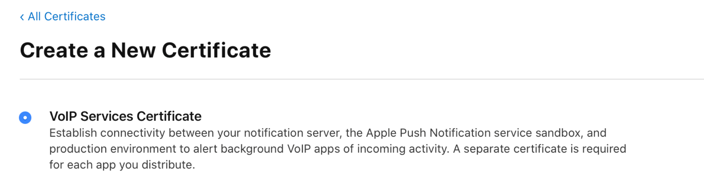

1. When the **`certificate`** is ready, click **Download** and save it to your local drive (**`voip_services.cer`** file).

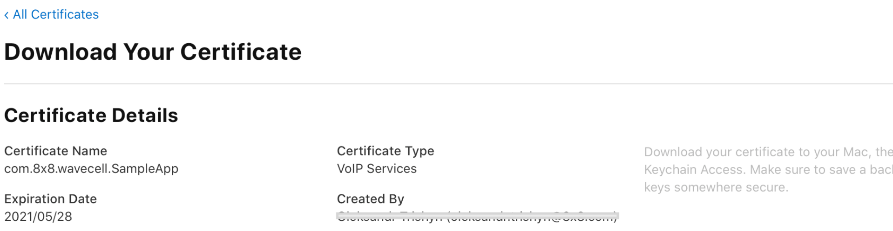

2. Open the **`voip_services.cer`** file with the **Keychain Access** app on your computer.

Select the **login** option if you are asked which keychain to add the certificate to.
3. In the **Keychain Access** app, select the **Certificates** option in the bottom section of the left sidebar.

You will now need to find the certificate you have created.
4. Export your Certificate as a **`.p12`** file.

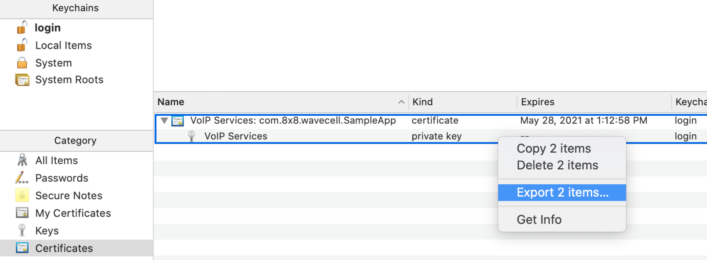

5. Convert the **`.p12`** file to a **`.pem`** file using the Terminal **`openssl`** command:

```bash
openssl pkcs12 -in PATH_TO_YOUR_P12 -nokeys -out cert.pem -nodes
openssl pkcs12 -in PATH_TO_YOUR_P12 -nocerts -out key.pem -nodes
openssl rsa -in key.pem -out key.pem
cat cert.pem key.pem > apns-voip-services.pem

```

6. Register the Certificate (**`apns-voip-services.pem`** file) with your Wavecell developer account.

### Token-based

For the token-base connection you will need to [generate a key](https://help.apple.com/developer-account/#/devcdfbb56a3) in your Apple developer  

account with **`Apple Push Notification Service`** enabled:

1. Once the **key** is ready click **Download** and save it to your hard drive (**`AuthKey_<Key ID>.p8`** file
2. Register the **`Key ID`** and **`Key`** (.p8 file) in your Wavecell developer account.
