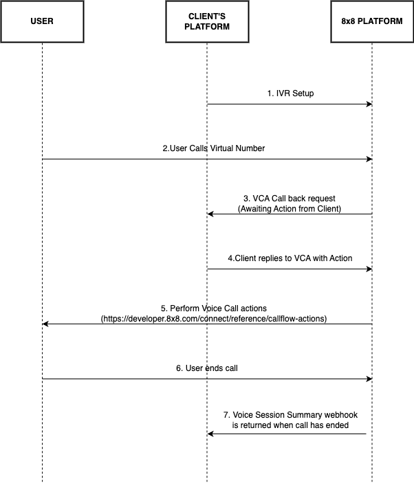

# IVR

8x8 IVR is built on our programmable voice capabilities. 8x8 Interactive Voice Response Service is an automated telephone system that combines pre-recorded messages or text-to-speech technology with a dual-tone multi-frequency (DTMF) interface to provide real-time user interaction over the Public Switch Telephone Network Service.

IVR can be used for interactive outbound call outreach and also handling inbound calls to improve the customer experience by providing a self-service method for customers.

Actions(methods) that can be used on predefined IVR flow:

- Say - Initiates an outgoing call to the desired destination. This function should be used to connect the first call with another party.
- SayAndCapture - Plays a voice file into the call and then captures users DTMF input and reports back the DTMF via Voice Call Action (VCA) webhook.
- makeCall - Initiates an outgoing call to the desired destination. This function should be used to connect the first call with another party.
- playFile - Downloads the sound/voice file provided and plays it back in the currently active call.
- Hangup - Disconnects all active calls. This will terminate the session, triggering the session summary webhook

Main Voice IVR features are:

- Wide range of languages - [Voice Profile API to retrieve fill range of voice profiles)](/connect/reference/get-voice-profile-information)
- User input support over DTMF
- Voice Call Action Webhook
- Dedicated local numbers where applicable
- Billing per successful call
- Detailed reports and statistics

## IVR flow

On the diagram below a simple inbound IVR flow diagram is shown:

## Prerequisites

Before you get started, please contact your account manager to ensure that your account has access to this product and that the following points have been managed:

- You will need a new sub-account id to enable and set up 8x8's Number Masking service
- In order to use our Inbound IVR product, you require a Virtual Number that will be allocated to your sub-account by our 8x8 team
- You will need to set up and configure an endpoint where the voice call action webhook will be sent. You can use the [Webhooks](/connect/reference/create-a-new-webhook) APIs to set up your endpoints. Once that is completed you are ready to use our IVR product and begin building your call flows.
