# Tutorial: Google Sheets and SMS

## Requirements

* An 8x8 Connect account
* Make.com account
* Google Sheet

## Tutorial

This tutorial will take you through an example of how to use Make, Google Sheets and 8x8 SMS API together to automate sending an SMS whenever a new entry is added to Google Sheets.

### Google Sheet Setup

Before we start on the Make.com scenario, create a new Google Sheet in your Google Account that you can access with the following format. This will be used later to add new rows and trigger the Make.com Scenario.

The sheet should have **Phone Number** in Cell A1 and **Message** in Cell B1 to serve as headers.

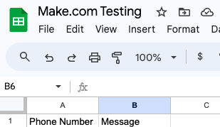

Add phone number and message columns

### Create a New Scenario

The create button is located on the top right from the Dashboard.

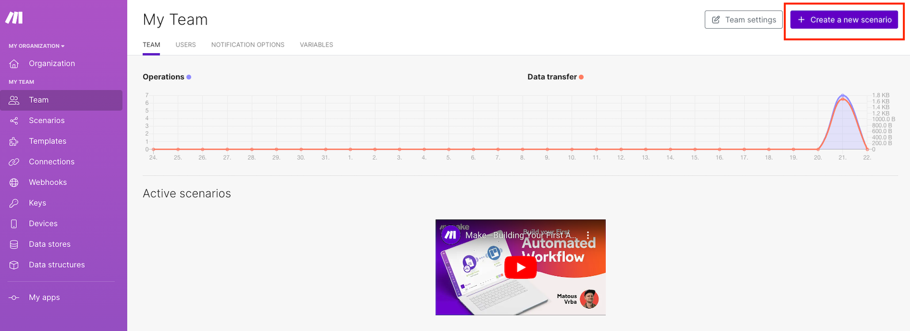

### Add a Trigger

The trigger is the first action in a scenario, here we will select **"Google Sheets"**

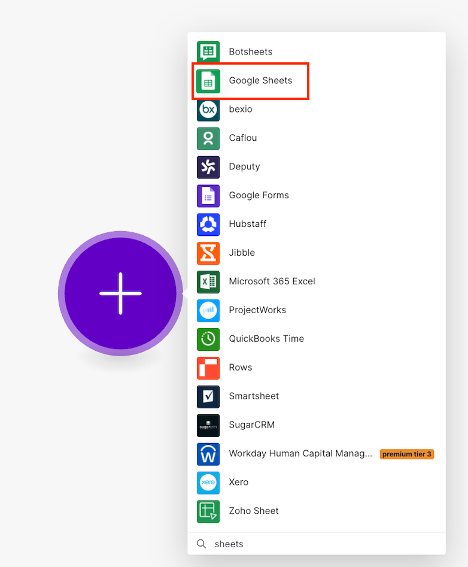

In the list of triggers/actions for Google Sheets, select **"Watch new rows"**

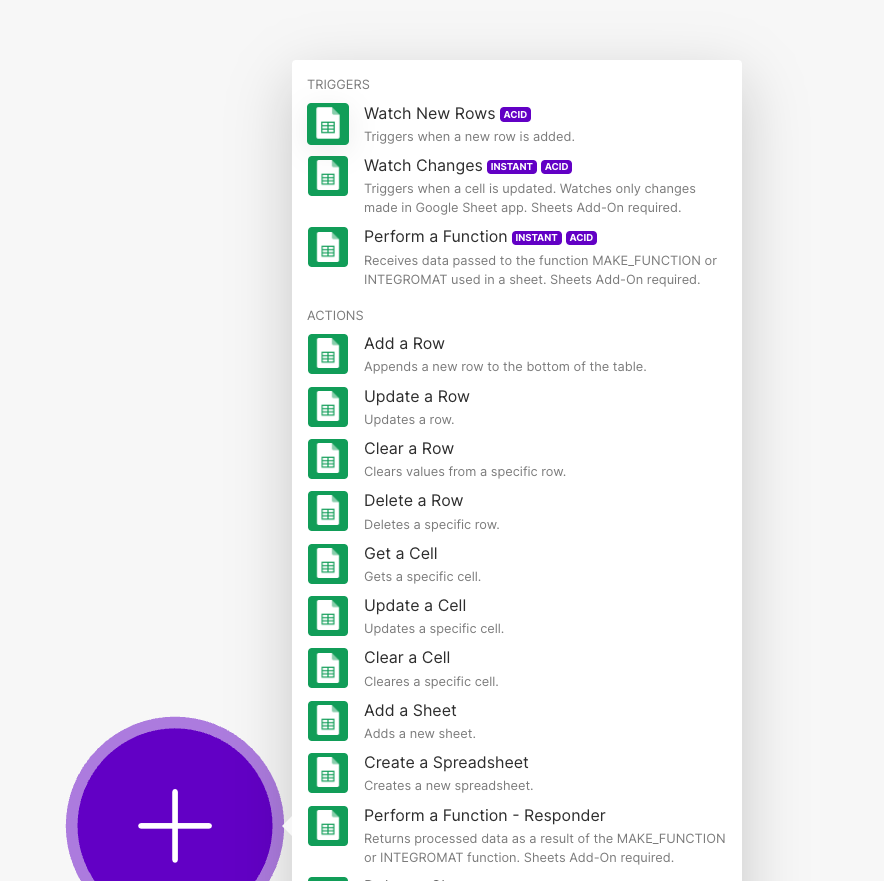

Then you will want to add a new connection.

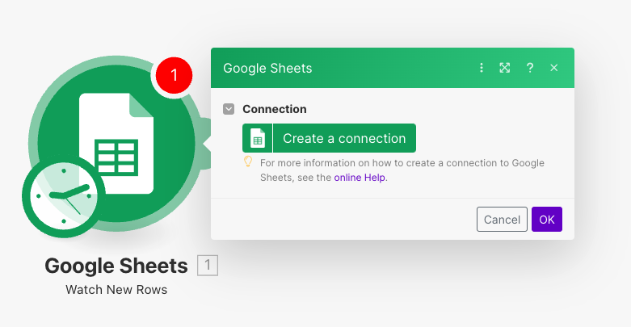

This will prompt you to connect your Google account and then specify the information about your Google Sheet.

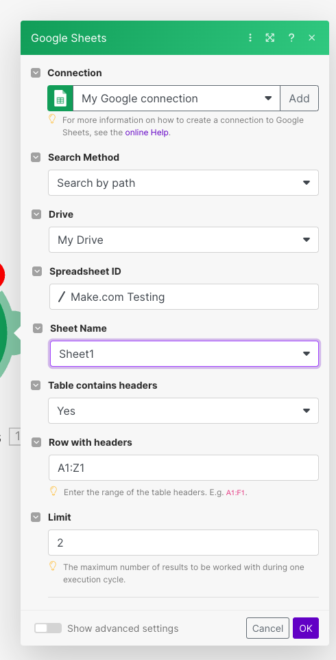

It will then prompt you to decide which row to start watching, in this example our Google Sheet is blank so we will select 2 since our new data should start at row 2.

After that, we will select the "Add another module" Option and select 8x8 from the list.

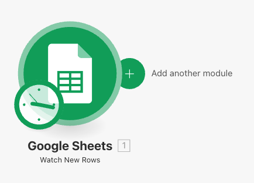

Afterwards, you can specify the following fields which are required:

* **Subaccount:** Enter in your 8x8 subaccount
* **Destination:** Select the output that contains the Phone Number in the Google Sheet
* **Text:** Select the output that contains the Message in the Google Sheet

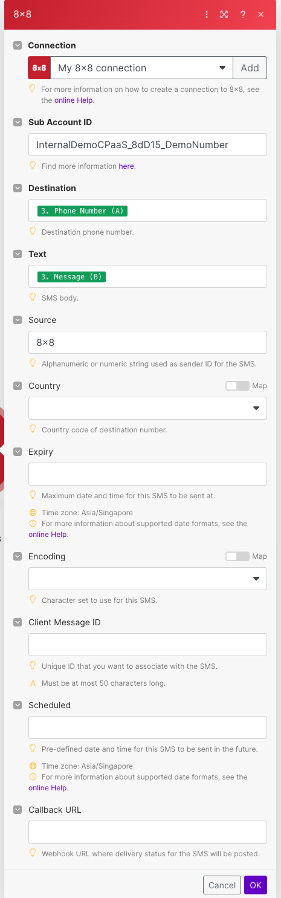

When you connect for the first time to 8x8, you will be prompted for an 8x8 API Key which can be obtained from the 8x8 Connect Dashboard under the API Keys section.

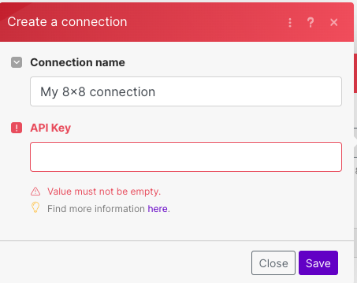

### Enable your Make.com Scenario

Turn on Scheduling on the Bottom Left and select your desired frequency, by default, it will check every 15 minutes.

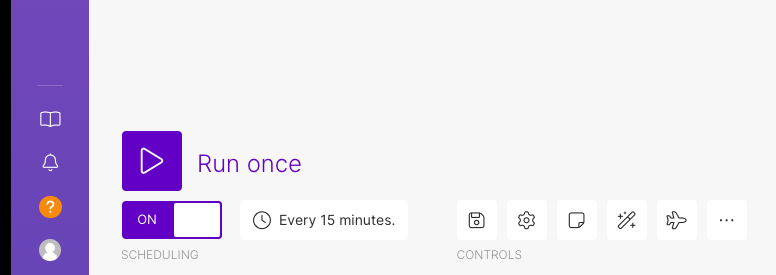

### Add a Row and Receive an SMS

Once you add a row to your Google Sheet, this should trigger Make.com to send you an SMS at the specified phone number. This may not be immediate as it needs to wait for the scheduled interval.

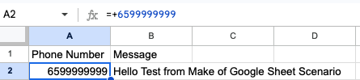

This should result in an SMS being sent to the destination specified.

## Potential Future Use Cases

Make.com is not limited to using 8x8 with Google Sheets of course. There may be other modules connecting to other apps that would be useful.

To see a full list of make.com apps, see their webpage [here](https://www.make.com/en/integrations?addOnApps=1&nativeApps=1).

## Supported Modules

Here are the list of supported modules for Make.com:

* Send a Single SMS
* Send a Bulk SMS
* Send a Single Chat App Message
* Make an API Call

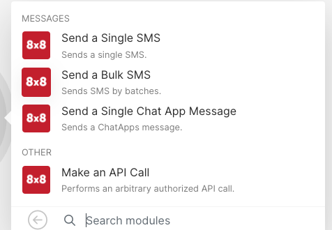
